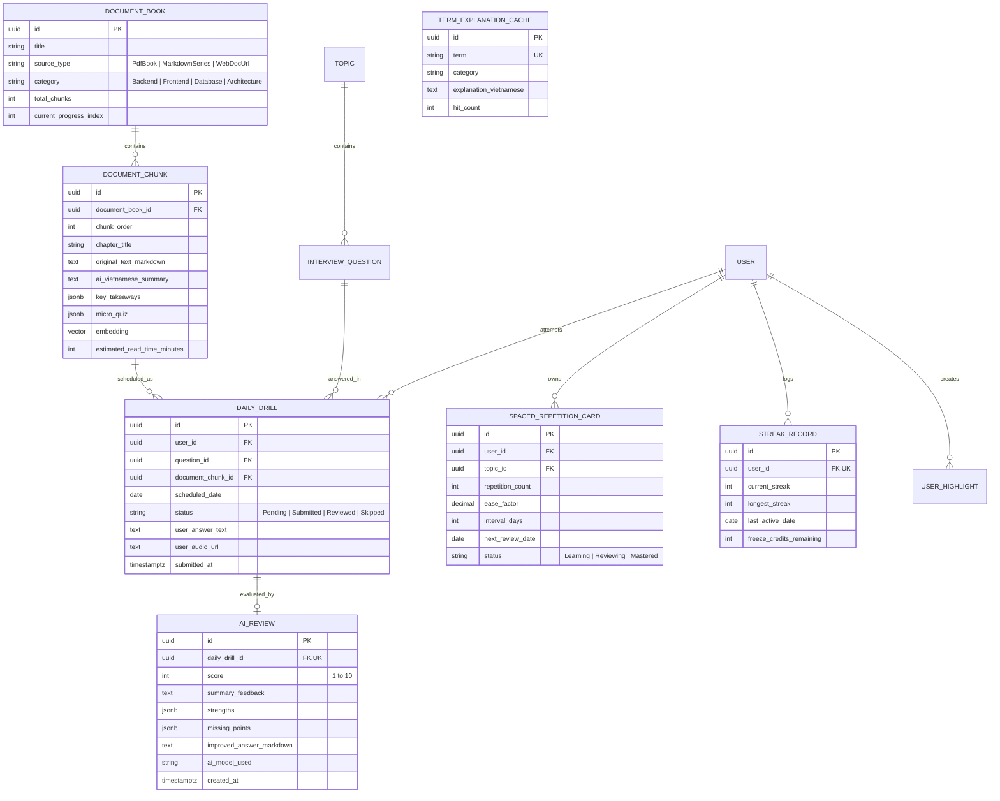

# TechDaily — Daily Senior Engineering & Interview Drill Platform

An AI-powered, daily bite-sized learning and technical interview preparation platform for Senior Fullstack & Backend (.NET) Engineers.

---

## 🎯 Project Overview

TechDaily is built to solve two critical developer challenges:
1. **Daily Micro-Learning from Real Docs:** Extracting curated, 3–5 minute reading slices from authoritative technical documentation (Microsoft Learn, PostgreSQL 17 Manual, Vue 3 / Nuxt 4 Docs, DDIA, CLR via C#) with instant Vietnamese summaries and inline AI explanations.
2. **Active Recall & Mock Interview Drills:** Providing daily Senior-level engineering challenges with instant AI evaluation (scoring, technical gap analysis, model answers) and voice response capability.

---

## 🏗️ Architecture & Technology Stack

| Layer | Technology | Key Responsibilities |
|---|---|---|
| **Backend API** | **ASP.NET Core (.NET 10)** | Clean Architecture, C# 13, Plain Use-Case Handlers (Pure DI), Rich Domain Model, 100% English codebase |
| **Data Persistence** | **EF Core 10 + Npgsql** | PostgreSQL 17 (`pgvector`), JSONB (`ToJson()`) for takeaways/quizzes/reviews, Local Volume Audio Storage |
| **AI Evaluation Engine** | **Gemini 2.5 / 2.0 Flash API** | 1-Pass Multimodal voice/text evaluation, Structured Output (JSON Schema), Semantic Term Cache, AI Chunking |
| **Scheduler & Jobs** | **BackgroundService / Quartz.NET** | Daily dispatch at 08:00 AM, evening reminder at 20:00 PM, Spaced Repetition (SM-2) scheduling |
| **Frontend Web** | **Nuxt 4 + Vue 3** | Dual-Pane SSR/PWA app, Tailwind CSS, Pinia, `@nuxtjs/i18n` (en/vi), `@nuxtjs/color-mode` (Dark/Light), CodeMirror 6 + Shiki Live Preview |
| **Notifications** | **Telegram Bot API** | Lightweight morning alerts and streak retention reminders with direct deep links to Web |

---

## 🌟 Core Features (MVP)

### 1. 🏠 Daily Focus Hub (`/today`)
- **Daily Doc Slice:** Curated 3–5 minute excerpt from official docs preserving original source language (English docs in English, Vietnamese docs in Vietnamese) with structured takeaways and quick check quiz.
- **Inline AI Explainer:** Highlight any complex technical term to get instant popover explanation localized to your language (backed by `TermExplanationCaches`).
- **Senior Interview Challenge:** Daily scenario question with dual-mode answer submission: **CodeMirror 6 Markdown Editor** (with Shiki live preview) & **HTML5 Voice Recording Mode**.
- **AI Reviewer:** Instant scoring (1–10), strengths, missed internal mechanisms, and model answer from a Principal Engineer persona in 2-4s.

### 2. 📚 Document Library & AI Chunking (`/library`)
- **Curated Books & Series:** Track reading progress across multiple books (e.g. *CLR via C#*, *Vue 3 Reactivity*, *Postgres 17 Internals*) in their original language.
- **Import from URL / Markdown:** Paste any tech blog / doc link $\rightarrow$ AI automatically slices it into bite-sized daily chunks with vector embeddings.

### 3. 🧠 Spaced Repetition & Notes (`/review` & `/notes`)
- **SM-2 Anki Flashcards:** Automatically resurface concepts you struggled with after 3, 7, and 21 days (encapsulated domain logic).
- **Searchable Highlights:** Centralized vault of all your highlighted notes and code snippets.

### 4. 🌙 Dark Mode & 🌐 Internationalization (i18n)
- **Dark Mode First:** Full dark/light theme switching with `@nuxtjs/color-mode` and synchronized Shiki editor highlighting for night study sessions.
- **Multilingual UI:** Full i18n support for English (`en-US`) and Vietnamese (`vi-VN`) via `@nuxtjs/i18n`.

### 5. 🔥 Habit & Motivation
- **GitHub-style Streak Heatmap:** Visual tracking of daily consistency.
- **Streak Freeze:** Automatic monthly freeze protection (2 freezes/month) so busy workdays don't break your momentum.

---

## 🏛️ Database Schema Overview



---

## 🚀 Project Structure (Target)

```
techdaily/
├── backend/
│   ├── src/
│   │   ├── TechDaily.Api/
│   │   ├── TechDaily.Application/
│   │   ├── TechDaily.Domain/
│   │   └── TechDaily.Infrastructure/
│   └── tests/
│       └── TechDaily.Tests/
├── frontend/
│   ├── pages/
│   │   ├── index.vue
│   │   ├── today.vue
│   │   ├── library.vue
│   │   ├── review.vue
│   │   └── notes.vue
│   ├── components/
│   └── stores/
├── docs/
│   ├── curriculum-30-days.md
│   └── database-design.md
└── docker-compose.yml
```
