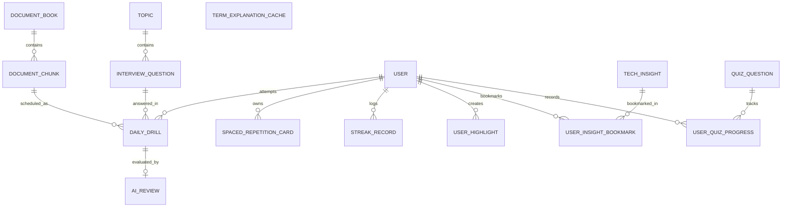

# 🗄️ TechDaily — Database Design & Entity Specifications

Database Engine: **PostgreSQL 17** with `pgvector` extension  
ORM: **EF Core 10 (Npgsql)**

---

## 1. Schema Diagram

---

## 2. Table Definitions

### `Users`
| Column | Type | Constraints | Description |
|---|---|---|---|
| `Id` | `uuid` | PK | Unique User Identifier |
| `Email` | `varchar(255)` | NOT NULL, UNIQUE | User email address |
| `Name` | `varchar(255)` | NOT NULL | User display name |
| `AvatarUrl` | `varchar(500)` | NULL | Profile image URL |
| `GoogleSubjectId` | `varchar(255)` | NULL | Google OAuth Subject Identifier |
| `PasswordHash` | `varchar(500)` | NULL | PBKDF2 Password Hash (100,000 iterations SHA-256) |
| `TelegramChatId` | `bigint` | NULL | Telegram Chat ID for automated notifications |
| `PreferredLocale` | `varchar(10)` | NOT NULL, Default 'en' | User language preference (`en` / `vi`) |
| `TargetRole` | `varchar(100)` | NOT NULL, Default 'Senior Engineer' | Target engineering role |
| `DailyGoalMinutes` | `int` | NOT NULL, Default 10 | Daily study goal in minutes |
| `IsDeleted` | `boolean` | NOT NULL, Default false | Soft delete flag |
| `CreatedAt` | `timestamptz` | NOT NULL | Creation timestamp |
| `UpdatedAt` | `timestamptz` | NULL | Last updated timestamp |

---

### `DocumentBooks`
| Column | Type | Constraints | Description |
|---|---|---|---|
| `Id` | `uuid` | PK | Unique Identifier |
| `Title` | `varchar(255)` | NOT NULL | Title of book/series (e.g. *CLR via C#*) |
| `Slug` | `varchar(255)` | NOT NULL, UNIQUE | URL slug |
| `SourceType` | `varchar(50)` | NOT NULL | Enum: `PdfBook`, `MarkdownSeries`, `WebDocUrl` |
| `Category` | `varchar(50)` | NOT NULL | Enum: `Frontend`, `Backend`, `Database`, `Architecture` |
| `TotalChunks` | `int` | NOT NULL, Default 0 | Total number of daily reading slices |
| `AuthorOrSourceUrl` | `varchar(500)` | NULL | Original author, source file, or documentation link |
| `IsPublished` | `boolean` | NOT NULL, Default true | Publishing status |
| `IsDeleted` | `boolean` | NOT NULL, Default false | Soft delete flag |
| `CreatedAt` | `timestamptz` | NOT NULL | Creation timestamp |
| `UpdatedAt` | `timestamptz` | NULL | Last updated timestamp |

---

### `DocumentChunks`
| Column | Type | Constraints | Description |
|---|---|---|---|
| `Id` | `uuid` | PK | Unique Identifier |
| `DocumentBookId` | `uuid` | FK $\rightarrow$ `DocumentBooks(Id)`, NOT NULL | Reference to parent book |
| `ChunkOrder` | `int` | NOT NULL | Day index in series (1, 2, 3...) |
| `ChapterTitle` | `varchar(255)` | NOT NULL | Chapter/Topic Title |
| `OriginalTextMarkdown` | `text` | NOT NULL | Sanitized Markdown content with code blocks |
| `SummaryMarkdown` | `text` | NOT NULL | 3-5 core takeaways |
| `KeyTakeaways` | `jsonb` | NOT NULL | Array of bullet point strings `string[]` |
| `MicroQuiz` | `jsonb` | NOT NULL | `{ question: string, options: string[], answerIndex: int, explanation: string }` |
| `Language` | `varchar(10)` | NOT NULL, Default 'en' | ISO language code (`en`, `vi`, etc.) |
| `Embedding` | `vector(768)` | NULL | Vector embedding for semantic search (pgvector) |
| `EstimatedReadMinutes` | `int` | NOT NULL, Default 3 | Estimated reading time |
| `IsDeleted` | `boolean` | NOT NULL, Default false | Soft delete flag |
| `CreatedAt` | `timestamptz` | NOT NULL | Creation timestamp |
| `UpdatedAt` | `timestamptz` | NULL | Last updated timestamp |

---

### `Topics`
| Column | Type | Constraints | Description |
|---|---|---|---|
| `Id` | `uuid` | PK | Unique Identifier |
| `Slug` | `varchar(255)` | NOT NULL, UNIQUE | URL friendly slug |
| `Title` | `varchar(255)` | NOT NULL | Topic Title |
| `Category` | `varchar(50)` | NOT NULL | Enum: `FrontendWeb`, `BackendDotNet`, `DatabaseStorage`, `SystemDesign` |
| `Difficulty` | `varchar(50)` | NOT NULL | Enum: `Intermediate`, `Senior`, `Lead` |
| `DayOrder` | `int` | NOT NULL | Day index in 30-day curriculum (1-30) |
| `Summary` | `text` | NOT NULL | Brief 1-paragraph summary |
| `DeepDiveMarkdown` | `text` | NOT NULL | Full in-depth technical explanation |
| `BenchmarkSnippet` | `text` | NULL | BenchmarkDotNet or Code comparison markdown |
| `CreatedAt` | `timestamptz` | NOT NULL | Creation timestamp |

---

### `InterviewQuestions`
| Column | Type | Constraints | Description |
|---|---|---|---|
| `Id` | `uuid` | PK | Unique Identifier |
| `TopicId` | `uuid` | FK $\rightarrow$ `Topics(Id)`, NOT NULL | Reference to parent topic |
| `QuestionText` | `text` | NOT NULL | Senior-level scenario question |
| `Options` | `jsonb` | NOT NULL, Default '[]' | Array of multiple-choice scenario options `string[]` |
| `CorrectOptionIndex` | `int` | NOT NULL, Default 0 | Index of optimal senior solution |
| `ExplanationMarkdown` | `text` | NOT NULL, Default '' | Deep-dive trade-off analysis and mechanics |
| `ExpectedKeyPoints` | `jsonb` | NOT NULL | Array of required points `string[]` |
| `ModelAnswerMarkdown` | `text` | NOT NULL | Benchmark answer written by Principal Architect |
| `Difficulty` | `varchar(50)` | NOT NULL | Difficulty tier |

---

### `DailyDrills`
| Column | Type | Constraints | Description |
|---|---|---|---|
| `Id` | `uuid` | PK | Unique Identifier |
| `UserId` | `uuid` | NOT NULL | User identifier |
| `QuestionId` | `uuid` | FK $\rightarrow$ `InterviewQuestions(Id)`, NOT NULL | Question attempted |
| `DocumentChunkId` | `uuid` | FK $\rightarrow$ `DocumentChunks(Id)`, NULL | Document read for the day |
| `ScheduledDate` | `date` | NOT NULL | Date assigned (YYYY-MM-DD) |
| `Status` | `varchar(50)` | NOT NULL | Enum: `Pending`, `Submitted`, `Reviewed`, `Skipped` |
| `SelectedOptionIndex` | `int` | NULL | Option index selected by user |
| `IsCorrect` | `boolean` | NULL | Whether user selected the optimal option |
| `Score` | `int` | NULL | Score awarded (10 for optimal, 0 otherwise) |
| `SubmittedAt` | `timestamptz` | NULL | Submission timestamp |

---

### `AiReviews`
| Column | Type | Constraints | Description |
|---|---|---|---|
| `Id` | `uuid` | PK | Unique Identifier |
| `DailyDrillId` | `uuid` | FK $\rightarrow$ `DailyDrills(Id)`, UNIQUE, NOT NULL | 1-to-1 link with user drill |
| `Score` | `int` | NOT NULL | Grade from 1 to 10 |
| `SummaryFeedback` | `text` | NOT NULL | Concise evaluation summary |
| `Strengths` | `jsonb` | NOT NULL | Array of points candidate got right `string[]` |
| `MissingPoints` | `jsonb` | NOT NULL | Array of internal mechanisms missed `string[]` |
| `ImprovedAnswerMarkdown` | `text` | NOT NULL | Suggested ideal response |
| `AiModelUsed` | `varchar(50)` | NOT NULL | e.g. `gemini-2.5-flash` |
| `CreatedAt` | `timestamptz` | NOT NULL | Evaluation timestamp |

---

### `SpacedRepetitionCards` (SM-2 Algorithm)
| Column | Type | Constraints | Description |
|---|---|---|---|
| `Id` | `uuid` | PK | Unique Identifier |
| `UserId` | `uuid` | NOT NULL | User identifier |
| `TopicId` | `uuid` | FK $\rightarrow$ `Topics(Id)`, NOT NULL | Reference to topic |
| `RepetitionCount` | `int` | NOT NULL, Default 0 | Times reviewed |
| `EaseFactor` | `decimal(5,2)` | NOT NULL, Default 2.50 | SM-2 Ease Factor |
| `IntervalDays` | `int` | NOT NULL, Default 1 | Current review interval in days |
| `NextReviewDate` | `date` | NOT NULL | Next scheduled review date |
| `LastReviewDate` | `date` | NULL | Last reviewed date |
| `Status` | `varchar(50)` | NOT NULL | Enum: `Learning`, `Reviewing`, `Mastered` |

---

### `StreakRecords`
| Column | Type | Constraints | Description |
|---|---|---|---|
| `Id` | `uuid` | PK | Unique Identifier |
| `UserId` | `uuid` | NOT NULL, UNIQUE | User identifier |
| `CurrentStreak` | `int` | NOT NULL, Default 0 | Current consecutive days |
| `LongestStreak` | `int` | NOT NULL, Default 0 | All-time highest streak |
| `LastActiveDate` | `date` | NULL | Date of last completed drill |
| `FreezeCreditsRemaining` | `int` | NOT NULL, Default 2 | Available monthly streak freezes |
| `TotalDrillsCompleted` | `int` | NOT NULL, Default 0 | Cumulative completed drills |
| `AverageScore` | `decimal(4,2)` | NOT NULL, Default 0.00 | Average AI review score |

---

### `UserHighlights`
| Column | Type | Constraints | Description |
|---|---|---|---|
| `Id` | `uuid` | PK | Unique Identifier |
| `UserId` | `uuid` | NOT NULL | User identifier |
| `DocumentChunkId` | `uuid` | FK $\rightarrow$ `DocumentChunks(Id)`, NOT NULL | Source chunk |
| `SelectedText` | `text` | NOT NULL | Highlighted quote |
| `Note` | `text` | NULL | Personal reflection note |
| `Tags` | `jsonb` | NOT NULL | Array of tag strings `string[]` |
| `CreatedAt` | `timestamptz` | NOT NULL | Creation timestamp |

---

### `TermExplanationCaches` (Semantic Explainer Cache)
| Column | Type | Constraints | Description |
|---|---|---|---|
| `Id` | `uuid` | PK | Unique Identifier |
| `Term` | `varchar(255)` | NOT NULL | Terminology/keyword in lowercase (e.g. *loh*, *mvcc*) |
| `Category` | `varchar(50)` | NOT NULL | e.g. `DotNet`, `Postgres`, `Vue`, `SystemDesign` |
| `Locale` | `varchar(10)` | NOT NULL, Default 'en' | Target language locale (`en`, `vi`) |
| `ExplanationText` | `text` | NOT NULL | 2-sentence concise explanation in the requested locale |
| `Embedding` | `vector(768)` | NULL | Vector embedding for semantic match |
| `HitCount` | `int` | NOT NULL, Default 1 | Frequency of lookups |
| `CreatedAt` | `timestamptz` | NOT NULL | Creation timestamp |

---

### `TechInsights` (Infinite Tech Insights Feed)
| Column | Type | Constraints | Description |
|---|---|---|---|
| `Id` | `uuid` | PK | Unique Identifier |
| `Slug` | `varchar(255)` | NOT NULL, UNIQUE | URL slug identifier |
| `Title` | `varchar(255)` | NOT NULL | Senior insight title |
| `Category` | `int` | NOT NULL | Enum: `0=FrontendWeb`, `1=BackendDotNet`, `2=DatabaseStorage`, `3=SystemDesign` |
| `Tags` | `jsonb/text` | NOT NULL | Array of tag keywords `string[]` |
| `SummaryMarkdown` | `text` | NOT NULL | Problem summary hook |
| `ProblemSnippet` | `text` | NOT NULL | Anti-pattern code example |
| `SolutionSnippet` | `text` | NOT NULL | Optimal senior implementation |
| `UnderTheHoodMarkdown` | `text` | NOT NULL | Deep dive runtime engine mechanics |
| `BenchmarkStats` | `varchar(255)` | NOT NULL | Performance improvement metric |
| `SourceUrl` | `varchar(500)` | NULL | Official documentation or benchmark reference |
| `LikesCount` | `int` | NOT NULL, Default 0 | Likes counter |
| `BookmarksCount` | `int` | NOT NULL, Default 0 | Bookmarks counter |
| `IsPublished` | `boolean` | NOT NULL, Default true | Publishing visibility |
| `IsDeleted` | `boolean` | NOT NULL, Default false | Soft delete flag |
| `CreatedAt` | `timestamptz` | NOT NULL | Creation timestamp |
| `UpdatedAt` | `timestamptz` | NULL | Last update timestamp |

---

### `UserInsightBookmarks` (Persisted Insight Saves)
| Column | Type | Constraints | Description |
|---|---|---|---|
| `Id` | `uuid` | PK | Unique Identifier |
| `UserId` | `uuid` | FK $\rightarrow$ `Users(Id)`, NOT NULL | Owner user identifier |
| `InsightId` | `uuid` | FK $\rightarrow$ `TechInsights(Id)`, NOT NULL | Bookmarked insight identifier |
| `CreatedAt` | `timestamptz` | NOT NULL | Bookmark creation timestamp |

> **Unique Index:** `IX_UserInsightBookmarks_UserId_InsightId` ON `(UserId, InsightId)`.  
> **Cascade Delete:** Deleting either the parent `User` or `TechInsight` automatically cascades to remove related bookmarks.

---

### `QuizQuestions` (Interview Arena Question Bank)
| Column | Type | Constraints | Description |
|---|---|---|---|
| `Id` | `uuid` | PK | Unique Identifier |
| `Topic` | `varchar(255)` | NOT NULL | Interview topic keyword (e.g. *.NET 10 Memory*, *PostgreSQL MVCC*) |
| `Category` | `int` | NOT NULL | Enum: `0=FrontendWeb`, `1=BackendDotNet`, `2=DatabaseStorage`, `3=SystemDesign` |
| `Level` | `int` | NOT NULL | Enum: `0=Fresher`, `1=Junior`, `2=Middle`, `3=Senior` |
| `QuestionText` | `text` | NOT NULL | Technical scenario problem statement |
| `Options` | `jsonb` | NOT NULL | Array of 4 answer options `string[]` |
| `CorrectOptionIndex` | `int` | NOT NULL | 0-based index of correct option (0-3) |
| `ExplanationMarkdown` | `text` | NOT NULL | Technical analysis and distractor breakdown |
| `Tags` | `jsonb` | NOT NULL | Array of tag keywords `string[]` |
| `CreatedByUserId` | `uuid` | NULL | Creator user ID if custom generated |
| `IsDeleted` | `boolean` | NOT NULL, Default false | Soft delete flag |
| `CreatedAt` | `timestamptz` | NOT NULL | Creation timestamp |
| `UpdatedAt` | `timestamptz` | NULL | Last update timestamp |

> **Indexes:**  
> - `IX_QuizQuestions_Topic_Level` ON `(lower(Topic), Level)` WHERE `"IsDeleted" = false`  
> - `IX_QuizQuestions_Category` ON `(Category)` WHERE `"IsDeleted" = false`

---

### `UserQuizProgresses` (Spaced Repetition & Question Mastery)
| Column | Type | Constraints | Description |
|---|---|---|---|
| `Id` | `uuid` | PK | Unique Identifier |
| `UserId` | `uuid` | FK $\rightarrow$ `Users(Id)`, NOT NULL | Owner user identifier |
| `QuestionId` | `uuid` | FK $\rightarrow$ `QuizQuestions(Id)`, NOT NULL | Reference to quiz question |
| `IsMastered` | `boolean` | NOT NULL, Default false | True after 2 consecutive correct submissions |
| `LastSelectedOptionIndex` | `int` | NULL | Index chosen in last attempt |
| `IsLastAnswerCorrect` | `boolean` | NULL | Correctness of latest attempt |
| `CorrectCount` | `int` | NOT NULL, Default 0 | Total correct submissions |
| `IncorrectCount` | `int` | NOT NULL, Default 0 | Total incorrect submissions |
| `ConsecutiveCorrectCount` | `int` | NOT NULL, Default 0 | Current consecutive correct streak |
| `LastAttemptedAt` | `timestamptz` | NULL | Timestamp of last attempt |
| `IsDeleted` | `boolean` | NOT NULL, Default false | Soft delete flag |
| `CreatedAt` | `timestamptz` | NOT NULL | Creation timestamp |
| `UpdatedAt` | `timestamptz` | NULL | Last update timestamp |

> **Unique Index:** `IX_UserQuizProgresses_UserId_QuestionId` ON `(UserId, QuestionId)` WHERE `"IsDeleted" = false`  
> **Query Index:** `IX_UserQuizProgresses_UserId_IsMastered` ON `(UserId, IsMastered)` WHERE `"IsDeleted" = false`

