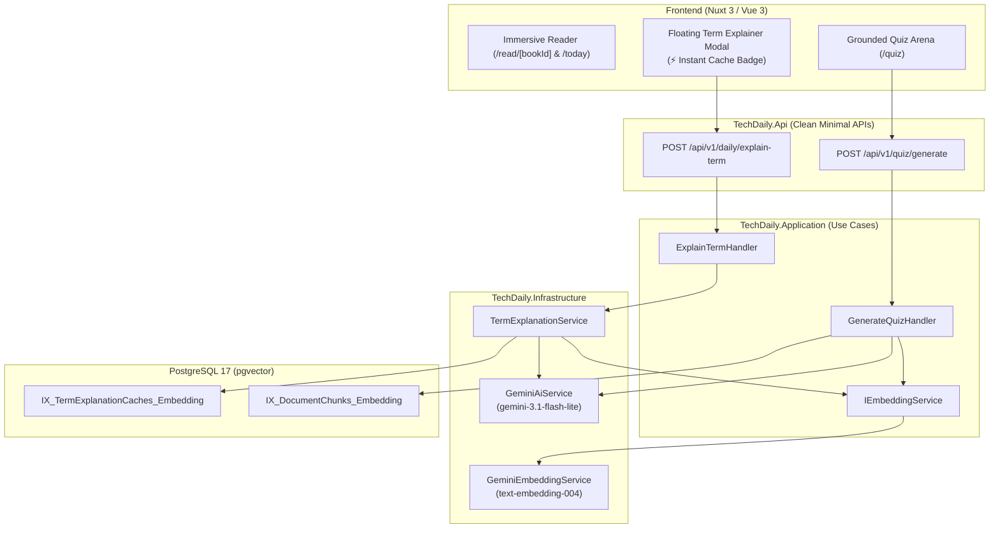

# Technical Design: Clean Reader AI Experience & Model Standardization

## 1. Architectural Overview
This change refines the reader architecture to eliminate conversational chatbot distractions while standardizing all AI models and branding across the platform.



---

## 2. In-Book Chatbot Removal

### Frontend Simplification
1. **Component Deletion:** Delete `frontend/components/reader/AskBookDrawer.vue` and its unit test `frontend/tests/components/AskBookDrawer.spec.ts`.
2. **Page Cleanup:**
   - In `frontend/pages/read/[bookId].vue`:
     - Remove `AskBookDrawer` import and template component `<AskBookDrawer ... />`.
     - Remove reactive state `isAskDrawerOpen`.
     - Remove "Hỏi AI" header button (`reader.ask_book`) and keyboard shortcut (`Shift + ?`).
   - In `frontend/pages/today.vue`:
     - Remove `AskBookDrawer` import, template component, and toggle state.
3. **Store & i18n Cleanup:**
   - In `frontend/stores/useLibraryStore.ts`: remove `askBook` method, `BookCitation`, and `AskBookResult` types.
   - Clean unit tests in `frontend/tests/stores/library.spec.ts`.
   - Remove unused translation keys in `en.json` and `vi.json` (`ask_book`, `ask_book_subtitle`, `ask_book_empty_title`, `ask_placeholder`, `suggested_questions`, `clear_chat`).

### Backend Simplification
1. **Handler & Endpoint Deletion:**
   - Delete `backend/src/TechDaily.Application/Features/Library/AskBook/AskBookHandler.cs`.
   - Delete `backend/tests/TechDaily.Tests/Application/AskBookHandlerTests.cs`.
   - Remove `POST /api/v1/library/books/{id}/ask` route from `backend/src/TechDaily.Api/Endpoints/LibraryEndpoints.cs`.
2. **Service Interface Cleanup:**
   - Remove `IBookQAService` from `backend/src/TechDaily.Application/Interfaces/IServiceInterfaces.cs`.
   - Remove `AskAsync` implementation from `backend/src/TechDaily.Infrastructure/Services/GeminiAiService.cs`.
3. **Nginx Reverse Proxy:**
   - Remove `/library/books/[^/]+/ask` from the `ai_limit` location regex in `nginx/nginx.conf`.

---

## 3. Gemini Model Standardization & Clean Branding

### Standardizing Model Configurations & Fallbacks
In accordance with `AGENTS.md` Rule 12:
- Update fallback model in `GeminiAiService.cs`:
  ```csharp
  _model = configuration["Gemini:Model"] ?? "gemini-3.1-flash-lite";
  ```
- Update fallback model in `TermExplanationService.cs`:
  ```csharp
  _model = configuration["Gemini:Model"] ?? "gemini-3.1-flash-lite";
  ```
- Update endpoint summaries in `InsightsEndpoints.cs` and `QuizEndpoints.cs` to reference Google Gemini Flash Lite.

### Professional UI Term Explainer Branding
In `frontend/components/today/TermExplainerModal.vue`:
- Replace `Analyzing term with Gemini 3.6 Flash...` with `Analyzing term with Google Gemini...`.
- Replace `Powered by Gemini 3.6 Flash` with `Powered by Google Gemini`.
- Preserve the `⚡ Instant Cache` badge when served from the semantic cache (`isFromCache == true`).
