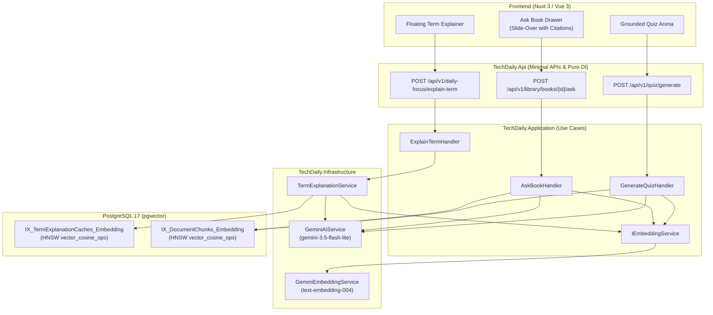
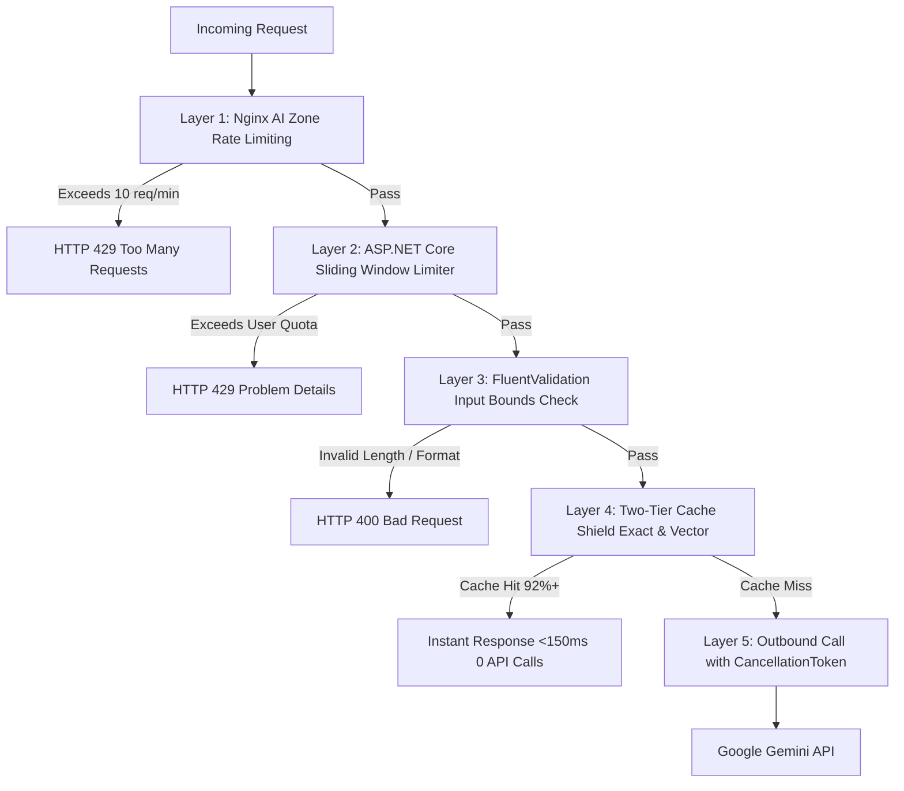

# Technical Design: pgvector Embeddings, Semantic Caching, In-Book RAG, and Grounded Quizzes

## 1. Architectural Overview
This change activates PostgreSQL 17's native `pgvector` capabilities already defined in the database schema without adding new table columns or modifying entity relationships. It bridges the Application and Infrastructure layers with Google's cloud-hosted **`text-embedding-004`** model, offloading all embedding computation away from the host server.



---

## 2. Core Service Contracts

### `IEmbeddingService`
```csharp
namespace TechDaily.Application.Interfaces;

public interface IEmbeddingService
{
    Task<Result<Pgvector.Vector>> GenerateEmbeddingAsync(
        string text, 
        CancellationToken cancellationToken = default);

    Task<Result<List<Pgvector.Vector>>> GenerateBatchEmbeddingsAsync(
        List<string> texts, 
        CancellationToken cancellationToken = default);
}
```

### `GeminiEmbeddingService`
- **Endpoint:** `POST https://generativelanguage.googleapis.com/v1beta/models/text-embedding-004:embedContent`
- **Batch Endpoint:** `POST https://generativelanguage.googleapis.com/v1beta/models/text-embedding-004:batchEmbedContents`
- **Vector Output:** Exactly 768 floating point numbers matching `Pgvector.Vector`.
- **Zero-Resource VPS Footprint:** Network payload is tiny (~3KB for 768 floats). CPU usage on the VPS is strictly limited to JSON serialization and HTTP I/O.

---

## 3. Two-Tier Semantic Cache (Feature 3)

In `TermExplanationService`:

1. **Tier 1 (Exact B-Tree Match):**
   ```csharp
   var cached = await _dbContext.TermExplanationCaches
       .FirstOrDefaultAsync(t => t.Term == normalizedTerm && t.Locale == locale, ct);
   if (cached != null) {
       cached.IncrementHit();
       await _dbContext.SaveChangesAsync(ct);
       return cached.ExplanationText;
   }
   ```
2. **Tier 2 (pgvector HNSW Semantic Match):**
   ```csharp
   var termVector = await _embeddingService.GenerateEmbeddingAsync($"[{safeCategory}] {normalizedTerm}", ct);
   if (termVector.IsSuccess) {
       var semanticHit = await _dbContext.TermExplanationCaches
           .Where(t => t.Locale == locale && t.Category == safeCategory && t.Embedding != null)
           .OrderBy(t => t.Embedding!.CosineDistance(termVector.Value))
           .Select(t => new {
               Entity = t,
               Distance = t.Embedding!.CosineDistance(termVector.Value)
           })
           .FirstOrDefaultAsync(ct);

       if (semanticHit != null && semanticHit.Distance <= 0.08) { // >= 92% semantic similarity
           semanticHit.Entity.IncrementHit();
           await _dbContext.SaveChangesAsync(ct);
           return semanticHit.Entity.ExplanationText;
       }
   }
   ```
3. **Tier 3 (Gemini Flash Fallback & Vectorized Store):**
   - If both cache tiers miss, invoke Gemini 3.6 Flash.
   - Save new `TermExplanationCache` with `Embedding = termVector.Value`.

---

## 4. "Ask AI About This Book" (In-Context RAG - Feature 2)

### API Contract
`POST /api/v1/library/books/{bookId:guid}/ask`

**Request:**
```json
{
  "question": "How does this book handle concurrency conflicts during write skew?",
  "currentChunkId": "optional-guid-of-current-slice",
  "locale": "en"
}
```

**Response:**
```json
{
  "answerMarkdown": "The author addresses write skew in Chapter 7...",
  "citations": [
    {
      "chunkOrder": 7,
      "chapterTitle": "Transactions: Serializable Snapshot Isolation",
      "relevanceScore": 0.89,
      "excerpt": "SSI detects write skew by tracking active read-locks..."
    }
  ]
}
```

### Retrieval & Grounding Logic (`AskBookHandler`)
- Vectorize user question: `var qVec = await _embeddingService.GenerateEmbeddingAsync(request.Question, ct);`
- LINQ pgvector query scoped strictly to `request.BookId`:
  ```csharp
  var topChunks = await _dbContext.DocumentChunks
      .AsNoTracking()
      .Where(c => c.DocumentBookId == request.BookId && c.Embedding != null)
      .OrderBy(c => c.Embedding!.CosineDistance(qVec.Value))
      .Take(3)
      .Select(c => new {
          c.ChunkOrder,
          c.ChapterTitle,
          c.OriginalTextMarkdown,
          c.SummaryMarkdown,
          Distance = c.Embedding!.CosineDistance(qVec.Value)
      })
      .ToListAsync(ct);
  ```
- Grounded prompt with strict guardrails preventing speculation outside the provided text.

---

## 5. Grounded Quiz Generation (Feature 4)

In `GenerateQuizHandler`:
- When `Grounded = true` or `BookId` is provided:
  - Vector search identifies authoritative chunks matching the requested topic or book.
  - Slices are concatenated into reference material:
    ```
    AUTHORITATIVE REFERENCE CONTEXT:
    ---
    [Slice 14: Distributed Consensus]
    Key Tradeoffs: Raft leader election timeout vs network jitter...
    ---
    TASK: Generate 5 deep scenario interview questions strictly testing understanding of these tradeoffs.
    ```
- Generated quiz questions store `SourceExcerpt` and `SourceChunkOrder` inside `ExplanationMarkdown`, rendering clickable reference badges upon answer review.

---

## 6. Frontend UI/UX Design

### A. Ask Book Slide-Over Drawer (`AskBookDrawer.vue`)
- Positioned on the right side of `/read/[bookId]` and `/today`.
- Triggered via floating header button `💬 Hỏi tài liệu` or keyboard shortcut `Shift + ?`.
- Renders streaming or markdown response with interactive citation pills (e.g. `[Lát 7: SSI Isolation]`).
- Clicking a citation pill updates the reader's active slice (`?slice=7`) and smoothly scrolls to the relevant section.

### B. Floating Explainer Latency Improvement
- Explanations appear in <150ms on semantic hits.
- Tooltip displays a discreet `⚡ Instant Cache` badge when served from semantic cache.

---

## 7. Multi-Layer Anti-Spam & Cost Defense Architecture

To protect Gemini API token quotas and prevent server strain on low-spec VPS environments, a 6-layer anti-spam defense is implemented:



1. **Layer 1: Reverse Proxy Rate Limiting (Nginx `ai_limit` Zone)**
   - Nginx configuration introduces a dedicated rate limiting zone for costly AI/RAG routes:
     ```nginx
     limit_req_zone $binary_remote_addr zone=ai_limit:10m rate=10r/m;

     location ~* ^/api/v1/(daily-focus/explain-term|library/books/[^/]+/ask|quiz/generate) {
         limit_req zone=ai_limit burst=5 nodelay;
         limit_req_status 429;
         proxy_pass http://backend_upstream;
         ...
     }
     ```
   - Drops request bursts immediately at the edge without reaching the .NET Kestrel server.

2. **Layer 2: In-App Sliding Window Rate Limiting (ASP.NET Core .NET 10)**
   - Registered in `Program.cs` via `Microsoft.AspNetCore.RateLimiting`:
     - Sliding window policy (`AiEndpointsPolicy`): Maximum **10 requests per minute per authenticated user identity** (keyed by `ClaimTypes.NameIdentifier` or IP for unauthenticated).
     - Returns RFC 7807 `429 Too Many Requests` problem details with `Retry-After` header.

3. **Layer 3: Strict Input Length & Payload Boundaries**
   - FluentValidation enforces defensive size boundaries on all AI requests:
     - `AskBookRequest.Question`: Between 3 and 300 characters.
     - `ExplainTermRequest.Term`: Between 2 and 500 characters.
     - `GenerateQuizRequest.Topic`: Maximum 100 characters.
   - Prevents prompt stuffing, denial-of-service payload injection, and excessive token burning.

4. **Layer 4: Semantic Caching as an Anti-Spam Shield**
   - Exact and near-exact duplicates (e.g. repeated button clicks or frequent highlight queries) hit Tier 1 (B-Tree) or Tier 2 (HNSW vector similarity $\ge 92\%$) and return within 1–150ms.
   - Absorbs repeated queries without firing outbound calls to Google Gemini.

5. **Layer 5: Client-Side Mutex Guards & Debouncing (Frontend)**
   - Floating text explainer enforces a **400ms selection debounce** and ignores rapid mouse drags or selections below 2 characters.
   - "Ask Book" and "Generate Quiz" triggers maintain reactive state `isAsking` and `isGenerating`.
   - Submit buttons are explicitly disabled (`disabled:opacity-50 disabled:cursor-not-allowed`) with a spinning loader, completely preventing multi-click spam.

6. **Layer 6: Immediate Cancellation Propagation**
   - Endpoints pass `HttpContext.RequestAborted` directly down to `_httpClient.SendAsync`.
   - If a user closes the drawer, navigates away, or refreshes the page, the in-flight outbound Gemini HTTP call terminates immediately, conserving tokens and compute.

---

## 8. Performance & VPS Safety Boundaries
- **VPS Memory:** 0 MB added to resident RAM (all vector models execute in Google Cloud).
- **CPU:** Pure LINQ projection compiling to PostgreSQL native operator `<=>`.
- **Index Speed:** HNSW graph traversal completes in <2ms on PostgreSQL 17.
- **Resilience:** Graceful fallback to exact match or general LLM completion if Gemini Embedding API is temporarily unreachable or unconfigured.
