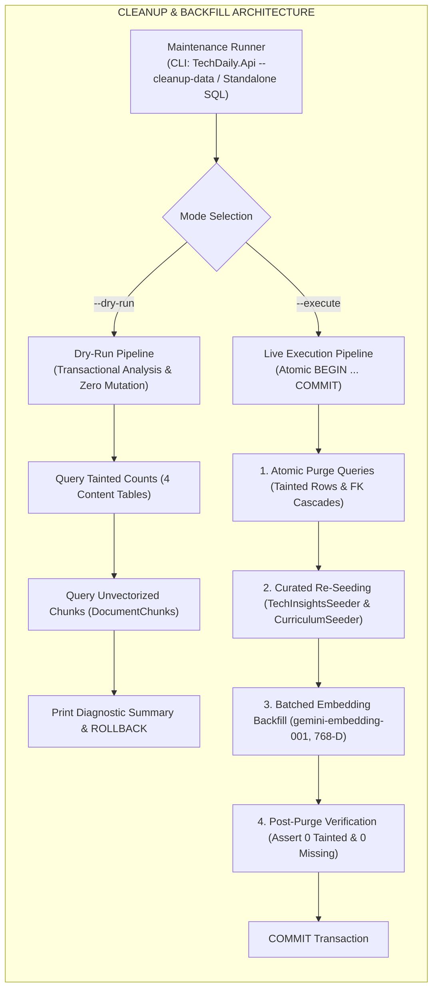
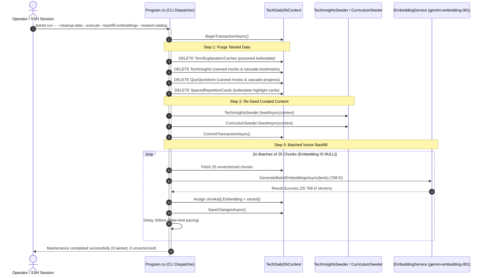

# Technical Design: Clean Up Fallback and Silent Failure Data Across Local and Production Databases

## 1. Architecture Overview

This document defines the technical architecture, SQL statements, CLI tooling, batching pipelines, and operational runbooks for purging poisoned fallback data and backfilling missing vector embeddings across both local and production PostgreSQL 17 databases.



---

## 2. Tainted Data Signatures & Targeted Purge Queries

### 2.1 `TermExplanationCaches`

#### Problem:
When `TermExplanationService` encountered Gemini API failures or missing keys, `GetFallbackExplanation` stored generic boilerplate text in English and Vietnamese. Additionally, terms were persisted without valid 768-D embeddings.

#### Identification Criteria:
```sql
-- English boilerplate
ExplanationText LIKE '%represents a core runtime or architectural mechanism%'
-- Vietnamese boilerplate
ExplanationText LIKE '%Khái niệm kỹ thuật quan trọng mô tả cơ chế hoạt động nội tại%'
```

#### SQL Purge Statement:
```sql
-- Preview (Dry Run)
SELECT COUNT(*) AS poisoned_term_cache_count
FROM "TermExplanationCaches"
WHERE "ExplanationText" LIKE '%represents a core runtime or architectural mechanism%'
   OR "ExplanationText" LIKE '%Khái niệm kỹ thuật quan trọng mô tả cơ chế hoạt động nội tại%';

-- Execution (Atomic Purge)
DELETE FROM "TermExplanationCaches"
WHERE "ExplanationText" LIKE '%represents a core runtime or architectural mechanism%'
   OR "ExplanationText" LIKE '%Khái niệm kỹ thuật quan trọng mô tả cơ chế hoạt động nội tại%';
```

---

### 2.2 `TechInsights`

#### Problem:
`GeminiAiService.GenerateMockInsight` generated canned insights when Gemini failed. These insights have titles from a fixed mock pool, slugs ending in randomized 6-character hex values (`-[0-9a-f]{6}`), or problem/solution snippets not present in the curated `tech-insights.json` seed catalog.

#### Identification Criteria:
```sql
-- 1. Slugs ending with randomized hex generated by GenerateSlug:
Slug ~ '-[0-9a-f]{6}$'
AND (
    Title IN (
        -- English mock pool titles
        'High-Throughput Buffer Pooling with ArrayPool<T>.Shared in ASP.NET Core',
        'Architecting Non-Blocking Request Ingestion with System.Threading.Channels',
        'Sub-millisecond Latency with OutputCache and Eviction Tags',
        'Mitigating ThreadPool Starvation by Eliminating Sync-over-Async',
        'Zero-allocation Memory Optimization with Span<T> and Memory<T>',
        'PostgreSQL MVCC Internals: Preventing Table Bloat with Autovacuum',
        -- Vietnamese mock pool titles
        'Tối ưu hóa Memory Allocation trong ASP.NET Core với ArrayPool<T>.Shared',
        'Kiến trúc Non-blocking Request Processing với System.Threading.Channels trong ASP.NET Core',
        'Tối ưu hóa Latency với OutputCache và Tag-Based Eviction trong ASP.NET Core',
        'Phòng chống ThreadPool Starvation bằng cách loại bỏ Sync-over-Async trong ASP.NET Core',
        'Tối ưu hóa cấp phát bộ nhớ với Span<T> và Memory<T>',
        'Cơ chế MVCC và Vacuuming trong PostgreSQL'
    )
    OR "BenchmarkStats" LIKE '⚡ Giảm 95% LOH Allocations%'
    OR "BenchmarkStats" LIKE '⚡ 95% Reduced LOH Allocations%'
    OR "BenchmarkStats" LIKE '⚡ 10x Throughput%'
    OR "UnderTheHoodMarkdown" LIKE '### Under The Hood Mechanics\n- `ArrayPool<T>` quản lý các bucket mảng%'
)
```

#### Relational Cascades:
- `UserInsightBookmarks` references `TechInsights.Id` with `ON DELETE CASCADE`.
- Deleting tainted `TechInsights` automatically cascades to remove orphaned bookmarks.

#### SQL Purge Statement:
```sql
-- Preview (Dry Run)
SELECT COUNT(*) AS poisoned_insights_count
FROM "TechInsights"
WHERE "Slug" ~ '-[0-9a-f]{6}$'
  AND (
      "Title" IN (
          'High-Throughput Buffer Pooling with ArrayPool<T>.Shared in ASP.NET Core',
          'Architecting Non-Blocking Request Ingestion with System.Threading.Channels',
          'Sub-millisecond Latency with OutputCache and Eviction Tags',
          'Mitigating ThreadPool Starvation by Eliminating Sync-over-Async',
          'Zero-allocation Memory Optimization with Span<T> and Memory<T>',
          'PostgreSQL MVCC Internals: Preventing Table Bloat with Autovacuum',
          'Tối ưu hóa Memory Allocation trong ASP.NET Core với ArrayPool<T>.Shared',
          'Kiến trúc Non-blocking Request Processing với System.Threading.Channels trong ASP.NET Core',
          'Tối ưu hóa Latency với OutputCache và Tag-Based Eviction trong ASP.NET Core',
          'Phòng chống ThreadPool Starvation bằng cách loại bỏ Sync-over-Async trong ASP.NET Core',
          'Tối ưu hóa cấp phát bộ nhớ với Span<T> và Memory<T>',
          'Cơ chế MVCC và Vacuuming trong PostgreSQL'
      )
      OR "BenchmarkStats" LIKE '⚡ Giảm 95% LOH Allocations%'
      OR "BenchmarkStats" LIKE '⚡ 95% Reduced LOH Allocations%'
      OR "BenchmarkStats" LIKE '⚡ 10x Throughput%'
      OR "UnderTheHoodMarkdown" LIKE '### Under The Hood Mechanics\n- `ArrayPool<T>` quản lý các bucket mảng%'
  );

-- Execution (Atomic Purge)
DELETE FROM "TechInsights"
WHERE "Slug" ~ '-[0-9a-f]{6}$'
  AND (
      "Title" IN (
          'High-Throughput Buffer Pooling with ArrayPool<T>.Shared in ASP.NET Core',
          'Architecting Non-Blocking Request Ingestion with System.Threading.Channels',
          'Sub-millisecond Latency with OutputCache and Eviction Tags',
          'Mitigating ThreadPool Starvation by Eliminating Sync-over-Async',
          'Zero-allocation Memory Optimization with Span<T> and Memory<T>',
          'PostgreSQL MVCC Internals: Preventing Table Bloat with Autovacuum',
          'Tối ưu hóa Memory Allocation trong ASP.NET Core với ArrayPool<T>.Shared',
          'Kiến trúc Non-blocking Request Processing với System.Threading.Channels trong ASP.NET Core',
          'Tối ưu hóa Latency với OutputCache và Tag-Based Eviction trong ASP.NET Core',
          'Phòng chống ThreadPool Starvation bằng cách loại bỏ Sync-over-Async trong ASP.NET Core',
          'Tối ưu hóa cấp phát bộ nhớ với Span<T> và Memory<T>',
          'Cơ chế MVCC và Vacuuming trong PostgreSQL'
      )
      OR "BenchmarkStats" LIKE '⚡ Giảm 95% LOH Allocations%'
      OR "BenchmarkStats" LIKE '⚡ 95% Reduced LOH Allocations%'
      OR "BenchmarkStats" LIKE '⚡ 10x Throughput%'
      OR "UnderTheHoodMarkdown" LIKE '### Under The Hood Mechanics\n- `ArrayPool<T>` quản lý các bucket mảng%'
  );
```

---

### 2.3 `QuizQuestions`

#### Problem:
`GeminiAiService.GenerateMockQuestions` generated canned mock questions when Gemini failed.

#### Identification Criteria:
```sql
QuestionText LIKE '%When addressing "%", which architectural strategy is optimal?%'
OR QuestionText LIKE '%Khi giải quyết vấn đề "%", phương án kiến trúc nào sau đây là tối ưu nhất?%'
OR ExplanationMarkdown LIKE '%### Technical Deep Dive\n- **Optimal Solution:**%'
OR ExplanationMarkdown LIKE '%### Phân Tích Kỹ Thuật Chuyên Sâu\n- **Phương án đúng:**%'
```

#### Relational Cascades:
- `UserQuizProgresses` references `QuizQuestions.Id` with `ON DELETE CASCADE`.
- `SpacedRepetitionCards` references `QuizQuestions.Id` through `SourceQuizQuestionId` with `ON DELETE SET NULL`.
- Deleting tainted quiz questions cleanly removes user quiz progresses associated with mock questions and sets `SourceQuizQuestionId = NULL` on affected cards.

#### SQL Purge Statement:
```sql
-- Preview (Dry Run)
SELECT COUNT(*) AS poisoned_quiz_questions_count
FROM "QuizQuestions"
WHERE "QuestionText" LIKE '%When addressing "%", which architectural strategy is optimal?%'
   OR "QuestionText" LIKE '%Khi giải quyết vấn đề "%", phương án kiến trúc nào sau đây là tối ưu nhất?%'
   OR "ExplanationMarkdown" LIKE '%### Technical Deep Dive\n- **Optimal Solution:**%'
   OR "ExplanationMarkdown" LIKE '%### Phân Tích Kỹ Thuật Chuyên Sâu\n- **Phương án đúng:**%';

-- Execution (Atomic Purge)
DELETE FROM "QuizQuestions"
WHERE "QuestionText" LIKE '%When addressing "%", which architectural strategy is optimal?%'
   OR "QuestionText" LIKE '%Khi giải quyết vấn đề "%", phương án kiến trúc nào sau đây là tối ưu nhất?%'
   OR "ExplanationMarkdown" LIKE '%### Technical Deep Dive\n- **Optimal Solution:**%'
   OR "ExplanationMarkdown" LIKE '%### Phân Tích Kỹ Thuật Chuyên Sâu\n- **Phương án đúng:**%';
```

---

### 2.4 `SpacedRepetitionCards`

#### Problem:
`CreateCardFromHighlightHandler` called `SynthesizeActiveRecallCardAsync`. When Gemini failed, the fallback returned a canned generic prompt and concatenated the user's note and quote without synthesis.

#### Identification Criteria:
```sql
SourceType = 'Highlight'
AND (
    FrontMarkdown LIKE 'What is the core architectural principle behind:%'
    OR FrontMarkdown LIKE 'Nguyên lý kiến trúc cốt lõi đằng sau trích dẫn trong%'
)
```

#### Relational Dependencies:
- `SpacedRepetitionCards.SourceHighlightId` references `UserHighlights.Id` with `ON DELETE SET NULL`.
- Deleting these cards removes the corrupted flashcard without touching the parent `UserHighlights` table, preserving the user's reading notes and highlights.

#### SQL Purge Statement:
```sql
-- Preview (Dry Run)
SELECT COUNT(*) AS poisoned_cards_count
FROM "SpacedRepetitionCards"
WHERE "SourceType" = 'Highlight'
  AND (
      "FrontMarkdown" LIKE 'What is the core architectural principle behind:%'
      OR "FrontMarkdown" LIKE 'Nguyên lý kiến trúc cốt lõi đằng sau trích dẫn trong%'
  );

-- Execution (Atomic Purge)
DELETE FROM "SpacedRepetitionCards"
WHERE "SourceType" = 'Highlight'
  AND (
      "FrontMarkdown" LIKE 'What is the core architectural principle behind:%'
      OR "FrontMarkdown" LIKE 'Nguyên lý kiến trúc cốt lõi đằng sau trích dẫn trong%'
  );
```

---

### 2.5 `DocumentChunks` (Unvectorized Rows)

#### Problem:
465+ document chunks have `Embedding IS NULL` due to failures with the deprecated `text-embedding-004` model.

#### Identification Criteria:
```sql
Embedding IS NULL
```

#### Query for Backfill Candidates:
```sql
SELECT c."Id", c."DocumentBookId", c."ChunkOrder", c."ChapterTitle", c."SummaryMarkdown", c."OriginalTextMarkdown"
FROM "DocumentChunks" c
WHERE c."Embedding" IS NULL
ORDER BY c."DocumentBookId", c."ChunkOrder";
```

---

## 3. Maintenance CLI Tooling Design (`TechDaily.Api`)

To provide programmatic, type-safe execution that can reuse the application's `IEmbeddingService`, EF Core configurations, and seeders, we design maintenance CLI commands built into `TechDaily.Api`:

### 3.1 Command-Line Arguments Specification

```bash
dotnet run --project backend/src/TechDaily.Api -- [OPTIONS]
```

| Flag | Type | Default | Description |
| :--- | :--- | :--- | :--- |
| `--cleanup-data` | Flag | `false` | Enables database cleanup and data maintenance mode. |
| `--dry-run` | Flag | `false` | Analyzes tainted records and unvectorized chunks, prints counts, and rolls back transaction. |
| `--execute` | Flag | `false` | Executes the atomic purge and commits changes to PostgreSQL. |
| `--backfill-embeddings` | Flag | `false` | Executes batched vector generation for all `DocumentChunks` where `Embedding IS NULL`. |
| `--batch-size=<N>` | Int | `25` | Number of chunks vectorized per batch during embedding backfill (bounded between 5 and 50). |
| `--reseed-catalog` | Flag | `false` | Runs `TechInsightsSeeder.SeedAsync` and `CurriculumSeeder.SeedAsync` following purge. |

### 3.2 CLI Execution Architecture



---

## 4. Standalone SQL Scripts Architecture

For operational environments where compiling or running the .NET API runner directly in a maintenance container is inconvenient or restricted, two standalone SQL scripts are provided:

### 4.1 `cleanup-dry-run.sql`
```sql
-- TechDaily Database Hygiene: Dry-Run Analysis Script
-- Safe for execution on any environment: Performs NO mutations (ROLLBACK)

BEGIN;

-- 1. Analyze TermExplanationCaches
SELECT 'TermExplanationCaches' AS table_name,
       COUNT(*) AS tainted_rows_found
FROM "TermExplanationCaches"
WHERE "ExplanationText" LIKE '%represents a core runtime or architectural mechanism%'
   OR "ExplanationText" LIKE '%Khái niệm kỹ thuật quan trọng mô tả cơ chế hoạt động nội tại%';

-- 2. Analyze TechInsights
SELECT 'TechInsights' AS table_name,
       COUNT(*) AS tainted_rows_found
FROM "TechInsights"
WHERE "Slug" ~ '-[0-9a-f]{6}$'
  AND (
      "Title" IN (
          'High-Throughput Buffer Pooling with ArrayPool<T>.Shared in ASP.NET Core',
          'Architecting Non-Blocking Request Ingestion with System.Threading.Channels',
          'Sub-millisecond Latency with OutputCache and Eviction Tags',
          'Mitigating ThreadPool Starvation by Eliminating Sync-over-Async',
          'Zero-allocation Memory Optimization with Span<T> and Memory<T>',
          'PostgreSQL MVCC Internals: Preventing Table Bloat with Autovacuum',
          'Tối ưu hóa Memory Allocation trong ASP.NET Core với ArrayPool<T>.Shared',
          'Kiến trúc Non-blocking Request Processing với System.Threading.Channels trong ASP.NET Core',
          'Tối ưu hóa Latency với OutputCache và Tag-Based Eviction trong ASP.NET Core',
          'Phòng chống ThreadPool Starvation bằng cách loại bỏ Sync-over-Async trong ASP.NET Core',
          'Tối ưu hóa cấp phát bộ nhớ với Span<T> và Memory<T>',
          'Cơ chế MVCC và Vacuuming trong PostgreSQL'
      )
      OR "BenchmarkStats" LIKE '⚡ Giảm 95% LOH Allocations%'
      OR "BenchmarkStats" LIKE '⚡ 95% Reduced LOH Allocations%'
      OR "BenchmarkStats" LIKE '⚡ 10x Throughput%'
      OR "UnderTheHoodMarkdown" LIKE '### Under The Hood Mechanics\n- `ArrayPool<T>` quản lý các bucket mảng%'
  );

-- 3. Analyze QuizQuestions
SELECT 'QuizQuestions' AS table_name,
       COUNT(*) AS tainted_rows_found
FROM "QuizQuestions"
WHERE "QuestionText" LIKE '%When addressing "%", which architectural strategy is optimal?%'
   OR "QuestionText" LIKE '%Khi giải quyết vấn đề "%", phương án kiến trúc nào sau đây là tối ưu nhất?%'
   OR "ExplanationMarkdown" LIKE '%### Technical Deep Dive\n- **Optimal Solution:**%'
   OR "ExplanationMarkdown" LIKE '%### Phân Tích Kỹ Thuật Chuyên Sâu\n- **Phương án đúng:**%';

-- 4. Analyze SpacedRepetitionCards
SELECT 'SpacedRepetitionCards' AS table_name,
       COUNT(*) AS tainted_rows_found
FROM "SpacedRepetitionCards"
WHERE "SourceType" = 'Highlight'
  AND (
      "FrontMarkdown" LIKE 'What is the core architectural principle behind:%'
      OR "FrontMarkdown" LIKE 'Nguyên lý kiến trúc cốt lõi đằng sau trích dẫn trong%'
  );

-- 5. Analyze Unvectorized DocumentChunks
SELECT 'DocumentChunks (Unvectorized)' AS table_name,
       COUNT(*) AS unvectorized_chunks_found
FROM "DocumentChunks"
WHERE "Embedding" IS NULL;

-- Guarantee zero mutations
ROLLBACK;
```

### 4.2 `cleanup-execute.sql`
```sql
-- TechDaily Database Hygiene: Production Execution Script
-- Transactional & Idempotent: Executed within BEGIN ... COMMIT

BEGIN;

-- 1. Purge Poisoned TermExplanationCaches
DELETE FROM "TermExplanationCaches"
WHERE "ExplanationText" LIKE '%represents a core runtime or architectural mechanism%'
   OR "ExplanationText" LIKE '%Khái niệm kỹ thuật quan trọng mô tả cơ chế hoạt động nội tại%';

-- 2. Purge Poisoned TechInsights (Cascades to UserInsightBookmarks)
DELETE FROM "TechInsights"
WHERE "Slug" ~ '-[0-9a-f]{6}$'
  AND (
      "Title" IN (
          'High-Throughput Buffer Pooling with ArrayPool<T>.Shared in ASP.NET Core',
          'Architecting Non-Blocking Request Ingestion with System.Threading.Channels',
          'Sub-millisecond Latency with OutputCache and Eviction Tags',
          'Mitigating ThreadPool Starvation by Eliminating Sync-over-Async',
          'Zero-allocation Memory Optimization with Span<T> and Memory<T>',
          'PostgreSQL MVCC Internals: Preventing Table Bloat with Autovacuum',
          'Tối ưu hóa Memory Allocation trong ASP.NET Core với ArrayPool<T>.Shared',
          'Kiến trúc Non-blocking Request Processing với System.Threading.Channels trong ASP.NET Core',
          'Tối ưu hóa Latency với OutputCache và Tag-Based Eviction trong ASP.NET Core',
          'Phòng chống ThreadPool Starvation bằng cách loại bỏ Sync-over-Async trong ASP.NET Core',
          'Tối ưu hóa cấp phát bộ nhớ với Span<T> và Memory<T>',
          'Cơ chế MVCC và Vacuuming trong PostgreSQL'
      )
      OR "BenchmarkStats" LIKE '⚡ Giảm 95% LOH Allocations%'
      OR "BenchmarkStats" LIKE '⚡ 95% Reduced LOH Allocations%'
      OR "BenchmarkStats" LIKE '⚡ 10x Throughput%'
      OR "UnderTheHoodMarkdown" LIKE '### Under The Hood Mechanics\n- `ArrayPool<T>` quản lý các bucket mảng%'
  );

-- 3. Purge Poisoned QuizQuestions (Cascades to UserQuizProgresses; sets null on cards)
DELETE FROM "QuizQuestions"
WHERE "QuestionText" LIKE '%When addressing "%", which architectural strategy is optimal?%'
   OR "QuestionText" LIKE '%Khi giải quyết vấn đề "%", phương án kiến trúc nào sau đây là tối ưu nhất?%'
   OR "ExplanationMarkdown" LIKE '%### Technical Deep Dive\n- **Optimal Solution:**%'
   OR "ExplanationMarkdown" LIKE '%### Phân Tích Kỹ Thuật Chuyên Sâu\n- **Phương án đúng:**%';

-- 4. Purge Poisoned SpacedRepetitionCards (Preserves underlying UserHighlights)
DELETE FROM "SpacedRepetitionCards"
WHERE "SourceType" = 'Highlight'
  AND (
      "FrontMarkdown" LIKE 'What is the core architectural principle behind:%'
      OR "FrontMarkdown" LIKE 'Nguyên lý kiến trúc cốt lõi đằng sau trích dẫn trong%'
  );

COMMIT;
```

---

## 5. Batched Vector Backfill Architecture

### 5.1 Batch Processing Strategy
- **Batch Size:** 25 chunks per API batch.
- **Payload Composition:** For each chunk:
  ```csharp
  var text = string.IsNullOrWhiteSpace(chunk.SummaryMarkdown)
      ? $"{chunk.ChapterTitle}: {chunk.OriginalTextMarkdown[..Math.Min(1000, chunk.OriginalTextMarkdown.Length)]}"
      : $"{chunk.ChapterTitle}: {chunk.SummaryMarkdown}";
  ```
- **Dimensionality Enforcement:** Each item in `requests` passes `"outputDimensionality": 768`.
- **Validation:** Assert `vector.Length == 768` prior to assigning `chunk.Embedding = vector`.
- **Pacing & Rate Limiting:** Introduce an asynchronous delay of 200 milliseconds between batches (`await Task.Delay(200, ct)`).
- **Error Handling:** If a batch fails (e.g. HTTP 429 quota exhaustion or network timeout), retry up to 3 times with exponential backoff (1s, 2s, 4s). If retry fails, log the error with chunk IDs and proceed to the next batch without aborting the entire maintenance run.

---

## 6. Execution Runbooks for Local and Production Environments

### 6.1 Local Environment Runbook (`techdaily_postgres`)

1. **Verify PostgreSQL Container:**
   ```bash
   docker ps --filter "name=techdaily_postgres"
   ```
2. **Execute Dry-Run Analysis:**
   ```bash
   docker exec -i techdaily_postgres psql -U techdaily_user -d techdaily_db < scripts/cleanup-dry-run.sql
   # OR via .NET CLI:
   dotnet run --project backend/src/TechDaily.Api -- --cleanup-data --dry-run
   ```
3. **Review Dry-Run Output:**
   - Confirm tainted row counts match expectations.
4. **Execute Purge & Re-Seed:**
   ```bash
   docker exec -i techdaily_postgres psql -U techdaily_user -d techdaily_db < scripts/cleanup-execute.sql
   ```
5. **Run Backfill via Backend API Runner:**
   ```bash
   dotnet run --project backend/src/TechDaily.Api -- --cleanup-data --backfill-embeddings --reseed-catalog
   ```

---

### 6.2 Production Environment Runbook (`techdaily_postgres_prod` on Google Cloud VPS)

1. **Connect via Secure SSH:**
   ```bash
   ssh duycld03@<VPS_IP>
   cd /home/duycld03/workspace/techdaily
   ```

2. **Create Mandatory Pre-Cleanup Database Backup:**
   ```bash
   BACKUP_FILE="backup_pre_cleanup_$(date +%Y%m%d_%H%M%S).dump"
   docker exec techdaily_postgres_prod pg_dump -Fc -U techdaily_user -d techdaily_db > "/tmp/${BACKUP_FILE}"
   ls -lh "/tmp/${BACKUP_FILE}"
   ```

3. **Run Dry-Run Script via Docker Exec:**
   ```bash
   docker exec -i techdaily_postgres_prod psql -U techdaily_user -d techdaily_db < scripts/cleanup-dry-run.sql
   ```
   *Inspect the output table to verify exact counts of affected rows.*

4. **Execute Database Purge:**
   ```bash
   docker exec -i techdaily_postgres_prod psql -U techdaily_user -d techdaily_db < scripts/cleanup-execute.sql
   ```

5. **Execute Backfill and Re-Seeding via Container CLI Runner:**
   ```bash
   docker exec techdaily_backend_prod dotnet TechDaily.Api.dll --cleanup-data --backfill-embeddings --reseed-catalog --batch-size=25
   ```

6. **Post-Cleanup Integrity Verification:**
   - Run verification query:
     ```bash
     docker exec -i techdaily_postgres_prod psql -U techdaily_user -d techdaily_db -c "
       SELECT
         (SELECT COUNT(*) FROM \"TermExplanationCaches\" WHERE \"ExplanationText\" LIKE '%represents a core runtime%') AS tainted_terms,
         (SELECT COUNT(*) FROM \"TechInsights\" WHERE \"Slug\" ~ '-[0-9a-f]{6}$') AS tainted_insights,
         (SELECT COUNT(*) FROM \"QuizQuestions\" WHERE \"QuestionText\" LIKE '%When addressing%') AS tainted_quizzes,
         (SELECT COUNT(*) FROM \"SpacedRepetitionCards\" WHERE \"FrontMarkdown\" LIKE 'What is the core architectural%') AS tainted_cards,
         (SELECT COUNT(*) FROM \"DocumentChunks\" WHERE \"Embedding\" IS NULL) AS unvectorized_chunks;
     "
     ```
   - Verify that all counts return `0`.

7. **Verify AI System Health Endpoint:**
   ```bash
   curl -s http://localhost:5000/api/v1/system/ai-health | jq .
   ```
   - Must return `HTTP 200 OK` with `{ status: "healthy", dimension: 768 }`.

---

## 7. Data Hygiene & Integrity Invariants

1. **Zero Silent Synthetic Persistence:** No application handler, service, or seeder shall persist fallback boilerplate entities to PostgreSQL when upstream AI calls fail.
2. **Strict 768-D Vector Integrity:** Every record in `DocumentChunks` and `TermExplanationCaches` shall have either a genuine 768-dimensional float vector or `NULL`. No truncated, padded, or pseudo-random vectors are permitted in relational storage.
3. **Preservation of User-Authored Highlights:** Data hygiene operations targeting `SpacedRepetitionCards` shall never delete rows from `UserHighlights`.
4. **Curated Catalog Invariance:** Master seed items from `tech-insights.json` and `curriculum-30-days.json` shall always exist in the database with their canonical IDs, slugs, and markdown formatting.
