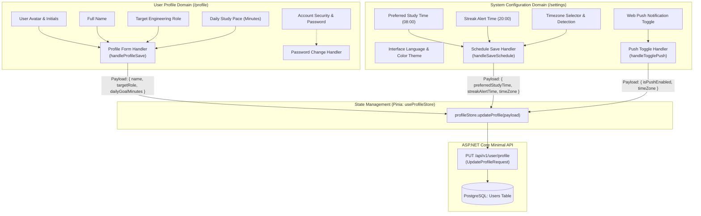
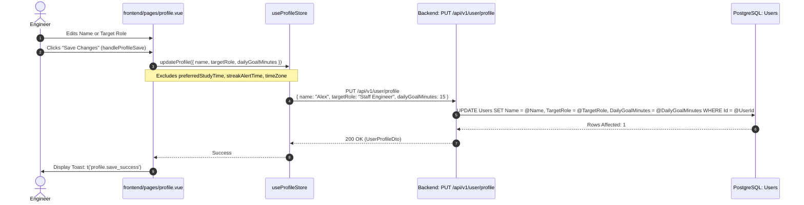
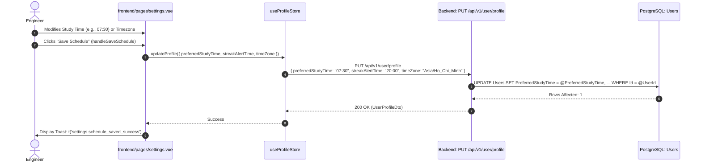
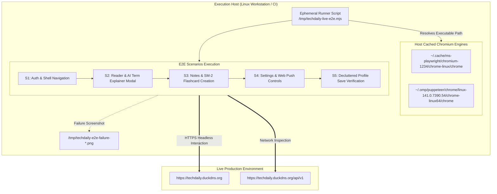

# Technical Design: Deduplicate Profile Notification Settings and Live Production E2E Verification Plan

## 1. Architecture Overview

This technical design establishes a strict separation of concerns between user identity management and system configuration, while defining a zero-repo-footprint live production end-to-end (E2E) verification harness.

### 1.1 Separation of Concerns: Identity vs Configuration

The TechDaily frontend architecture is refined into two distinct, non-overlapping domains:



#### Key Domain Invariants:
1. **`/profile` Domain Boundary:** Exclusively manages personal identity and study pace. It does **not** render schedule time inputs or timezone indicators, and it does **not** render links or redirect bridges to `/settings`.
2. **`/settings` Domain Boundary:** Exclusively manages application behavior, notifications, study reminder dispatch times, and timezone preferences.
3. **Partial Update Invariant:** The backend API endpoint `PUT /api/v1/user/profile` accepts an `UpdateProfileRequest` with nullable properties. Omitting `PreferredStudyTime`, `StreakAlertTime`, and `TimeZone` from `/profile` updates preserves their existing values in PostgreSQL without modification.

---

## 2. Component Data Flow & Sequence Diagrams

### 2.1 Decluttered Profile Update Sequence

When the user updates their name, target role, or daily goal minutes in `/profile`, the form submits a lean payload containing only identity attributes:



### 2.2 Settings Notification & Schedule Update Sequence

All notification scheduling and timezone modifications occur exclusively within `frontend/pages/settings.vue`:



---

## 3. Zero-Repo-Footprint Live Production E2E Execution Strategy

### 3.1 Design Principles
- **Zero Repo Footprint:** Absolutely no test files, fixtures, or npm configurations are committed into the TechDaily repository (`frontend/`, `backend/`, or root).
- **Ephemeral Runner:** The test runner is written to `/tmp/techdaily-live-e2e.mjs` and executed directly via `node`.
- **Pre-cached Chromium Utilization:** Automatically detects and resolves pre-cached browser binaries already present on the execution host:
  - `~/.cache/ms-playwright/chromium-*/chrome-linux/chrome`
  - `~/.omp/puppeteer/chrome/linux-*/chrome-linux64/chrome`
- **Target Environment:** Live production deployment at `https://techdaily.duckdns.org`.



---

## 4. Detailed Test Scenario Specifications

### Scenario 1 (S1): Authentication & Navigation Shell
- **Objective:** Validate that an authenticated session can be established and that primary navigational routes are responsive and healthy.
- **Workflow:**
  1. Launch headless Chromium with viewport `1280x800`.
  2. Navigate to `https://techdaily.duckdns.org/login`.
  3. Fill test credentials (or authenticate via configured session) and submit login.
  4. Wait for redirection to `/` or `/today`.
  5. Assert that navigation bar items (`Today`, `Library`, `Drills`, `Notes`, `Review`, `Settings`, `Profile`) are visible and interactable.
  6. Assert no uncaught JavaScript exceptions appear in browser console logs.

### Scenario 2 (S2): Reader & AI Term Explainer Modal
- **Objective:** Verify reading slice presentation, AI Term Explainer invocation, bilingual layout rendering, and modal responsive geometry (no overflow).
- **Workflow:**
  1. Navigate to `/today` or active reading slice `/reader`.
  2. Locate a technical term or highlight within the reader content, or trigger the term explanation interaction.
  3. Wait for the AI Term Explainer modal to mount in the DOM.
  4. Assert bilingual layout:
     - English technical term title & source definition section.
     - Vietnamese contextual explanation & architectural trade-offs section.
  5. Geometric Layout Check:
     - Query modal container bounding box via `element.boundingBox()`.
     - Verify `box.width <= viewport.width` and `box.height <= viewport.height`.
     - Evaluate `document.documentElement.scrollWidth <= document.documentElement.clientWidth` to verify zero horizontal page blowout.
  6. Close modal via Escape key or backdrop click; assert modal unmounts cleanly.

### Scenario 3 (S3): Notes & SM-2 Flashcard Creation & Review Queue
- **Objective:** Verify that generating a spaced repetition card from a highlight note in `/notes` executes without Vue Composition API injection errors and successfully enqueues the flashcard.
- **Workflow:**
  1. Navigate to `https://techdaily.duckdns.org/notes`.
  2. Attach page error listener to catch any unhandled client exceptions.
  3. Locate the first available highlight note card with the "Flashcard SM-2" action button.
  4. Click "Flashcard SM-2".
  5. Assert that console receives **zero** exceptions matching `[vue-i18n] Not found injection "vue-i18n"`.
  6. Wait for success toast notification (verifying `toast_flashcard_success` localization).
  7. Navigate to `https://techdaily.duckdns.org/review`.
  8. Assert review dashboard loads and flashcard queue displays active deck statistics.

### Scenario 4 (S4): Settings & Web Push
- **Objective:** Confirm `/settings` functions as the sole authority for notification scheduling and timezone preferences, and handles browser-specific push service constraints.
- **Workflow:**
  1. Navigate to `https://techdaily.duckdns.org/settings`.
  2. Assert Presence of the "Notification Schedule & Timezone Settings" card:
     - Preferred Study Time (`input[type="time"]`).
     - Streak Alert Time (`input[type="time"]`).
     - Timezone selector (`select`).
  3. Update preferred study time to `"08:30"`, click "Save Schedule".
  4. Assert network response `PUT /api/v1/user/profile` returns `200 OK` with updated schedule fields.
  5. Verify push notification toggle UI:
     - If push service is blocked or simulating Brave privacy mode, assert that the user guidance (`settings.brave_push_service_blocked`) is rendered appropriately without raw unhandled exception strings.

### Scenario 5 (S5): Decluttered Profile Form Save Verification
- **Objective:** Confirm `/profile` has been completely purged of duplicate schedule/timezone inputs and links to settings, and that profile form submission sends only identity fields.
- **Workflow:**
  1. Navigate to `https://techdaily.duckdns.org/profile`.
  2. Assert complete absence of schedule inputs:
     - Assert `page.locator('input[type="time"]').count() === 0`.
     - Assert text content does not contain `"Study Schedule & Timezone"`.
     - Assert no `Clock` or `Globe` icon elements exist in the profile form.
  3. Assert no link to settings:
     - Assert `page.locator('a[href="/settings"]').count() === 0` within the profile container.
  4. Intercept network request for `PUT /api/v1/user/profile`.
  5. Fill new name (e.g., `"Senior Engineer Test"`) and select target role.
  6. Click "Save Changes" (`button[type="submit"]`).
  7. Inspect intercepted request payload:
     - Assert `payload.name === "Senior Engineer Test"`.
     - Assert `payload.targetRole` is present.
     - Assert `payload.dailyGoalMinutes` is present.
     - Assert `payload.preferredStudyTime === undefined`.
     - Assert `payload.streakAlertTime === undefined`.
     - Assert `payload.timeZone === undefined`.
  8. Assert success toast appears (`t('profile.save_success')`).
  9. Reload page (`page.reload()`) and assert updated name is preserved.

---

## 5. Implementation Details: `profile.vue` Clean Cutover

### 5.1 Script Setup Clean-up
```typescript
// REMOVE from imports:
// Globe, Clock

// REMOVE from reactive state:
// const preferredStudyTime = ref('08:00')
// const streakAlertTime = ref('20:00')
// const timeZone = ref(...)

// REMOVE from onMounted():
// if (data.user.preferredStudyTime) preferredStudyTime.value = data.user.preferredStudyTime
// if (data.user.streakAlertTime) streakAlertTime.value = data.user.streakAlertTime
// if (data.user.timeZone ...) ...

// UPDATE handleProfileSave():
async function handleProfileSave() {
  try {
    await profileStore.updateProfile({
      name: name.value.trim(),
      targetRole: targetRole.value,
      dailyGoalMinutes: dailyGoalMinutes.value
    })

    toast.success(t('profile.save_success'))
  } catch (err: unknown) {
    toast.error(formatError(err, 'profile.save_failed'))
  }
}
```

### 5.2 Template Clean-up
Excise lines 358–398 in `frontend/pages/profile.vue`:
```html
<!-- REMOVE ENTIRE BLOCK -->
<!-- Study Schedule & Timezone -->
<div class="p-4 rounded-xl bg-slate-50/70 dark:bg-slate-950/40 border border-slate-200 dark:border-slate-800 space-y-3">
  ...
</div>
```

---

## 6. Runner Script Architecture (`/tmp/techdaily-live-e2e.mjs`)

The standalone runner follows an asynchronous modular structure:

```javascript
import { chromium } from 'playwright' // or dynamically loaded from playwright core
import fs from 'fs'

const BASE_URL = process.env.LIVE_URL || 'https://techdaily.duckdns.org'
const CHROMIUM_PATH = resolveChromiumBinary()

async function main() {
  const browser = await chromium.launch({
    executablePath: CHROMIUM_PATH,
    headless: true,
    args: ['--no-sandbox', '--disable-setuid-sandbox', '--disable-dev-shm-usage']
  })
  const context = await browser.newContext({ viewport: { width: 1280, height: 800 } })
  const page = await context.newPage()

  const report = { passed: [], failed: [], duration: 0 }
  const start = Date.now()

  try {
    await runScenario1(page, report)
    await runScenario2(page, report)
    await runScenario3(page, report)
    await runScenario4(page, report)
    await runScenario5(page, report)
  } finally {
    report.duration = Date.now() - start
    await browser.close()
    printReport(report)
  }
}
```

### 6.1 Artifact & Screenshot Management
- In case of failure in any scenario $S_i$, the runner captures `page.screenshot({ path: '/tmp/techdaily-e2e-failure-s${i}.png', fullPage: true })`.
- All execution artifacts remain strictly outside the git tree under `/tmp/`.
- Zero files are added to `git status`.
