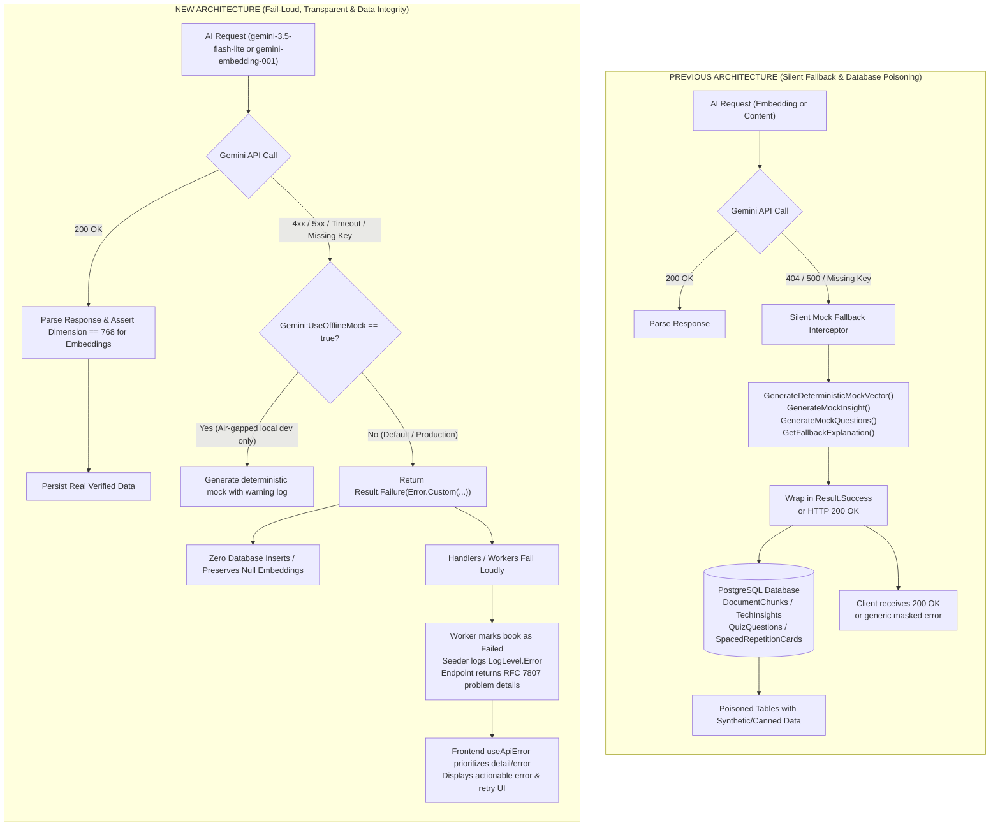
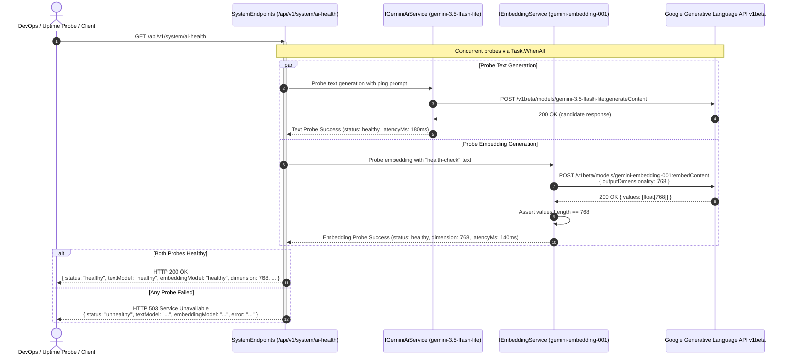

# Technical Design: Fail Loud & Transparent: Eliminate Silent Fallbacks, Fix Gemini Embedding Model, and Add AI Health Check

## 1. Architecture Overview

This technical design document outlines the architectural changes required to transition TechDaily's AI generation, vector embedding, and ingestion subsystems from **silent, error-masking mock fallbacks** to a **strict, fail-loud, and transparent** paradigm.

### 1.1 Architectural Contrast: Silent Fallback vs Fail-Loud

The previous architecture silently masked failures by generating synthetic noise and canned entities, resulting in database pollution and opaque client errors:



---

### 1.2 System AI Health Check Flow

The new health check endpoint `GET /api/v1/system/ai-health` provides end-to-end operational verification across both text generation and vector embedding models:



---

## 2. Detailed Technical Design & Implementation Boundaries

### 2.1 Standardized AI Models & Configuration Matrix

TechDaily standardizes on two dedicated Google Gemini models:
- **Text Generation Model:** `gemini-3.5-flash-lite` across all environments (`appsettings.json`, `appsettings.Development.json`, `appsettings.Local.json`, `GeminiAiService.cs`, `TermExplanationService.cs`). Selected for superior instruction following, under-the-hood technical analysis, and Vietnamese technical phrasing while retaining <200ms latency.
- **Vector Embedding Model:** `gemini-embedding-001` with explicit Matryoshka Representation Learning (MRL) truncation to `outputDimensionality: 768` to strictly match PostgreSQL `vector(768)` columns.

#### Configuration Matrix across Environments

| Configuration Key | `appsettings.json` (Production) | `appsettings.Development.json` | `appsettings.Local.json` | Code Fallback Default |
| :--- | :--- | :--- | :--- | :--- |
| `Gemini:Model` | `"gemini-3.5-flash-lite"` | `"gemini-3.5-flash-lite"` | `"gemini-3.5-flash-lite"` | `"gemini-3.5-flash-lite"` (`GeminiAiService`, `TermExplanationService`) |
| `Gemini:EmbeddingModel` | `"gemini-embedding-001"` | `"gemini-embedding-001"` | `"gemini-embedding-001"` | `"gemini-embedding-001"` (`GeminiEmbeddingService`) |
| `Gemini:UseOfflineMock` | `false` | `false` (or `true` if air-gapped) | `false` | `false` |

#### Environment Configuration Files

The Google Generative Language API v1beta has deprecated `text-embedding-004`, returning `HTTP 404 Not Found`. We update the configuration files across all environments to specify both models:

- `backend/src/TechDaily.Api/appsettings.json`:
  ```json
  "Gemini": {
    "ApiKey": "",
    "Model": "gemini-3.5-flash-lite",
    "EmbeddingModel": "gemini-embedding-001",
    "UseOfflineMock": false
  }
  ```
- `backend/src/TechDaily.Api/appsettings.Development.json`:
  ```json
  "Gemini": {
    "Model": "gemini-3.5-flash-lite",
    "EmbeddingModel": "gemini-embedding-001",
    "UseOfflineMock": false
  }
  ```
- `backend/src/TechDaily.Api/appsettings.Local.json` (if present or when created for local overrides):
  ```json
  "Gemini": {
    "Model": "gemini-3.5-flash-lite",
    "EmbeddingModel": "gemini-embedding-001",
    "UseOfflineMock": false
  }
  ```
#### Matryoshka Representation Learning (MRL) Payload Alignment
PostgreSQL schema in `TechDailyDbContext.cs` configures `vector(768)`:
```csharp
modelBuilder.Entity<DocumentChunk>().Property(c => c.Embedding).HasColumnType("vector(768)");
modelBuilder.Entity<TermExplanationCache>().Property(t => t.Embedding).HasColumnType("vector(768)");
```

`gemini-embedding-001` natively supports MRL. To enforce that the Google API outputs exactly 768 dimensions instead of its default 3072 or 1536 dimensions, the request bodies must specify `outputDimensionality: 768`.

##### Single Embedding Request (`embedContent`):
```json
{
  "model": "models/gemini-embedding-001",
  "content": {
    "parts": [
      { "text": "clean text sample..." }
    ]
  },
  "outputDimensionality": 768
}
```

##### Batch Embedding Request (`batchEmbedContents`):
```json
{
  "requests": [
    {
      "model": "models/gemini-embedding-001",
      "content": {
        "parts": [
          { "text": "chunk text 1..." }
        ]
      },
      "outputDimensionality": 768
    },
    {
      "model": "models/gemini-embedding-001",
      "content": {
        "parts": [
          { "text": "chunk text 2..." }
        ]
      },
      "outputDimensionality": 768
    }
  ]
}
```

##### Dimension Verification in `GeminiEmbeddingService`:
When parsing the JSON response:
```csharp
if (doc.RootElement.TryGetProperty("embedding", out var embeddingProp) &&
    embeddingProp.TryGetProperty("values", out var valuesProp))
{
    var valuesList = valuesProp.EnumerateArray().Select(v => v.GetSingle()).ToArray();
    if (valuesList.Length != 768)
    {
        _logger.LogError("Gemini embedding returned {Count} dimensions; expected 768.", valuesList.Length);
        return Error.Custom("Embedding.DimensionMismatch", $"Expected 768 dimensions but received {valuesList.Length}.");
    }
    return new Vector(valuesList);
}
```

---

### 2.2 Fail-Loud Embedding Service Architecture (`GeminiEmbeddingService.cs`)

1. **Elimination of Silent Mock Generation:**
   - Remove unconditional fallback to `GenerateDeterministicMockVector` in `GenerateEmbeddingAsync` and `GenerateBatchEmbeddingsAsync`.
   - Missing API key returns:
     ```csharp
     if (string.IsNullOrWhiteSpace(_apiKey))
     {
         if (_useOfflineMock)
         {
             _logger.LogWarning("Gemini API key is not configured. Gemini:UseOfflineMock is true; returning deterministic mock vector.");
             return GenerateDeterministicMockVector(text);
         }
         _logger.LogError("Gemini API key is not configured.");
         return Error.Custom("Embedding.MissingApiKey", "Gemini API key is not configured.");
     }
     ```
   - HTTP status error or exceptions return:
     ```csharp
     if (!response.IsSuccessStatusCode)
     {
         var errBody = await response.Content.ReadAsStringAsync(cancellationToken);
         _logger.LogError("Gemini Embedding API returned status {Status}: {Error}.", response.StatusCode, errBody);
         
         if (_useOfflineMock)
         {
             _logger.LogWarning("Gemini:UseOfflineMock is true; falling back to deterministic mock vector.");
             return GenerateDeterministicMockVector(text);
         }
         return Error.Custom("Embedding.ApiError", $"Gemini Embedding API returned status {response.StatusCode}: {errBody}");
     }
     ```
   - Batch sequential fallback: if the batched endpoint fails and sequential calls fail, return `Result<List<Vector>>.Failure`—never substitute fake vectors.

---

### 2.3 Background Seeder & Ingestion Pipeline Integrity

#### CurriculumSeeder (`CurriculumSeeder.BackfillEmbeddingsAsync`)
- **Previous behavior:** Silently ignored failures; if mock vectors were active, saved random vectors to `DocumentChunks`.
- **New behavior:**
  - Execute `await embeddingService.GenerateBatchEmbeddingsAsync(texts, cancellationToken)`.
  - If `!embResult.IsSuccess` or count does not match:
    - Log with `_logger.LogError("Curriculum vector backfill failed: {Error}", embResult.Error.Message)`.
    - Do **not** assign fake vectors.
    - Leave `chunk.Embedding = null` in PostgreSQL.
    - `context.SaveChangesAsync()` is not called for failed chunks, allowing subsequent startups or backfill runs to retry.

#### PDF Ingestion Worker (`PdfIngestionWorker.cs`)
- **Previous behavior:** Caught embedding errors with `_logger.LogWarning` and marked the book as `ProcessingStatus.Ready`.
- **New behavior:**
  - Ingestion pipeline divides extraction from enrichment:
    - If initial slice AI formatting or embedding fails due to unhandled exceptions or critical API failures, transition the book state:
      ```csharp
      book.Status = ProcessingStatus.Failed;
      book.StatusMessage = "Embedding generation failed";
      book.ErrorMessage = $"Failed to vectorize document chunks: {embEx.Message}";
      await dbContext.SaveChangesAsync(stoppingToken);
      ```
    - Ensure temporary files are cleaned up in `finally`.
    - Prevent half-ingested documents from masquerading as `Ready`.

---

### 2.4 Elimination of Canned Fallback Entities in AI Handlers

#### `GeminiAiService.cs`:
0. **Model Default Fallback Update:**
   - Update constructor default fallback model from `gemini-3.1-flash-lite` to `gemini-3.5-flash-lite`:
     `_model = configuration["Gemini:Model"] ?? "gemini-3.5-flash-lite";`
1. **`GenerateInsightAsync`:**
   - Remove `GenerateMockInsight` call on error or missing API key.
   - Return `Result<TechInsight>.Failure(Error.Custom("AiService.Unavailable", "Gemini AI insight generation service is unavailable."))`.
   - `GenerateInsightHandler.cs` receives this failure and returns `Result<TechInsightDto>.Failure(result.Error)`. Zero records are inserted into `TechInsights`.
2. **`GenerateQuestionsAsync`:**
   - Remove `GenerateMockQuestions` call on error or missing API key.
   - Return `Result<List<QuizQuestion>>.Failure(Error.Custom("AiService.Unavailable", "Gemini AI quiz generation service is unavailable."))`.
   - `GenerateQuizHandler.cs` receives this failure and does not persist canned quiz questions to `QuizQuestions`.
3. **`SynthesizeActiveRecallCardAsync` & `CreateCardFromHighlightHandler`:**
   - Change signature of `SynthesizeActiveRecallCardAsync` to return `Task<Result<(string Front, string Back)>>`.
   - On missing API key, HTTP error, or candidate parsing error, return `Result.Failure(Error.Custom("AiService.RecallSynthesisFailed", ...))`.
   - `CreateCardFromHighlightHandler.cs` inspects `result.IsSuccess`. If failure, it returns `result.Error` without persisting any record to `SpacedRepetitionCards`.

#### `TermExplanationService.cs`:
0. **Model Default Fallback Update:**
   - Update constructor default fallback model from `gemini-3.1-flash-lite` to `gemini-3.5-flash-lite`:
     `_model = configuration["Gemini:Model"] ?? "gemini-3.5-flash-lite";`
- Remove `GetFallbackExplanation` return with `TermExplanationResult(fallback, false)`.
- If Gemini API fails, returns HTTP error, or candidates are empty:
  - Return `Result<TermExplanationResult>.Failure(Error.Custom("AiService.Unavailable", "AI term explanation service is temporarily unavailable."))`.
- `ExplainTermHandler.cs` forwards this failure.
- `DailyFocusEndpoints.cs` maps this to `Results.BadRequest(new { code = result.Error.Code, error = result.Error.Message })` or `Results.StatusCode(503)`.
- `TermExplainerModal.vue` displays:
  - State: Error card with warning icon.
  - Message: Localized "AI service temporarily unavailable" or detailed server diagnostic.
  - Action: "Try Again" button re-invoking `loadExplanation()`.

---

### 2.5 Frontend Error Transparency (`frontend/composables/useApiError.ts`)

#### Error Extraction Precedence
Current logic checks `fallbackKey` before inspecting the backend error payload. The revised precedence strictly extracts backend diagnostics first:

```typescript
export function useApiError() {
  // ...
  function formatError(err: unknown, fallbackKey?: string): string {
    if (!err) {
      return fallbackKey && te(fallbackKey) ? t(fallbackKey) : ''
    }

    const errorObj = typeof err === 'object' && err !== null ? (err as Record<string, unknown>) : null
    const responseData = (errorObj?.data || (errorObj as any)?.response?._data) as Record<string, unknown> | undefined

    // 1. High-Priority: RFC 7807 problem details 'detail'
    if (responseData && typeof responseData.detail === 'string' && responseData.detail.trim()) {
      return responseData.detail.trim()
    }
    if (errorObj && typeof errorObj.detail === 'string' && errorObj.detail.trim()) {
      return errorObj.detail.trim()
    }

    // 2. High-Priority: Backend custom 'error' message
    if (responseData && typeof responseData.error === 'string' && responseData.error.trim()) {
      return responseData.error.trim()
    }
    if (errorObj && typeof errorObj.error === 'string' && errorObj.error.trim()) {
      return errorObj.error.trim()
    }

    // 3. Machine-readable error code mapping
    const code = (responseData?.code || errorObj?.code) as string | undefined
    if (code && typeof code === 'string') {
      const i18nKey = `api_errors.${code}`
      if (te(i18nKey)) {
        return t(i18nKey)
      }
    }

    // 4. Network / offline failure detection
    const message = (responseData?.message || errorObj?.message) as string | undefined
    const isNetworkError =
      errorObj?.name === 'TypeError' &&
      typeof message === 'string' &&
      (message.includes('fetch') ||
        message.includes('network') ||
        message.includes('Failed to fetch') ||
        message.includes('NetworkError'))

    if (isNetworkError && te('api_errors.NETWORK_ERROR')) {
      return t('api_errors.NETWORK_ERROR')
    }

    // 5. Meaningful backend message (if not generic HTTP status)
    if (message && !message.startsWith('HTTP Error') && !/^\d+$/.test(message.trim())) {
      return message
    }

    // 6. Caller-specified fallback key (only if backend did not provide detail/error)
    if (fallbackKey && te(fallbackKey)) {
      return t(fallbackKey)
    }
    if (fallbackKey && !i18n) {
      return fallbackKey
    }

    // 7. General server error fallback
    if (te('api_errors.SERVER_ERROR')) {
      return t('api_errors.SERVER_ERROR')
    }

    return 'An unexpected error occurred. Please try again.'
  }

  return { formatError, t }
}
```

#### Catch Block Clean-Up:
- `frontend/pages/quiz.vue` line 117:
  - Replace `libraryStore.fetchBooks().catch(() => {})` with proper logger or user notification:
    `libraryStore.fetchBooks().catch((err) => console.warn('Failed to load grounded books for quiz selector:', err))`
- `frontend/stores/useLibraryStore.ts` lines 219, 260:
  - Add `error.value = formatError(err)` or `console.error` rather than empty catch blocks.

---

### 2.6 System AI Health Check Endpoint (`GET /api/v1/system/ai-health`)

#### Endpoint Registration:
Add `SystemEndpoints.cs` in `backend/src/TechDaily.Api/Endpoints/SystemEndpoints.cs` and map in `Program.cs`:
```csharp
app.MapGroup("/api/v1/system")
   .WithTags("System Diagnostics & Health")
   .MapSystemEndpoints();
```

#### Endpoint Behavior:
1. Concurrently ping `IGeminiAiService` text model (`gemini-3.5-flash-lite`) and `IEmbeddingService` model (`gemini-embedding-001`) via `Task.WhenAll`.
2. Text probe: prompts Gemini with a short token request (e.g. `"ping"`), timing the execution and returning latency and status.
3. Embedding probe: calls `IEmbeddingService.GenerateEmbeddingAsync("health-check")` (`gemini-embedding-001`), timing execution and verifying that returned vector dimension == 768, returning status, latency, and dimension.
4. Response contracts:

##### HTTP 200 OK Response Schema:
```json
{
  "status": "healthy",
  "textModel": "healthy",
  "embeddingModel": "healthy",
  "dimension": 768,
  "details": {
    "text": {
      "model": "gemini-3.5-flash-lite",
      "status": "healthy",
      "latencyMs": 245
    },
    "embedding": {
      "model": "gemini-embedding-001",
      "status": "healthy",
      "dimension": 768,
      "latencyMs": 182
    }
  },
  "timestamp": "2026-09-16T12:00:00Z"
}
```

##### HTTP 503 Service Unavailable Response Schema:
```json
{
  "status": "unhealthy",
  "textModel": "healthy",
  "embeddingModel": "unhealthy",
  "dimension": null,
  "error": "Embedding probe failed: Expected 768 dimensions but received 3072",
  "details": {
    "text": {
      "model": "gemini-3.5-flash-lite",
      "status": "healthy",
      "latencyMs": 245
    },
    "embedding": {
      "model": "gemini-embedding-001",
      "status": "unhealthy",
      "error": "Expected 768 dimensions but received 3072",
      "latencyMs": 190
    }
  },
  "timestamp": "2026-09-16T12:00:00Z"
}
```

---

## 3. Verification & Testing Strategy

1. **Unit Tests for `GeminiEmbeddingService`:**
   - Verify `outputDimensionality: 768` is present in generated HTTP request bodies.
   - Verify HTTP 4xx/5xx responses return `Result.Failure(Error.Custom("Embedding.ApiError", ...))`.
   - Verify missing API key returns `Result.Failure` when `UseOfflineMock == false`.
   - Verify deterministic mock vector is only returned when `UseOfflineMock == true`.
2. **Unit Tests for `GeminiAiService` and Handlers:**
   - Verify `GenerateInsightAsync` returns `Result.Failure` on Gemini error; assert `TechInsights` table has 0 new records.
   - Verify `GenerateQuestionsAsync` returns `Result.Failure` on Gemini error; assert `QuizQuestions` table has 0 new records.
   - Verify `SynthesizeActiveRecallCardAsync` returns `Result.Failure`; assert `SpacedRepetitionCards` has 0 new records.
   - Verify `TermExplanationService.ExplainTermAsync` returns `Result.Failure`; assert no fallback generic string is returned.
3. **Integration Tests for Health Check Endpoint:**
   - Send `GET /api/v1/system/ai-health` with mocked/stubbed Gemini HTTP handlers and verify 200 OK and 503 Service Unavailable payloads.
4. **Frontend Unit Tests for `useApiError`:**
   - Test that RFC 7807 `{ detail: "Custom backend error" }` takes precedence over `fallbackKey`.
   - Test that `{ error: "Gemini quota exceeded" }` takes precedence over `fallbackKey`.
