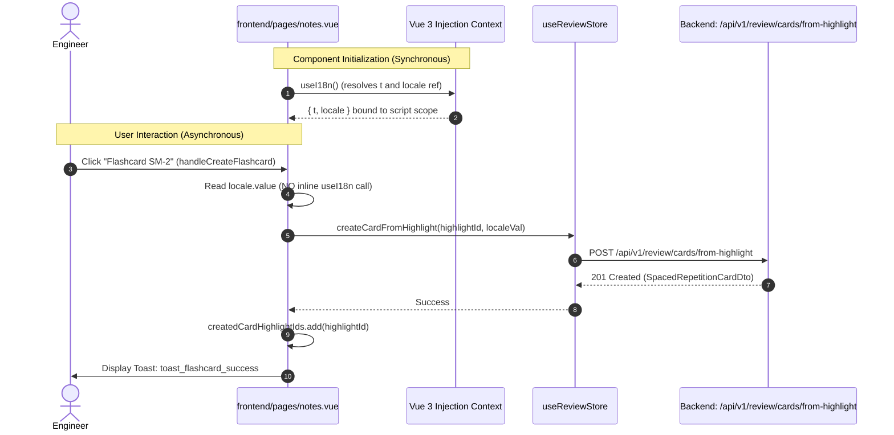
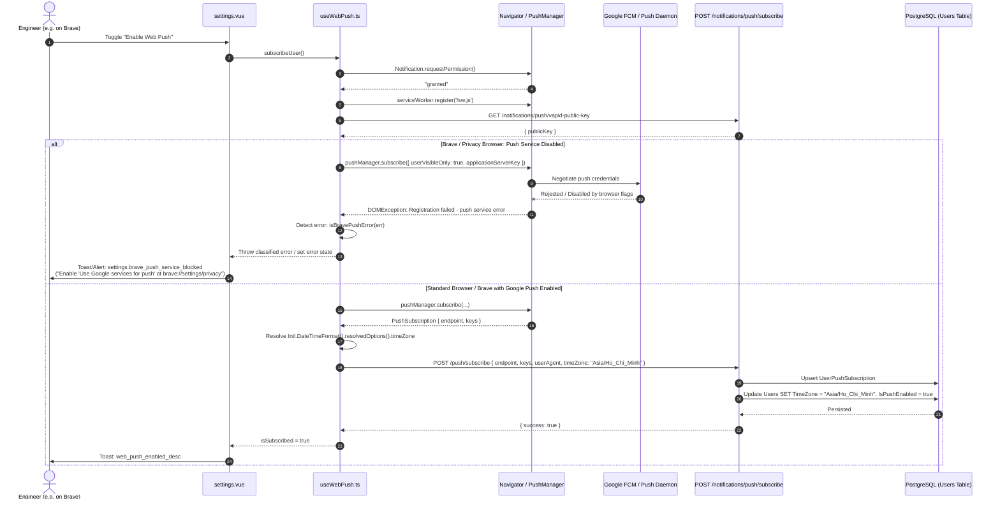

# Technical Design: Fix Notes Flashcard Creation, Handle Brave Push Service, and Auto-Sync Timezone

## 1. Architecture Overview

This technical design addresses three targeted engineering challenges across the client and server application layers:
1. **Vue 3 Composition API Lifecycle Conformance:** Correcting composable invocation timing in `frontend/pages/notes.vue` to prevent injection context loss.
2. **Brave Push Service Guard & User Guidance:** Implementing resilient detection and actionable error localization for Chromium-based privacy browsers where Google FCM services are disabled by default.
3. **Automated Timezone Synchronization:** Expanding the Web Push subscription handshake to automatically sync the user's IANA timezone without requiring separate manual profile edits.

```mermaid
flowchart TD
    subgraph NotesView ["Notes View (frontend/pages/notes.vue)"]
        TopLevel["Top-Level &lt;script setup&gt;:<br/>const { t, locale } = useI18n()"]
        UserClick["User Clicks 'Flashcard SM-2'"]
        CardHandler["handleCreateFlashcard(highlightId)"]
        ReviewStore["reviewStore.createCardFromHighlight(id, locale.value)"]
        
        TopLevel -.->|Synchronously captured locale ref| CardHandler
        UserClick --> CardHandler --> ReviewStore
    end

    subgraph PushSubscription ["Web Push Pipeline (frontend & backend)"]
        SettingsUI["Settings View (settings.vue)"]
        UseWebPush["Composable (useWebPush.ts)"]
        SW["Service Worker (sw.js)"]
        PushAPI["API: POST /notifications/push/subscribe"]
        Db[(PostgreSQL: Users & UserPushSubscriptions)]
        
        SettingsUI -->|Toggle Push On| UseWebPush
        UseWebPush -->|navigator.serviceWorker.ready| SW
        UseWebPush -->|pushManager.subscribe()| PushService{Browser Push Service}
        
        PushService -- Error: 'push service error' --> BraveCheck{Brave Detected?}
        BraveCheck -- Yes --> ActionableError["Set Error: brave_push_service_blocked<br/>Display brave://settings/privacy guidance"]
        ActionableError --> SettingsUI
        
        PushService -- Success --> ExtractedSub["Subscription JSON Keys + Intl TimeZone"]
        ExtractedSub --> PushAPI
        PushAPI -->|Update TimeZone & IsPushEnabled| Db
    end
```

---

## 2. Sequence Diagrams

### 2.1 Notes Flashcard Creation Flow
The diagram below shows how synchronous capture of the `locale` ref prevents injection crashes during asynchronous user interactions.



### 2.2 Web Push Subscription with Auto-Timezone Sync & Brave Protection



---

## 3. Component & Technical Specifications

### 3.1 Vue 3 Composition API Lifecycle Conformance (`notes.vue`)

#### Technical Cause & Mechanics
In Vue 3, dependency injection via `inject(injectionKey)` functions by retrieving values from the current component instance:
```typescript
// Conceptual Vue 3 core behavior:
function inject(key, defaultValue) {
  const instance = currentInstance || (currentApp && currentApp._context)
  if (instance) {
    // resolve provided dependency
  } else {
    warn(`inject() can only be used inside setup() or functional components.`)
  }
}
```
When `handleCreateFlashcard` is triggered as an event listener, Vue's internal `currentInstance` pointer is reset to `null` during asynchronous dispatch. Calling `useI18n()` inside `handleCreateFlashcard` throws:
`[vue-i18n] Not found injection "vue-i18n"`.

#### Implementation Refactoring
In `frontend/pages/notes.vue`:
```typescript
// BEFORE:
const { t } = useI18n()
// ...
async function handleCreateFlashcard(highlightId: string) {
  creatingCardHighlightId.value = highlightId
  try {
    const localeVal = (useI18n().locale.value as string) || 'en' // <-- CRASHES HERE
    await reviewStore.createCardFromHighlight(highlightId, localeVal)
    // ...
```
```typescript
// AFTER:
const { t, locale } = useI18n()
// ...
async function handleCreateFlashcard(highlightId: string) {
  creatingCardHighlightId.value = highlightId
  try {
    const localeVal = (locale.value as string) || 'en' // <-- SAFE: captured ref in scope
    await reviewStore.createCardFromHighlight(highlightId, localeVal)
    // ...
```

---

### 3.2 Auto-Sync Timezone on Push Subscription

#### Frontend Composable (`useWebPush.ts`)
The `subscribeUser` function will resolve the system/browser IANA timezone identifier via `Intl.DateTimeFormat().resolvedOptions().timeZone`:
```typescript
const clientTimeZone = Intl.DateTimeFormat().resolvedOptions().timeZone || 'UTC'

await api.post('/api/v1/notifications/push/subscribe', {
  endpoint: json.endpoint,
  keys: {
    p256dh: json.keys.p256dh,
    auth: json.keys.auth
  },
  userAgent: navigator.userAgent,
  timeZone: clientTimeZone
})
```
Optionally, `subscribeUser(preferredTimeZone?: string)` can accept an override if the user explicitly picked a timezone from a dropdown in `settings.vue`, falling back to the browser-detected timezone.

#### Backend DTO Expansion (`NotificationEndpoints.cs`)
Expand `SubscribePushRequest`:
```csharp
public record SubscribePushRequest(
    string Endpoint,
    PushSubscriptionKeys Keys,
    string? UserAgent,
    string? TimeZone = null
);
```

#### Backend Handler Synchronization Logic
In `NotificationEndpoints.MapNotificationEndpoints`:
```csharp
if (!string.IsNullOrWhiteSpace(request.TimeZone))
{
    var trimmedTz = request.TimeZone.Trim();
    // Validate or sanitize using existing worker resolver:
    var resolved = DailyPushNotificationWorker.ResolveTimeZone(trimmedTz);
    user.TimeZone = resolved.Id; // Validated IANA ID or fallback "UTC"
}

user.IsPushEnabled = true;
user.UpdatedAt = DateTime.UtcNow;
await db.SaveChangesAsync(ct);
```
This ensures:
1. Subscription and timezone preference synchronization are transactional within a single database operation.
2. Malformed or invalid timezone strings safely fallback to `"UTC"` rather than crashing the request or breaking the worker.
3. The user immediately receives localized morning and evening reminders without having to find and save a separate settings form.

---

### 3.3 Brave Push Service Detection & Actionable Guidance

#### Detection Heuristics
Brave can be identified through two complementary vectors:
1. **API Check:** `(navigator as any).brave && typeof (navigator as any).brave.isBrave === 'function'`.
2. **Error Signature Matching:** When push messaging is blocked at the browser level, `reg.pushManager.subscribe` rejects with a `DOMException` whose message contains:
   - `"Registration failed - push service error"`
   - `"push service error"`
   - or error name `"AbortError"` with push service context.

Helper function to classify push errors in `useWebPush.ts`:
```typescript
export function isBravePushServiceError(err: unknown): boolean {
  if (!(err instanceof Error)) return false
  const msg = err.message || ''
  const isPushServiceErr = msg.includes('push service error') || msg.includes('Registration failed')
  const isBraveBrowser = typeof (navigator as any)?.brave?.isBrave === 'function'
  return isPushServiceErr && (isBraveBrowser || msg.toLowerCase().includes('push service'))
}
```

#### Structured Error State in `useWebPush.ts`
Introduce a specific error code or state in `useWebPush`:
```typescript
export interface WebPushError {
  code: 'PERMISSION_DENIED' | 'NOT_SUPPORTED' | 'BRAVE_PUSH_SERVICE_DISABLED' | 'SUBSCRIPTION_FAILED'
  message: string
}
```
Or set a reactive state `isBraveBlocked = ref(false)` and provide a dedicated error message key. When `isBravePushServiceError(err)` returns `true`:
- Set `error.value = 'settings.brave_push_service_blocked'`
- Do not log unhandled runtime error to console.
- In `frontend/pages/settings.vue`, when catching the error during `handleTogglePush()`, check if the error matches or inspect `useWebPush` state to render the actionable translation with instructions for `brave://settings/privacy`.

---

### 3.4 Localization Strategy (i18n)

Update `frontend/i18n/locales/en.json` under `settings`:
```json
"brave_push_service_blocked": "Brave requires enabling 'Use Google services for push messaging' at brave://settings/privacy to receive notifications.",
"brave_push_service_instruction": "Open a new tab, navigate to brave://settings/privacy, enable 'Use Google services for push messaging', and restart Brave."
```

Update `frontend/i18n/locales/vi.json` under `settings`:
```json
"brave_push_service_blocked": "Brave yêu cầu bật 'Sử dụng dịch vụ của Google cho tin nhắn đẩy' tại brave://settings/privacy để nhận thông báo.",
"brave_push_service_instruction": "Mở tab mới, truy cập brave://settings/privacy, bật 'Sử dụng dịch vụ của Google cho tin nhắn đẩy' và khởi động lại Brave."
```

---

## 4. Security, Resilience & Privacy Considerations

1. **User Consent Integrity:** Auto-syncing timezone occurs strictly when the user explicitly triggers push notification opt-in. No background telemetry or unsolicited timezone scraping occurs without explicit user action.
2. **Timezone Validation:** Any incoming `timeZone` string is validated against standard system timezones via `DailyPushNotificationWorker.ResolveTimeZone`. Malicious, arbitrary, or buffer-overflowing strings are sanitized and mapped safely to `"UTC"`.
3. **Privacy Browser Respect:** We do not attempt to bypass or exploit browser privacy settings. The application provides clear, educational instructions explaining why Brave behaves this way and empowers the user to decide whether to enable Google push services in their browser configuration.

---

## 5. Testing & Verification Strategy

### 5.1 Frontend Unit Testing (`vitest`)
1. **`notes.vue` Composable Lifecycle:**
   - Mount `notes.vue` using `@vue/test-utils`.
   - Mock `useReviewStore.createCardFromHighlight`.
   - Trigger `handleCreateFlashcard(id)`.
   - Assert `reviewStore.createCardFromHighlight` is called with the active locale string (e.g. `'en'`).
   - Assert no `[vue-i18n]` injection exception is thrown.
2. **`useWebPush.ts` Timezone & Payload:**
   - Test that `subscribeUser` queries `Intl.DateTimeFormat().resolvedOptions().timeZone` and includes `timeZone` in the `POST /api/v1/notifications/push/subscribe` request payload.
3. **`useWebPush.ts` Brave Error Classification:**
   - Mock `reg.pushManager.subscribe` rejecting with `new Error('Registration failed - push service error')`.
   - Simulate `(navigator as any).brave = { isBrave: () => Promise.resolve(true) }`.
   - Verify `useWebPush` flags the error as `BRAVE_PUSH_SERVICE_DISABLED` and returns/sets actionable localized error key.

### 5.2 Backend Testing (`TechDaily.Tests`)
1. **`SubscribePushEndpointTests`:**
   - Test subscribing with a valid IANA timezone (e.g., `"Asia/Ho_Chi_Minh"`): verify `User.TimeZone` is updated in the database.
   - Test subscribing with an empty/null timezone: verify existing `User.TimeZone` is retained.
   - Test subscribing with an invalid timezone string: verify it falls back safely to `"UTC"` without throwing an exception.
