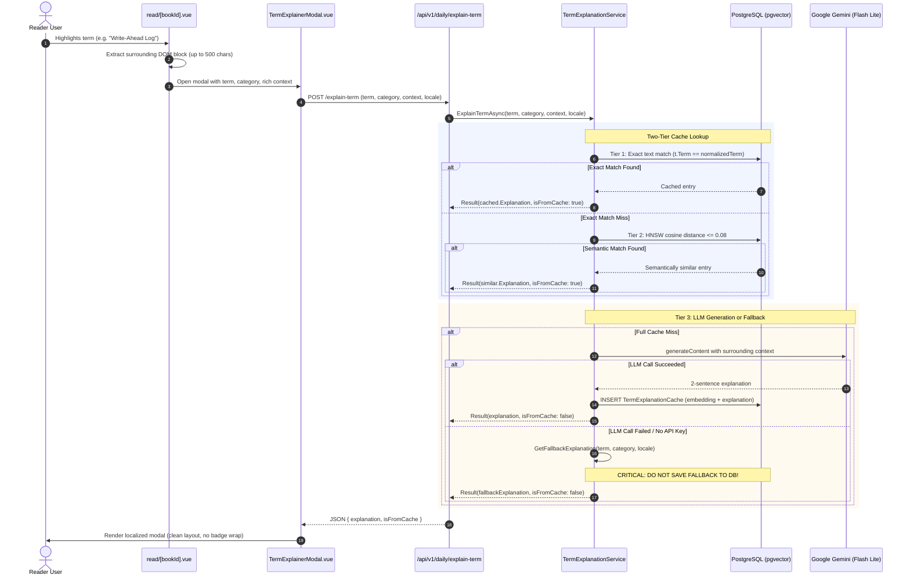
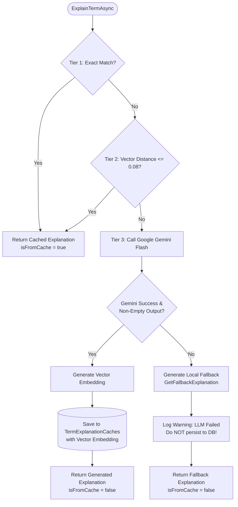

# Technical Design: Fix Term Explainer i18n, Layout, and Context

## 1. Architecture Overview

This design addresses three interconnected layers of the term explanation workflow:
1. **Frontend Presentation & Localization:** Robust responsive flex header layout and multi-language support in `TermExplainerModal.vue`.
2. **Context Enrichment:** Rich DOM paragraph context extraction from user selections in `read/[bookId].vue`.
3. **Backend Cache Hygiene:** Conditional persistence gate in `TermExplanationService.cs` preventing mock/fallback copy from poisoning `TermExplanationCaches`, plus purging legacy poisoned entries.



---

## 2. Frontend Component Layout & i18n (`TermExplainerModal.vue`)

### Problem Analysis
Currently, the modal header template is structured as follows:
```html
<div class="flex items-center justify-between pb-3 border-b border-slate-200 dark:border-slate-800">
  <div class="flex items-center gap-3">
    <!-- Icon -->
    <div class="p-2 rounded-xl ..."><Sparkles class="w-5 h-5" /></div>
    <!-- Title & Badge Container -->
    <div>
      <div class="flex items-center gap-2">
        <span class="text-xs font-bold uppercase ...">{{ category }}</span>
        <span v-if="isFromCache" class="... text-[10px] ...">⚡ Instant Cache</span>
      </div>
      <h3 class="text-lg font-bold ...">{{ term }}</h3>
    </div>
  </div>
  <button @click="emit('close')" class="p-2 ..."><X class="w-5 h-5" /></button>
</div>
```

**Defects:**
1. Outer flex child (`div.flex.items-center.gap-3`) has no `min-w-0` or `flex-1`.
2. Title & badge container (`div`) has no `min-w-0`.
3. Category `span` has no width constraint or truncation (`truncate`).
4. Badge `span` lacks `whitespace-nowrap shrink-0`, allowing `"⚡ Instant Cache"` to break into `"⚡ Instant"` and `"Cache"`.
5. Close button lacks `shrink-0`, risking compression.

### Refined Layout Specification
```html
<!-- Header -->
<div class="flex items-center justify-between gap-3 pb-3 border-b border-slate-200 dark:border-slate-800">
  <div class="flex items-center gap-3 min-w-0 flex-1">
    <div class="p-2 rounded-xl bg-brand-100 dark:bg-brand-500/10 text-brand-700 dark:text-brand-400 border border-brand-200 dark:border-brand-500/20 shrink-0">
      <Sparkles class="w-5 h-5" />
    </div>
    <div class="min-w-0 flex-1">
      <div class="flex items-center gap-2 flex-wrap sm:flex-nowrap">
        <span
          class="text-xs font-bold uppercase tracking-wider text-brand-700 dark:text-brand-400 truncate max-w-[180px] sm:max-w-xs"
          :title="category"
        >
          {{ category }}
        </span>
        <span
          v-if="isFromCache"
          class="inline-flex items-center gap-1 px-2 py-0.5 rounded-full text-[10px] font-bold bg-amber-500/15 text-amber-600 dark:text-amber-400 border border-amber-500/30 shadow-xs whitespace-nowrap shrink-0"
        >
          ⚡ {{ $t("reader.instant_cache") }}
        </span>
      </div>
      <h3 class="text-lg font-bold text-slate-900 dark:text-white leading-tight font-mono mt-0.5 truncate" :title="term">
        {{ term }}
      </h3>
    </div>
  </div>
  <button
    @click="emit('close')"
    class="p-2 rounded-xl text-slate-400 hover:text-slate-900 dark:hover:text-white hover:bg-slate-100 dark:hover:bg-slate-800 transition-colors shrink-0"
    :aria-label="$t('common.close') || 'Close'"
  >
    <X class="w-5 h-5" />
  </button>
</div>
```

### Comprehensive i18n Localization Mapping

| Location in Modal | Hardcoded Copy | i18n Key | English (`en.json`) | Vietnamese (`vi.json`) |
|---|---|---|---|---|
| Cache Badge | `⚡ Instant Cache` | `reader.instant_cache` | `"Instant Cache"` | `"Bộ nhớ tức thì"` |
| Loading Spinner | `"Analyzing term with Google Gemini..."` | `reader.term_explainer_loading` | `"Analyzing term with Google Gemini..."` | `"Đang phân tích thuật ngữ với Google Gemini..."` |
| Modal Footer Left | `"Powered by Google Gemini"` | `reader.term_explainer_powered_by` | `"Powered by Google Gemini"` | `"Được hỗ trợ bởi Google Gemini"` |
| Copy Action Button | `"Copy Explanation"` | `reader.term_explainer_copy` | `"Copy Explanation"` | `"Sao chép giải thích"` |
| Copied State | `"Copied"` | `reader.term_explainer_copied` | `"Copied"` | `"Đã sao chép"` |

---

## 3. Reader Selection Context Extraction (`read/[bookId].vue`)

### Current Deficiency
```typescript
function handleExplainSelection() {
  currentTerm.value = floatingToolbar.value.selectedText;
  currentContext.value = currentChunk.value?.chapterTitle || ""; // <-- Only chapter title!
  floatingToolbar.value.visible = false;
  isExplainerOpen.value = true;
}
```
Passing only `chapterTitle` (e.g., `"Chapter 3: Storage and Retrieval"`) robs the LLM of the paragraph context where the user encountered the term.

### Surrounding Context Extraction Algorithm
When the user selects text or clicks "Explain with Gemini":
1. Check `window.getSelection()`.
2. Inspect the selection's `anchorNode` or `Range.commonAncestorContainer`.
3. Locate the enclosing block element by traversing up the DOM tree until reaching a block node (`P`, `BLOCKQUOTE`, `LI`, `PRE`, `DIV`) or the root markdown reader container (`.prose` / `.doc-reader-content`).
4. Retrieve the `textContent` of the enclosing block element.
5. If the block text length exceeds 500 characters, extract a window of context (up to 500 characters) centered around the selected term or leading up to 250 characters before and 250 characters after the selection offset.
6. Clean up extraneous whitespace and newlines.
7. Fallback to `currentChunk.value?.chapterTitle || ""` if no enclosing text is found.

```typescript
function extractSurroundingContext(selection: Selection | null, maxChars = 500): string {
  if (!selection || selection.rangeCount === 0) return "";
  const range = selection.getRangeAt(0);
  let container: Node | null = range.commonAncestorContainer;

  if (container.nodeType === Node.TEXT_NODE) {
    container = container.parentElement;
  }

  // Walk up to nearest block container within the reader pane
  const blockTags = new Set(["P", "BLOCKQUOTE", "LI", "DIV", "PRE", "SECTION", "ARTICLE"]);
  let blockEl = container as HTMLElement | null;
  while (blockEl && !blockTags.has(blockEl.tagName) && !blockEl.classList.contains("doc-reader-content")) {
    blockEl = blockEl.parentElement;
  }

  const fullText = blockEl?.textContent?.trim().replace(/\s+/g, " ") || "";
  if (!fullText) return "";

  if (fullText.length <= maxChars) {
    return fullText;
  }

  // Window context around selected text
  const selectedStr = selection.toString().trim();
  const idx = fullText.indexOf(selectedStr);
  if (idx === -1) {
    return fullText.slice(0, maxChars);
  }

  const halfWindow = Math.floor((maxChars - selectedStr.length) / 2);
  const start = Math.max(0, idx - halfWindow);
  const end = Math.min(fullText.length, idx + selectedStr.length + halfWindow);
  let snippet = fullText.slice(start, end);
  if (start > 0) snippet = "..." + snippet;
  if (end < fullText.length) snippet = snippet + "...";

  return snippet;
}
```

This context string is captured during selection or passed when triggering `handleExplainSelection`:
```typescript
function handleExplainSelection() {
  currentTerm.value = floatingToolbar.value.selectedText;
  const surrounding = extractSurroundingContext(window.getSelection());
  currentContext.value = surrounding || currentChunk.value?.chapterTitle || "";
  floatingToolbar.value.visible = false;
  isExplainerOpen.value = true;
}
```

---

## 4. Backend Cache Hygiene & Flow (`TermExplanationService.cs`)

### Cache Poisoning Vulnerability
In `TermExplanationService.cs`:
```csharp
if (string.IsNullOrWhiteSpace(explanation))
{
    explanation = GetFallbackExplanation(term, category, locale);
}

// Persists whether explanation was generated by Gemini OR by GetFallbackExplanation!
var newCache = new TermExplanationCache
{
    Term = normalizedTerm,
    Category = safeCategory,
    Locale = locale,
    ExplanationText = explanation,
    Embedding = termVector,
    HitCount = 1
};
await _dbContext.TermExplanationCaches.AddAsync(newCache, cancellationToken);
await _dbContext.SaveChangesAsync(cancellationToken);

return new TermExplanationResult(explanation, false);
```

If Gemini is unavailable or `Gemini:ApiKey` is missing, generic fallback text:
> *"The term '{term}' in {category} represents a core runtime or architectural mechanism governing system performance and data flow."*
gets permanently stored in `TermExplanationCaches`. Future queries hit Tier 1 or Tier 2 cache and return this fallback text, falsely branded with `⚡ Instant Cache`.

### Correct Caching Gate Architecture


### Implementation Logic
```csharp
// 3. Tier 3: Cache Miss - Attempt Gemini Generation
string explanation = string.Empty;
bool isLlmGenerated = false;

if (!string.IsNullOrWhiteSpace(_apiKey))
{
    try
    {
        // ... invoke Gemini API ...
        if (response.IsSuccessStatusCode && !string.IsNullOrWhiteSpace(candidateText))
        {
            explanation = candidateText.Trim();
            isLlmGenerated = true;
        }
    }
    catch (Exception ex) when (ex is not OperationCanceledException)
    {
        _logger.LogWarning(ex, "Gemini API error during term explanation. Using transient fallback.");
    }
}

// 4. Persistence Gate: Only persist verified LLM output to DB cache
if (isLlmGenerated && !string.IsNullOrWhiteSpace(explanation))
{
    try
    {
        var newCache = new TermExplanationCache
        {
            Term = normalizedTerm,
            Category = safeCategory,
            Locale = locale,
            ExplanationText = explanation,
            Embedding = termVector,
            HitCount = 1
        };

        await _dbContext.TermExplanationCaches.AddAsync(newCache, cancellationToken);
        await _dbContext.SaveChangesAsync(cancellationToken);
    }
    catch (Exception ex)
    {
        _logger.LogError(ex, "Failed to persist term explanation cache for term '{Term}'", normalizedTerm);
    }

    return new TermExplanationResult(explanation, false);
}

// 5. Transient Fallback: Never cached in database
var fallback = GetFallbackExplanation(term, safeCategory, locale);
return new TermExplanationResult(fallback, false);
```

### Database Purge of Poisoned Legacy Records
To eliminate existing poisoned rows from `TermExplanationCaches`, execute a targeted cleanup:
```sql
DELETE FROM "TermExplanationCaches"
WHERE "ExplanationText" LIKE '%represents a core runtime or architectural mechanism%'
   OR "ExplanationText" LIKE '%Khái niệm kỹ thuật quan trọng mô tả cơ chế hoạt động nội tại%';
```
This can be run as an EF Core migration or on startup maintenance in infrastructure configuration.

---

## 5. Verification Strategy

| Layer | Target | Test Scenario |
|---|---|---|
| **Frontend Layout** | `TermExplainerModal.vue` | Mount with 100-character `category` and `isFromCache: true`. Verify badge maintains single line (`whitespace-nowrap`), category has `truncate`, and close button maintains full dimensions. |
| **Frontend i18n** | `TermExplainerModal.vue` | Mount with `vi` locale; assert DOM contains `"⚡ Bộ nhớ tức thì"`, `"Đang phân tích thuật ngữ với Google Gemini..."`, and `"Sao chép giải thích"`. Mount with `en` locale; assert English translations render. |
| **Frontend Context** | `read/[bookId].vue` | Simulate text selection within mock DOM `<p>` element; verify `extractSurroundingContext` returns surrounding paragraph slice (up to 500 characters) containing selected term. |
| **Backend Hygiene** | `TermExplanationServiceTests.cs` | Test with simulated Gemini failure (mock 500 or null response); verify method returns fallback text, but `DbContext.TermExplanationCaches.CountAsync()` remains 0. |
| **Backend Caching** | `TermExplanationServiceTests.cs` | Test with successful Gemini response; verify response is saved to `TermExplanationCaches` with embedding and `HitCount = 1`. |
| **Purge Verification** | Database | Verify all placeholder records matching fallback signatures are deleted from PostgreSQL `TermExplanationCaches`. |
