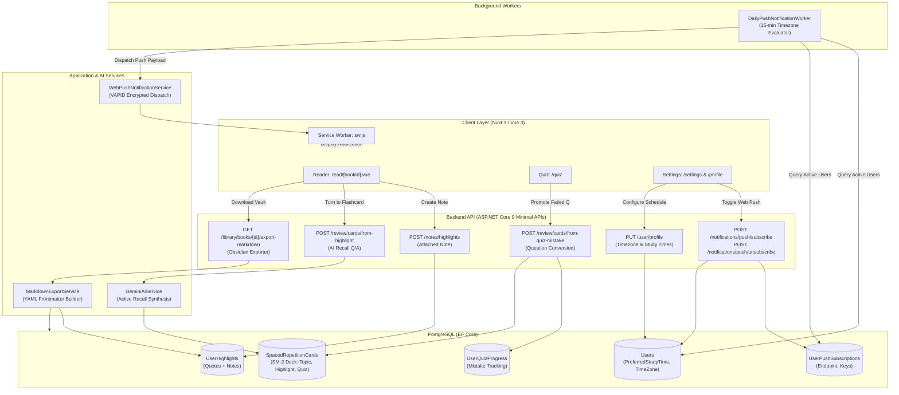
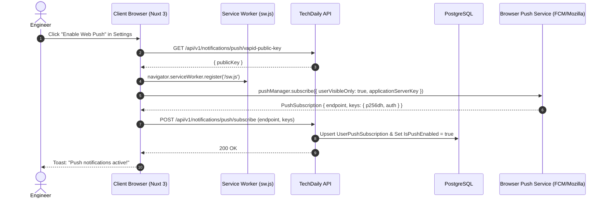

# Technical Design: Unified Knowledge Retention Loop & Customizable Web Push Notifications

## 1. Architecture Overview

This design unifies three foundational subsystems of the TechDaily platform:
1. **Housekeeping & Domain Cleanup:** Eliminating orphaned frontend components, removing dead `MicroQuiz` columns from PostgreSQL, and pruning unused AI prompt tokens.
2. **Layered Knowledge Retention ("Second Brain" Pipeline):** Transforming passive text highlights into active reflections with a floating note popover, bridging both reading highlights and quiz mistakes into the SM-2 spaced repetition deck, and exposing an Obsidian/Notion markdown exporter.
3. **Customizable Web Push Notifications:** Upgrading notification delivery from high-friction Telegram to native browser Web Push (RFC 8291 / RFC 8292 / VAPID), driven by a 15-minute timezone-aware background worker.



---

## 2. Data Models & Database Schema

### 2.1 Schema Modifications: `Users` Table
Extend `TechDaily.Domain.Entities.User` to store push preferences, individual study habits, and IANA timezone identifiers.

```csharp
namespace TechDaily.Domain.Entities;

public class User : BaseEntity
{
    // Existing fields: Email, Name, AvatarUrl, PasswordHash, TelegramChatId, PreferredLocale, TargetRole, DailyGoalMinutes...

    /// <summary>
    /// User's preferred daily study reminder time in local timezone (e.g. 07:30:00).
    /// </summary>
    public TimeOnly? PreferredStudyTime { get; set; }

    /// <summary>
    /// User's preferred evening streak preservation alert time in local timezone (e.g. 21:00:00).
    /// </summary>
    public TimeOnly? StreakAlertTime { get; set; }

    /// <summary>
    /// IANA standard Timezone identifier (e.g., "Asia/Ho_Chi_Minh", "America/New_York", "Europe/London"). Default: "UTC".
    /// </summary>
    public string TimeZone { get; set; } = "UTC";

    /// <summary>
    /// Global toggle indicating whether browser web push notifications are active for this user.
    /// </summary>
    public bool IsPushEnabled { get; set; } = false;

    // Navigation collections
    public ICollection<UserPushSubscription> PushSubscriptions { get; set; } = new List<UserPushSubscription>();
}
```

### 2.2 New Entity: `UserPushSubscription`
Represents an individual browser push notification subscription token compliant with RFC 8291.

```csharp
namespace TechDaily.Domain.Entities;

public class UserPushSubscription : BaseEntity
{
    public Guid UserId { get; set; }
    public string Endpoint { get; set; } = string.Empty;
    public string P256dh { get; set; } = string.Empty;
    public string Auth { get; set; } = string.Empty;
    public string? UserAgent { get; set; }

    // Navigation property
    public User User { get; set; } = null!;
}
```

### 2.3 Generalizing `SpacedRepetitionCard`
Currently, `SpacedRepetitionCard` requires a non-null `TopicId`. We extend it to support cards created from diverse learning surfaces:
1. `Topic`: Pre-curated daily curriculum topics.
2. `Highlight`: User highlights transformed into active recall flashcards via Gemini.
3. `QuizMistake`: Failed interview quiz questions promoted into the review deck.

```csharp
namespace TechDaily.Domain.Enums;

public enum CardSourceType
{
    Topic = 0,
    Highlight = 1,
    QuizMistake = 2
}
```

```csharp
namespace TechDaily.Domain.Entities;

public class SpacedRepetitionCard : BaseEntity
{
    public Guid UserId { get; set; }

    /// <summary>
    /// Nullable for cards generated from Highlights or Quiz Mistakes.
    /// </summary>
    public Guid? TopicId { get; set; }

    public CardSourceType SourceType { get; set; } = CardSourceType.Topic;

    /// <summary>
    /// Front prompt/question text (Markdown supported).
    /// </summary>
    public string? FrontMarkdown { get; set; }

    /// <summary>
    /// Back answer/explanation text (Markdown supported).
    /// </summary>
    public string? BackMarkdown { get; set; }

    /// <summary>
    /// Optional foreign key tracking originating highlight note.
    /// </summary>
    public Guid? SourceHighlightId { get; set; }

    /// <summary>
    /// Optional foreign key tracking originating quiz question.
    /// </summary>
    public Guid? SourceQuizQuestionId { get; set; }

    // SM-2 Spaced Repetition Engine Parameters
    public int RepetitionCount { get; private set; } = 0;
    public decimal EaseFactor { get; private set; } = 2.50m;
    public int IntervalDays { get; private set; } = 1;
    public DateOnly NextReviewDate { get; private set; }
    public DateOnly? LastReviewDate { get; private set; }
    public CardStatus Status { get; private set; } = CardStatus.Learning;

    // Navigation properties
    public User User { get; set; } = null!;
    public Topic? Topic { get; set; }
    public UserHighlight? SourceHighlight { get; set; }
    public QuizQuestion? SourceQuizQuestion { get; set; }

    // Factory methods for new card types
    public static SpacedRepetitionCard CreateFromHighlight(
        Guid userId,
        Guid highlightId,
        string frontMarkdown,
        string backMarkdown,
        DateOnly? initialDate = null)
    {
        return new SpacedRepetitionCard
        {
            UserId = userId,
            SourceType = CardSourceType.Highlight,
            SourceHighlightId = highlightId,
            FrontMarkdown = frontMarkdown,
            BackMarkdown = backMarkdown,
            NextReviewDate = initialDate ?? DateOnly.FromDateTime(DateTime.UtcNow),
            Status = CardStatus.Learning
        };
    }

    public static SpacedRepetitionCard CreateFromQuizMistake(
        Guid userId,
        Guid questionId,
        string frontMarkdown,
        string backMarkdown,
        DateOnly? initialDate = null)
    {
        return new SpacedRepetitionCard
        {
            UserId = userId,
            SourceType = CardSourceType.QuizMistake,
            SourceQuizQuestionId = questionId,
            FrontMarkdown = frontMarkdown,
            BackMarkdown = backMarkdown,
            NextReviewDate = initialDate ?? DateOnly.FromDateTime(DateTime.UtcNow),
            Status = CardStatus.Learning
        };
    }
}
```

### 2.4 EF Core Configuration & Migration Blueprint
- Remove `builder.OwnsOne(c => c.MicroQuiz, ...)` from `DocumentChunkConfiguration`.
- Add `UserPushSubscriptionConfiguration`:
  - `builder.HasKey(s => s.Id);`
  - `builder.Property(s => s.Endpoint).IsRequired();`
  - `builder.HasIndex(s => new { s.UserId, s.Endpoint }).IsUnique();`
  - `builder.HasOne(s => s.User).WithMany(u => u.PushSubscriptions).HasForeignKey(s => s.UserId).OnDelete(DeleteBehavior.Cascade);`
- Update `SpacedRepetitionCardConfiguration`:
  - `builder.Property(c => c.TopicId).IsRequired(false);`
  - `builder.Property(c => c.SourceType).HasConversion<string>().HasMaxLength(50).IsRequired();`
  - `builder.HasOne(c => c.SourceHighlight).WithMany().HasForeignKey(c => c.SourceHighlightId).OnDelete(DeleteBehavior.SetNull);`
  - `builder.HasOne(c => c.SourceQuizQuestion).WithMany().HasForeignKey(c => c.SourceQuizQuestionId).OnDelete(DeleteBehavior.SetNull);`

---

## 3. API Specifications & Contracts

### 3.1 Personal Note Capture on Highlights
**Endpoint:** `POST /api/v1/notes/highlights` (Authenticated)
The backend endpoint `CreateHighlightHandler` already accepts `string? Note` and `List<string>? Tags`. We enhance the reader frontend to present a floating note popover allowing users to input reflections.

**Request Payload:**
```json
{
  "documentChunkId": "3fa85f64-5717-4562-b3fc-2c963f66afa6",
  "selectedText": "LSM-Trees append writes sequentially to a Write-Ahead Log (WAL) before updating MemTable.",
  "note": "Crucial invariant: Sequential WAL append converts random disk I/O into deterministic sequential writes, boosting write throughput.",
  "tags": ["storage-engine", "lsm-tree", "durability"]
}
```

**Response Payload (`HTTP 201 Created`):**
```json
{
  "highlight": {
    "id": "7ca64082-20c2-4eb1-9993-41bbd9c1598f",
    "documentChunkId": "3fa85f64-5717-4562-b3fc-2c963f66afa6",
    "bookId": "09f7a759-42b7-4e92-ba91-3829497e20b3",
    "bookTitle": "Designing Data-Intensive Applications",
    "chapterTitle": "Chapter 3: Storage and Retrieval",
    "selectedText": "LSM-Trees append writes sequentially to a Write-Ahead Log (WAL) before updating MemTable.",
    "note": "Crucial invariant: Sequential WAL append converts random disk I/O into deterministic sequential writes, boosting write throughput.",
    "tags": ["storage-engine", "lsm-tree", "durability"],
    "createdAt": "2026-09-16T08:30:00Z"
  }
}
```

---

### 3.2 1-Click "Turn Highlight into SM-2 Flashcard"
**Endpoint:** `POST /api/v1/review/cards/from-highlight` (Authenticated)

**Request Payload:**
```json
{
  "highlightId": "7ca64082-20c2-4eb1-9993-41bbd9c1598f"
}
```

**Processing Flow:**
1. Fetch `UserHighlight` by `highlightId` verifying ownership (`UserId == currentUserId`).
2. Load parent `DocumentChunk` and `DocumentBook` for architectural context.
3. Call `GeminiAiService.SynthesizeActiveRecallCardAsync(quote, note, chapterContext)`.
4. Prompt format sent to Gemini Flash:
   ```
   You are an expert technical curriculum designer for senior software engineers.
   Given this quote highlighted by an engineer from '{bookTitle}' ({chapterTitle}):
   QUOTE: "{selectedText}"
   ENGINEER'S NOTE: "{note}"

   Create an active recall flashcard:
   1. Front: A concise, direct conceptual question testing understanding of the underlying engineering mechanism or trade-off. Do NOT ask "What did the author say about X?". Instead ask: "Why does X achieve Y?" or "How does mechanism X handle failure condition Y?".
   2. Back: A clear, authoritative explanation (2-3 sentences max) detailing the answer, architectural trade-offs, and operational invariants.

   Respond strictly in JSON:
   {
     "front": "Why do LSM-Tree storage engines write to a Write-Ahead Log (WAL) before modifying the in-memory MemTable?",
     "back": "To guarantee durability (the D in ACID). Because the in-memory MemTable is vulnerable to power loss or crashes, the sequential append-only WAL allows immediate crash recovery with minimal disk I/O latency."
   }
   ```
5. Persist new `SpacedRepetitionCard` with `SourceType = CardSourceType.Highlight`, `SourceHighlightId = highlightId`, and `NextReviewDate = today`.
6. Return `ReviewCardDto`.

---

### 3.3 1-Click "Push Quiz Mistake to SM-2 Deck"
**Endpoint:** `POST /api/v1/review/cards/from-quiz-mistake` (Authenticated)

**Request Payload:**
```json
{
  "questionId": "c9e7829a-2479-450f-a496-e26e2e50cf60"
}
```

**Processing Flow:**
1. Retrieve `QuizQuestion` and user's `UserQuizProgress`.
2. Check if a `SpacedRepetitionCard` already exists for this `(UserId, SourceQuizQuestionId)`:
   - If exists: Reset `NextReviewDate = today`, `RepetitionCount = 0`, `Status = CardStatus.Learning` to restart the spaced repetition cycle.
   - If new: Construct:
     - `FrontMarkdown`: Question text followed by the scenario options.
     - `BackMarkdown`: Identifies the correct option with its detailed `ExplanationMarkdown`.
     - Persist with `SourceType = CardSourceType.QuizMistake`.
3. Bidirectional Mastery Sync:
   - When the user grades this card in `/review` with `qualityGrade >= 3` (successful recall), the `GradeReviewCardHandler` inspects `card.SourceQuizQuestionId`. If present, it updates `UserQuizProgress.IsMastered = true`.
4. Return `ReviewCardDto`.

---

### 3.4 Obsidian & Notion Markdown Exporter
**Endpoint:** `GET /api/v1/library/books/{id}/export-markdown` (Authenticated)

**Response Headers:**
```http
Content-Type: text/markdown; charset=utf-8
Content-Disposition: attachment; filename="designing-data-intensive-applications-notes.md"
```

**Export Output Structure:**
```markdown
---
title: "Designing Data-Intensive Applications"
author: "Martin Kleppmann"
category: "SystemDesign"
source_url: "https://dataintensive.net"
exported_at: "2026-09-16T10:15:30Z"
total_chapters: 12
total_highlights: 8
tags:
  - techdaily
  - system-design
  - engineering-reading
---

# Designing Data-Intensive Applications

*Exported from TechDaily on September 16, 2026*

---

## Chapter 3: Storage and Retrieval

### Executive Summary
Examines the fundamental storage engines powering modern databases: log-structured and B-tree families. Understand how disk-based data structures optimize between read and write throughput.

### Key Takeaways
- **Write Optimization:** Append-only log files offer unmatched write performance by eliminating random seek overhead.
- **Read Trade-off:** Secondary indexing incurs write amplification but speeds up queries from O(N) to O(log N).
- **Compaction:** Background merge-compaction bounds disk utilization in log-structured storage engines.

### Highlights & Engineering Reflections

> "LSM-Trees append writes sequentially to a Write-Ahead Log (WAL) before updating MemTable."
> 
> **Personal Note:** Crucial invariant: Sequential WAL append converts random disk I/O into deterministic sequential writes, boosting write throughput.
> *Tags: `#storage-engine` `#lsm-tree` `#durability`*

> "B-Trees break the database down into fixed-size blocks or pages, traditionally 4KB in size, and read or write one page at a time."
> 
> *Tags: `#b-tree` `#page-cache`*

---
```

---

### 3.5 Web Push Subscription & Management Endpoints

#### 3.5.1 Get VAPID Public Key
**Endpoint:** `GET /api/v1/notifications/push/vapid-public-key` (Authenticated)
**Response:**
```json
{
  "publicKey": "BNc_yG..."
}
```

#### 3.5.2 Subscribe Device to Web Push
**Endpoint:** `POST /api/v1/notifications/push/subscribe` (Authenticated)
**Request Payload:**
```json
{
  "endpoint": "https://fcm.googleapis.com/fcm/send/eK-9...",
  "keys": {
    "p256dh": "BKo9...",
    "auth": "A8k7..."
  },
  "userAgent": "Mozilla/5.0 (Macintosh; Intel Mac OS X 10_15_7) AppleWebKit/537.36..."
}
```
**Processing:**
- Upsert subscription matching `(UserId, Endpoint)`.
- Set `User.IsPushEnabled = true`.
- Return `HTTP 200 OK`.

#### 3.5.3 Unsubscribe Device
**Endpoint:** `POST /api/v1/notifications/push/unsubscribe` (Authenticated)
**Request Payload:**
```json
{
  "endpoint": "https://fcm.googleapis.com/fcm/send/eK-9..."
}
```
**Processing:**
- Delete matching subscription from `UserPushSubscriptions`.
- If user has no remaining subscriptions, update `User.IsPushEnabled = false`.
- Return `HTTP 204 No Content`.

---

### 3.6 User Profile Endpoint Update
**Endpoint:** `PUT /api/v1/user/profile` (Authenticated)

**Extended Request Payload:**
```json
{
  "name": "Jane Doe",
  "preferredLocale": "en",
  "targetRole": "Staff Engineer",
  "dailyGoalMinutes": 15,
  "telegramChatId": null,
  "preferredStudyTime": "08:00",
  "streakAlertTime": "20:30",
  "timeZone": "Asia/Ho_Chi_Minh",
  "isPushEnabled": true
}
```

---

## 4. Web Push Notification Architecture



### 4.1 Service Worker Implementation (`frontend/public/sw.js`)
The service worker is minimal, resilient, and adheres to standard Web Push event contracts:

```javascript
self.addEventListener('push', function (event) {
  if (!event.data) return;

  try {
    const payload = event.data.json();
    const options = {
      body: payload.body || 'Your daily engineering session is ready.',
      icon: payload.icon || '/icon.png',
      badge: payload.badge || '/badge.png',
      data: {
        url: payload.url || '/today'
      },
      tag: payload.tag || 'techdaily-daily',
      renotify: true,
      requireInteraction: false
    };

    event.waitUntil(
      self.registration.showNotification(payload.title || 'TechDaily', options)
    );
  } catch (err) {
    console.error('Error handling push event:', err);
  }
});

self.addEventListener('notificationclick', function (event) {
  event.notification.close();
  const targetUrl = (event.notification.data && event.notification.data.url) || '/today';

  event.waitUntil(
    clients.matchAll({ type: 'window', includeUncontrolled: true }).then(function (clientList) {
      for (const client of clientList) {
        if (client.url.includes(self.registration.scope) && 'focus' in client) {
          client.navigate(targetUrl);
          return client.focus();
        }
      }
      if (clients.openWindow) {
        return clients.openWindow(targetUrl);
      }
    })
  );
});
```

---

## 5. Background Worker Architecture: `DailyPushNotificationWorker`

### 5.1 Execution Model
`DailyPushNotificationWorker` runs as a scoped .NET `BackgroundService` with a 15-minute evaluation cadence:

```csharp
namespace TechDaily.Infrastructure.Workers;

public class DailyPushNotificationWorker : BackgroundService
{
    private readonly IServiceScopeFactory _scopeFactory;
    private readonly ILogger<DailyPushNotificationWorker> _logger;
    private readonly PeriodicTimer _timer = new(TimeSpan.FromMinutes(15));

    public DailyPushNotificationWorker(
        IServiceScopeFactory scopeFactory,
        ILogger<DailyPushNotificationWorker> logger)
    {
        _scopeFactory = scopeFactory;
        _logger = logger;
    }

    protected override async Task ExecuteAsync(CancellationToken stoppingToken)
    {
        _logger.LogInformation("DailyPushNotificationWorker initialized with 15-minute interval.");

        while (!stoppingToken.IsCancellationRequested && await _timer.WaitForNextTickAsync(stoppingToken))
        {
            try
            {
                await EvaluateAndDispatchNotificationsAsync(stoppingToken);
            }
            catch (Exception ex) when (ex is not OperationCanceledException)
            {
                _logger.LogError(ex, "Unhandled exception in DailyPushNotificationWorker.");
            }
        }
    }
}
```

### 5.2 Timezone Resolution & Evaluation Algorithm

```mermaid
flowchart TD
    Start([15-Minute Timer Tick]) --> LoadUsers[Load Users where IsPushEnabled == true<br/>with PushSubscriptions and StreakRecord]
    LoadUsers --> LoopUsers{For Each User}

    LoopUsers -- Next User --> ResolveTZ[Resolve TimeZoneInfo<br/>Fallback to UTC on failure]
    ResolveTZ --> ConvertTime[Convert DateTimeOffset.UtcNow<br/>to User Local Time]

    ConvertTime --> MatchMorning{Local Time matches<br/>PreferredStudyTime slot?<br/>(Within 15-min window)}
    MatchMorning -- Yes --> CheckStudiedMorning{Completed reading<br/>or quiz today?}
    CheckStudiedMorning -- No --> DedupeMorning{Dispatched in<br/>last 12 hours?}
    DedupeMorning -- No --> DispatchMorning[Send Push: 'Time for Today's Reading!'<br/>Record Dispatch]

    MatchMorning -- No --> MatchEvening{Local Time matches<br/>StreakAlertTime slot?<br/>(Within 15-min window)}
    CheckStudiedMorning -- Yes --> MatchEvening
    DedupeMorning -- Yes --> MatchEvening

    MatchEvening -- Yes --> CheckStreak{CurrentStreak > 0 &<br/>Not Completed Today?}
    CheckStreak -- Yes --> DedupeEvening{Dispatched in<br/>last 12 hours?}
    DedupeEvening -- No --> DispatchEvening[Send Push: 'Keep your X-day streak alive!'<br/>Record Dispatch]

    MatchEvening -- No --> LoopUsers
    CheckStreak -- No --> LoopUsers
    DedupeEvening -- Yes --> LoopUsers
    DispatchMorning --> LoopUsers
    DispatchEvening --> LoopUsers

    LoopUsers -- Done --> WaitTick([Wait for next 15-min tick])
```

### 5.3 Stale Subscription Cleanup
When `WebPushNotificationService` encounters an HTTP `404 Not Found` or `410 Gone` from push endpoints (FCM, Apple Web Push, Mozilla autopush), it indicates the user revoked permissions or uninstalled the browser. The worker catches this exception and deletes the stale subscription from `UserPushSubscriptions`, ensuring database hygiene.

---

## 6. UX Wireframes & Component Blueprints

### 6.1 Reader Floating Note Popover (`read/[bookId].vue`)

```
┌────────────────────────────────────────────────────────────────────────┐
│  LSM-Trees append writes sequentially to a Write-Ahead Log (WAL)       │
│  before updating MemTable.                                             │
│                                                                        │
│       ┌─────────────────────────────────────────────────────────┐      │
│       │ ⚡ Explain with Gemini   │ 📋 Copy   │ 📝 Add Note       │      │
│       ├─────────────────────────────────────────────────────────┤      │
│       │ Personal Reflection / Architecture Note:                │      │
│       │ ┌─────────────────────────────────────────────────────┐ │      │
│       │ │Sequential WAL converts random disk I/O to sequential│ │      │
│       │ │writes, boosting write throughput...                 │ │      │
│       │ └─────────────────────────────────────────────────────┘ │      │
│       │ Tags: [storage-engine x] [+ Add Tag]                    │      │
│       │                                                         │      │
│       │ [Save Note]   [⚡ Turn into SM-2 Flashcard]   [Cancel]  │      │
│       └─────────────────────────────────────────────────────────┘      │
└────────────────────────────────────────────────────────────────────────┘
```

### 6.2 Quiz Mistake Spaced Repetition Bridge (`/quiz`)

```
┌────────────────────────────────────────────────────────────────────────┐
│  Quiz Completed! Accuracy: 3/5 (60%)                                   │
│                                                                        │
│  Mistakes to Review:                                                   │
│                                                                        │
│  ❌ Q2: PostgreSQL Multi-Version Concurrency Control (MVCC)             │
│     Your Answer: In-place row overwriting with row-level locks         │
│     Correct: Appending new row version and vacuuming dead tuples       │
│                                                                        │
│     [ 🔄 Push to SM-2 Spaced Deck ]  <-- 1-Click Bridge                │
│     (Successfully added! Next review: Today in /review)                │
└────────────────────────────────────────────────────────────────────────┘
```

### 6.3 Settings / Profile Push Notifications Section (`/settings` & `/profile`)

```
┌────────────────────────────────────────────────────────────────────────┐
│  🔔 Web Push Notifications                                             │
│  Receive study reminders and streak preservation alerts directly       │
│  in your browser without configuring third-party bots.                 │
│                                                                        │
│  [ Toggle: Enable Browser Push ]  (Active on this device)              │
│                                                                        │
│  Timezone:                                                             │
│  [ Asia/Ho_Chi_Minh (UTC+7) - Auto-detected                       ▼ ] │
│                                                                        │
│  Study Reminder Time:       Streak Warning Time:                       │
│  [ 07 : 30  AM  🕒 ]        [ 09 : 00  PM  🕒 ]                        │
│                                                                        │
│  [ Save Notification Preferences ]                                     │
└────────────────────────────────────────────────────────────────────────┘
```
