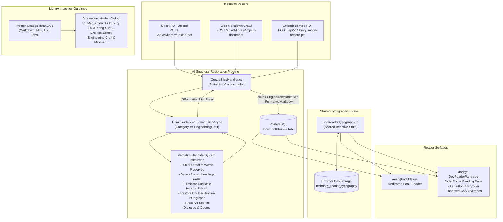

# Design: AI Structural Restoration and Today Reader Typography Controls

## Context

TechDaily provides software engineers with technical documentation and engineering craft literature. However, long-form books imported into the platform face two primary legibility and presentation bottlenecks:

1. **Publisher Layout Flattening & Run-in Text:**
   When books are imported from PDF, Web Markdown, or Embedded Web PDF viewer shells, publisher-specific formatting (such as section titles, subheadings, and introductory narrative stories formatted without separate vertical baseline coordinates) collapses into monolithic blocks of text. Pure geometric line-gap and margin heuristics in PDF extraction cannot reliably detect run-in headings or dialogue line breaks embedded in continuous streams.
   Furthermore, `CurateSliceHandler.cs` previously enforced a guardrail preventing `DocumentChunk.OriginalTextMarkdown` from being overwritten for `Category.EngineeringCraft`. While this guardrail protected against AI summarization, it permanently locked the reader into displaying raw, squashed, unformatted text without headings or paragraph breaks.

2. **Siloed Reader Typography Controls:**
   The dedicated reader view (`/read/[bookId].vue`) recently introduced novel-style typography settings (`Aa`), but its implementation is local to the component. The daily focus reading view (`frontend/components/today/DocReaderPane.vue` on `/today`) hardcodes font sizes and default sans-serif styling. Software engineers engaging with daily curriculum on `/today` cannot scale text size, choose high-readability serif fonts, or adjust line spacing, nor do preferences synchronize across reading views.

See `proposal.md` for broader background and motivation.

---

## Goals / Non-Goals

### Goals

- **100% Verbatim AI Structural Restoration:** Adapt `GeminiAiService.FormatSliceAsync` for `Category.EngineeringCraft` to enforce 100% verbatim author text retention (zero summarization, zero abbreviation, zero omission) while restoring Markdown headings (`### {SectionTitle}`), proper paragraph boundaries (`\n\n`), dialogue breaks, and eliminating duplicate header echoes.
- **Clean Markdown Storage in Curation Pipeline:** Allow `CurateSliceHandler.cs` to persist `chunk.OriginalTextMarkdown = aiResult.Value.FormattedMarkdown` when `FormattedMarkdown` is present, ensuring clean, restored markdown is stored in PostgreSQL and rendered across all reader views.
- **Unified Ingestion Pipeline Synchronization:** Ensure Direct PDF uploads, Web Markdown crawls, and Embedded Web PDFs all benefit from consistent AI structural restoration through `CurateSliceHandler`.
- **Streamlined Library Guidance:** Update the in-context amber callout under the Category selector in `frontend/pages/library.vue` and locale files (`en.json`, `vi.json`) with concise, accurate guidance explaining verbatim preservation and structural restoration.
- **Shared Typography Composable:** Create `frontend/composables/useReaderTypography.ts` managing reactive typography state (`fontSize`, `fontFamily`, `lineSpacing`, `readingWidth`) synchronized via `localStorage` under key `techdaily_reader_typography`.
- **Refactor Dedicated Reader:** Refactor `frontend/pages/read/[bookId].vue` to consume `useReaderTypography()`, eliminating redundant state and storage code.
- **Today Reader Typography Controls:** Implement a sleek `Aa` button and popover dropdown in `DocReaderPane.vue` with font size scaling (`A-`/`A+`), font family selection (Sans/Serif/Mono), line spacing (Normal/Relaxed/Loose), and deep CSS inheritance (`:deep(.markdown-body p), :deep(.markdown-body li) { font-size: inherit !important; line-height: inherit !important; }`).
- **Real-Time Cross-View Synchronization:** Seamlessly synchronize typography preferences between `/read/[bookId]` and `/today`.

### Non-Goals

- Modifying baseline geometric extraction or OCR algorithms in `PdfPigExtractor.cs`.
- Changing database schema or executing EF Core migrations (existing columns accommodate the clean markdown).
- Modifying vector embedding algorithms, semantic caches, or SM-2 flashcard scheduling.
- Adding typography controls to non-reading views (e.g. `/profile`, `/review`, `/insights`).

---

## Architecture & Data Flow



---

## Decisions

### Decision 1: AI-Driven Structural Restoration with Strict Verbatim System Instructions

- **Context:** In publisher PDFs and scanned documents, subheadings, chapter numbers, and narrative introductions often share the exact same baseline Y coordinates and font size as body paragraphs. Coordinate-based heuristic parsing cannot reliably distinguish where an introductory anecdote ends and a major subheading begins.
- **Decision:** Enhance the system instruction in `GeminiAiService.FormatSliceAsync` for `Category.EngineeringCraft` with explicit structural directives:
  1. Mandate 100% verbatim text retention: strictly forbid summarizing, paraphrasing, condensing, or dropping any author anecdotes, examples, or narrative flow.
  2. Detect run-in headings and promote them to standard Markdown headings (`### {SectionTitle}`).
  3. Strip duplicate header echoes and running headers immediately following the top-level `# {ChapterTitle}`.
  4. Restore natural paragraph boundaries with clean double newlines (`\n\n`).
  5. Preserve spoken dialogue and quotes on distinct lines.
- **Alternatives Considered:**
  - *Rule-based regex post-processing:* Highly brittle across different book publishers and translation formats; frequently misclassifies narrative sentences as headings or breaks dialogue.
  - *Accepting monolithic text in reader:* Results in poor readability, eye strain, and degraded user engagement for software engineering classics.

### Decision 2: Allowing `chunk.OriginalTextMarkdown = aiResult.Value.FormattedMarkdown` in `CurateSliceHandler.cs`

- **Context:** Previously, `CurateSliceHandler.cs` contained a guardrail:
  ```csharp
  if (chunk.DocumentBook?.Category != Category.EngineeringCraft)
  {
      chunk.OriginalTextMarkdown = aiResult.Value.FormattedMarkdown;
  }
  ```
  This guardrail was created to prevent summarized text from overwriting book prose. However, because `GeminiAiService` now guarantees 100% verbatim text with structural restoration, keeping this guardrail locked readers into viewing the unformatted raw extraction.
- **Decision:** Allow updating `chunk.OriginalTextMarkdown = aiResult.Value.FormattedMarkdown` whenever `FormattedMarkdown` is present in a successful `aiResult`.
- **Alternatives Considered:**
  - *Adding a separate database column `RestoredTextMarkdown`:* Rejected because it requires EF Core database migrations, increases database storage redundancy, and requires branching logic across every consumer endpoint (`GetSlice`, `TodayFocus`, etc.).

### Decision 3: Shared Reactive Composable (`useReaderTypography.ts`) vs. Pinia Store

- **Context:** Typography preferences (font size, font family, line spacing, reading column width) must be shared between `/read/[bookId]` and `/today` (`DocReaderPane.vue`), persisted in `localStorage`, and reactive.
- **Decision:** Implement a centralized Vue composable `useReaderTypography.ts` using module-level reactive state (`ref<ReaderTypography>`).
- **Rationale:** A module-level ref in a Nuxt composable provides lightweight, zero-boilerplate shared state without adding actions/mutations to Pinia. It encapsulates:
  - Default configurations and type definitions.
  - Stepped font size increment/decrement logic with boundary bounds checking.
  - Computed mappings for pixel font sizes, line heights, font classes, and reading width classes.
  - Safe `localStorage` hydration and reactive watch-based persistence.
- **Alternatives Considered:**
  - *Component-local state with independent localStorage listeners:* Causes code duplication and potential race conditions when updating preferences.
  - *Full Pinia Store:* Feasible, but composables with module-level state are idiomatic in Vue 3/Nuxt 4 for self-contained UI preferences.

### Decision 4: Typography Integration & Scoped CSS Inheritance in `DocReaderPane.vue`

- **Context:** `DocReaderPane.vue` renders markdown content inside a `.doc-reader-content.markdown-body` container. By default, Tailwind Typography or `markdown-body` stylesheets define fixed font sizes and line heights on `<p>` and `<li>` elements, which would prevent container-level `fontSize` and `lineHeight` styles from propagating down to text elements.
- **Decision:**
  1. Add an `Aa` button and popover dropdown to the header of `DocReaderPane.vue` (adjacent to estimated read time and document title).
  2. Bind dynamic `:style="{ fontSize: fontSizePx, lineHeight: lineHeightValue }"` and `:class="[fontFamilyClass]"` to `.doc-reader-content`.
  3. Add scoped CSS with `!important` inheritance:
     ```css
     :deep(.markdown-body p),
     :deep(.markdown-body li) {
       font-size: inherit !important;
       line-height: inherit !important;
     }
     ```
  4. Implement click-outside and Escape key dismissal.
- **Alternatives Considered:**
  - *Re-rendering markdown HTML with inline style injections on every tag:* Highly inefficient; causes DOM recreation and breaks text selection.
  - *Global CSS overrides:* Risk bleeding typography changes into non-reading application pages.

### Decision 5: Streamlined In-Context Note in Library Modals

- **Context:** The previous callout under the Category selector in `/library` was lengthy and imprecise.
- **Decision:** Streamline the callout text across `vi.json` and `en.json` (key `library.verbatim_category_hint`):
  - **VI:** `"Mẹo: Chọn chuyên mục \"Tư Duy Kỹ Sư & Năng Suất\" để giữ nguyên văn 100% nội dung sách (AI khôi phục tiêu đề & ngắt dòng)."`
  - **EN:** `"Tip: Select \"Engineering Craft & Mindset\" to preserve 100% verbatim book text (AI restores headings & paragraphs)."`

---

## Risks / Trade-offs

- **[Risk 1: AI hallucination, truncation, or accidental rewording during curation]**
  → *Mitigation:* The system prompt for `Category.EngineeringCraft` places the verbatim rule at highest priority: `"MANDATORY RULES: 1. 100% VERBATIM PRESERVATION: You MUST preserve every single sentence, anecdote, and paragraph of the author's original words without summarization, omission, condensation, or paraphrasing."` In addition, unit tests verify prompt constraints and markdown heading restoration.
- **[Risk 2: Token overflow on large chapter slices]**
  → *Mitigation:* The curation pipeline enforces an input sample limit (25,000 characters, ~6,000 tokens) before sending to Gemini Flash Lite, preventing API payload rejections while accommodating full book chapters.
- **[Risk 3: Markdown-it stylesheet overriding custom font sizes in DocReaderPane]**
  → *Mitigation:* Scoped CSS `:deep(.markdown-body p), :deep(.markdown-body li)` with `!important` inheritance explicitly forces child text elements to follow the container's reactive font size and line height.
- **[Risk 4: SSR Hydration Mismatch with LocalStorage]**
  → *Mitigation:* LocalStorage access is strictly wrapped inside `import.meta.client` and `onMounted` lifecycle hooks. Default typography values (`fontSize: 'base'`, `fontFamily: 'sans'`, `lineSpacing: 'relaxed'`) match server-rendered markup until client-side hydration smoothly applies user preferences.

---

## Migration Plan

1. **Backend Deployment:**
   - Update `GeminiAiService.cs` with structural restoration rules for `Category.EngineeringCraft`.
   - Update `CurateSliceHandler.cs` to persist `chunk.OriginalTextMarkdown = aiResult.Value.FormattedMarkdown`.
   - Run backend test suite (`dotnet test`) ensuring zero regressions.
2. **Frontend Deployment:**
   - Implement `frontend/composables/useReaderTypography.ts`.
   - Refactor `frontend/pages/read/[bookId].vue` to consume `useReaderTypography()`.
   - Enhance `frontend/components/today/DocReaderPane.vue` with `Aa` button, popover, dynamic style bindings, and deep CSS.
   - Update `frontend/pages/library.vue` and locale files (`en.json`, `vi.json`).
3. **Verification:**
   - Validate with `openspec validate --strict ai-structural-restoration-and-today-typography`.
   - Perform end-to-end verification across `/library`, `/read/[bookId]`, and `/today`.
