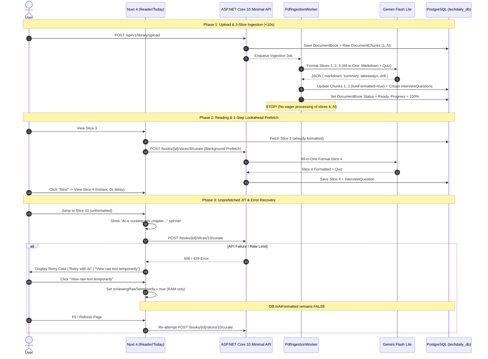

# Design: All-in-One Quiz Generation, Lazy Curation & Lookahead Prefetch

## 1. System Architecture & Data Flow



---

## 2. Interface & DTO Contracts

### `IAiMarkdownFormatter.cs`
```csharp
public record AiScenarioDrillVo(
    string QuestionText,
    List<string> Options,
    int CorrectOptionIndex,
    string ExplanationMarkdown,
    List<string> ExpectedKeyPoints);

public record AiFormattedSliceResult(
    string FormattedMarkdown,
    string SummaryMarkdown,
    List<string> KeyTakeaways,
    int EstimatedReadMinutes,
    AiScenarioDrillVo? ScenarioDrill);

public interface IAiMarkdownFormatter
{
    Task<Result<AiFormattedSliceResult>> FormatSliceAsync(
        string rawMarkdown,
        string chapterTitle,
        string? targetLocale = "en",
        CancellationToken cancellationToken = default);
}
```

### Combined Gemini Prompt
```text
You are a Principal Technical Writer and Software Architect.
Transform raw extracted book text into a publication-ready Technical Insight module AND create a Senior-level Architectural Scenario Drill.

Respond strictly with valid JSON:
{
  "formattedMarkdown": "Clean markdown with # Title, > [!NOTE], clean prose, code fences, > [!TIP], and ### Key Takeaways",
  "summaryMarkdown": "2-3 sentence executive architectural summary",
  "keyTakeaways": ["Point 1", "Point 2", "Point 3"],
  "scenarioDrill": {
    "questionText": "Realistic production trade-off problem testing these key takeaways",
    "options": ["A", "B", "C", "D"],
    "correctOptionIndex": 1,
    "explanationMarkdown": "Deep dive into why B is optimal and A/C/D incur technical debt",
    "expectedKeyPoints": ["Trade-off 1", "Trade-off 2"]
  }
}
```

---

## 3. Worker & Ingestion Refactoring (`PdfIngestionWorker.cs`)
- Ingestion extracts all slices from native bookmarks.
- Formats only `Math.Min(3, chunks.Count)` slices with Gemini Flash Lite.
- For each slice, saves the formatted content and persists the corresponding `InterviewQuestion` entity linked via `DocumentChunkId`.
- Updates `DocumentBook.Status = ProcessingStatus.Ready`, `ProgressPercentage = 100`, `StatusMessage = "Ready for reading"`.
- Deletes the infinite eager background loop for slices 4..N.

---

## 4. Frontend State & UX Specifications

### Lookahead Prefetching
- In `read/[bookId].vue` and `today.vue`:
  ```typescript
  function triggerLookaheadPrefetch(nextChunkOrder: number) {
    const nextChunk = book.value?.chunks?.find(c => c.chunkOrder === nextChunkOrder)
    if (nextChunk && !nextChunk.isAiFormatted && !prefetchedSet.has(nextChunkOrder)) {
      prefetchedSet.add(nextChunkOrder)
      libraryStore.curateSlice(bookId.value, nextChunkOrder).catch(() => {})
    }
  }
  ```

### Ephemeral Raw View
- `isViewingRawTemporarily = ref(false)`
- Never written to `localStorage` or backend.
- Banner atop reader:
  ```html
  <div v-if="isViewingRawTemporarily" class="bg-amber-500/10 border border-amber-500/30 text-amber-300 px-4 py-2 rounded-lg flex items-center justify-between text-sm">
    <span>Viewing unformatted raw text.</span>
    <button @click="handleRetryCurate" class="font-semibold underline hover:text-amber-200">Format with AI</button>
  </div>
  ```
