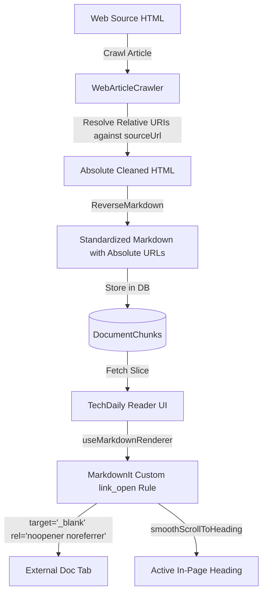

# Design: Document Relative Link Resolution & External Link Tab Isolation

## Architecture Overview



## Detailed Component Design

### 1. Backend: WebArticleCrawler (`WebArticleCrawler.cs`)

Before running ReverseMarkdown, a new preprocessing step `ResolveRelativeUrls(HtmlNode root, string sourceUrl)` runs on `contentNode`:

```csharp
private static void ResolveRelativeUrls(HtmlNode root, string sourceUrl)
{
    if (!Uri.TryCreate(sourceUrl, UriKind.Absolute, out var baseUri))
    {
        return;
    }

    // 1. Resolve anchor links (<a href="...">)
    var anchorNodes = root.SelectNodes(".//a[@href]");
    if (anchorNodes != null)
    {
        foreach (var a in anchorNodes)
        {
            var href = a.GetAttributeValue("href", "").Trim();
            if (string.IsNullOrEmpty(href) ||
                href.StartsWith("#") ||
                href.StartsWith("javascript:", StringComparison.OrdinalIgnoreCase) ||
                href.StartsWith("mailto:", StringComparison.OrdinalIgnoreCase) ||
                href.StartsWith("tel:", StringComparison.OrdinalIgnoreCase))
            {
                continue;
            }

            if (Uri.TryCreate(baseUri, href, out var resolvedUri))
            {
                a.SetAttributeValue("href", resolvedUri.AbsoluteUri);
            }
        }
    }

    // 2. Resolve image sources ()
    var imgNodes = root.SelectNodes(".//img[@src]");
    if (imgNodes != null)
    {
        foreach (var img in imgNodes)
        {
            var src = img.GetAttributeValue("src", "").Trim();
            if (string.IsNullOrEmpty(src) ||
                src.StartsWith("data:", StringComparison.OrdinalIgnoreCase))
            {
                continue;
            }

            if (Uri.TryCreate(baseUri, src, out var resolvedUri))
            {
                img.SetAttributeValue("src", resolvedUri.AbsoluteUri);
            }
        }
    }
}
```

### 2. Frontend: MarkdownIt Link Renderer (`useMarkdownRenderer.ts`)

Configure MarkdownIt's `link_open` rule:

```typescript
// Custom Link Renderer: Open external links in new tab, secure with noopener noreferrer
const defaultLinkOpen = md.renderer.rules.link_open || function (tokens, idx, options, env, self) {
  return self.renderToken(tokens, idx, options)
}

md.renderer.rules.link_open = (tokens, idx, options, env, self) => {
  const token = tokens[idx]
  const hrefIndex = token.attrIndex('href')

  if (hrefIndex >= 0) {
    const href = token.attrs ? token.attrs[hrefIndex][1] : ''
    // External link check
    if (/^https?:\/\//i.test(href)) {
      token.attrSet('target', '_blank')
      token.attrSet('rel', 'noopener noreferrer')
      token.attrJoin('class', 'external-link hover:underline text-emerald-600 dark:text-emerald-400')
    }
  }

  return defaultLinkOpen(tokens, idx, options, env, self)
}
```

## Security & Reliability Considerations
- **`rel="noopener noreferrer"`:** Protects against `window.opener` tab-napping and referrer leaking when linking to third-party domains.
- **Protocol validation:** Anchors starting with `javascript:` are skipped during crawl and sanitized by MarkdownIt HTML-escape settings.
- **Fragment bookmarks:** Local in-page bookmarks (`href="#basics"`) are preserved so internal section navigation continues to work smoothly.
