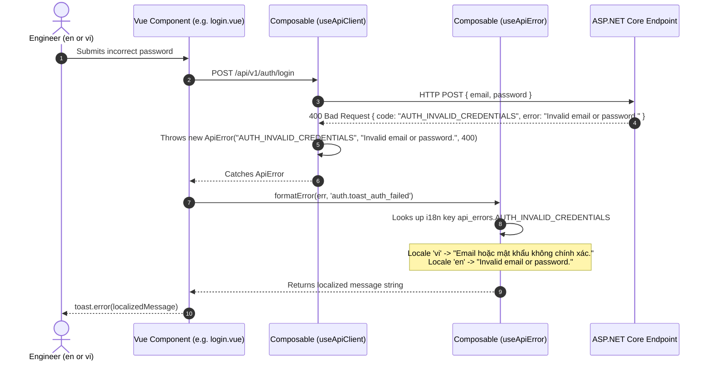

# Technical Design: Standardized Machine-Readable Error Codes & Complete Frontend i18n Localization

## 1. Architectural Overview

This design implements **Approach 1 (Machine-Readable Error Codes + Client-Side i18n)**:
1. **Backend (.NET 10)**: All error responses emit a standardized JSON envelope containing `code`, `error` (English developer message), and optional `details`. The backend codebase and server logs remain 100% English.
2. **HTTP Client Composable (`useApiClient.ts`)**: Parses the error envelope and throws a typed `ApiError(code, message, status, details)`.
3. **Error Translator Composable (`useApiError.ts`)**: Resolves `api_errors.<CODE>` from the client-side i18n catalog. If an unknown code is received, it gracefully falls back to a provided localized fallback key or generic server error.
4. **Toast & Alert Unification**: 100% of toast calls, loading indicators, confirmation modals, and contextual banners across all frontend components use `@nuxtjs/i18n` with full English and Vietnamese parity.

---

## 2. Component Interactions & Error Flow



---

## 3. Detailed Component Designs

### A. Backend Layer (`backend/`)

#### 1. Standard Error Catalog (`TechDaily.Application/Common/Error.cs`)
Expand `Error.cs` with typed error instances:
```csharp
public sealed record Error(string Code, string Message)
{
    // Common / Platform
    public static readonly Error NotFound = new("RESOURCE_NOT_FOUND", "The requested resource was not found.");
    public static readonly Error Unauthorized = new("UNAUTHORIZED", "User is unauthorized to perform this operation.");
    public static readonly Error Forbidden = new("FORBIDDEN", "User does not have permission for this resource.");
    public static readonly Error Validation = new("VALIDATION_FAILED", "Validation failed for the request.");
    public static readonly Error Conflict = new("CONFLICT", "A conflict occurred with existing state.");

    // Auth Domain
    public static readonly Error EmailPasswordRequired = new("AUTH_EMAIL_PASSWORD_REQUIRED", "Email and password are required.");
    public static readonly Error PasswordTooShort = new("AUTH_PASSWORD_TOO_SHORT", "Password must be at least 6 characters.");
    public static readonly Error EmailExists = new("AUTH_EMAIL_EXISTS", "An account with this email already exists.");
    public static readonly Error InvalidCredentials = new("AUTH_INVALID_CREDENTIALS", "Invalid email or password.");
    public static readonly Error GoogleTokenInvalid = new("AUTH_GOOGLE_TOKEN_INVALID", "Invalid Google authentication token.");
    public static readonly Error GoogleNotConfigured = new("AUTH_GOOGLE_NOT_CONFIGURED", "Google Client ID is not configured.");

    // User Domain
    public static readonly Error CurrentPasswordIncorrect = new("USER_CURRENT_PASSWORD_INCORRECT", "Current password is incorrect.");
    public static readonly Error NewPasswordTooShort = new("USER_NEW_PASSWORD_TOO_SHORT", "New password must be at least 6 characters.");

    // Library Domain
    public static readonly Error PdfRequired = new("LIBRARY_PDF_REQUIRED", "A valid PDF file is required.");
    public static readonly Error MultipartRequired = new("LIBRARY_MULTIPART_REQUIRED", "Multipart form data is required.");
}
```

#### 2. Standardized Endpoint Responses (`TechDaily.Api/Endpoints/*.cs`)
All endpoints map error responses into a consistent envelope:
```csharp
Results.BadRequest(new { code = error.Code, error = error.Message, details = (object?)null });
Results.NotFound(new { code = "RESOURCE_NOT_FOUND", error = "The requested resource was not found.", details = (object?)null });
```

---

### B. Frontend Layer (`frontend/`)

#### 1. Typed `ApiError` (`composables/useApiClient.ts`)
```typescript
export class ApiError extends Error {
  code: string
  status: number
  details?: any

  constructor(code: string, message: string, status: number, details?: any) {
    super(message)
    this.name = 'ApiError'
    this.code = code
    this.status = status
    this.details = details
  }
}
```
In `useApiClient.request`:
- On error response:
  ```typescript
  let errorCode = `HTTP_${response.status}`
  let errorMessage = `HTTP Error ${response.status}`
  let details = null
  try {
    const errorJson = await response.json()
    errorCode = errorJson.code || errorCode
    errorMessage = errorJson.error || errorJson.title || errorMessage
    details = errorJson.details || null
  } catch {}
  throw new ApiError(errorCode, errorMessage, response.status, details)
  ```

#### 2. Error Translation Composable (`composables/useApiError.ts`)
```typescript
export function useApiError() {
  const { t, te } = useI18n()

  function formatError(err: any, fallbackKey?: string): string {
    const code = err?.code || (err instanceof ApiError ? err.code : null)
    if (code) {
      const i18nKey = `api_errors.${code}`
      if (te(i18nKey)) {
        return t(i18nKey)
      }
    }
    if (fallbackKey && te(fallbackKey)) {
      return t(fallbackKey)
    }
    return err?.message || t('api_errors.SERVER_ERROR')
  }

  return { formatError }
}
```

#### 3. Frontend Toast & Alert Refactoring
All components use `formatError(err, 'domain.toast_action_error')` for API errors and `t('domain.toast_action_success')` for successful actions.

---

## 4. Dictionary Schema (`api_errors` namespace)

```json
{
  "api_errors": {
    "AUTH_EMAIL_PASSWORD_REQUIRED": "Email and password are required.",
    "AUTH_PASSWORD_TOO_SHORT": "Password must be at least 6 characters.",
    "AUTH_EMAIL_EXISTS": "An account with this email already exists.",
    "AUTH_INVALID_CREDENTIALS": "Invalid email or password.",
    "AUTH_GOOGLE_TOKEN_INVALID": "Invalid Google sign-in token. Please try again.",
    "AUTH_GOOGLE_NOT_CONFIGURED": "Google sign-in is not configured on this server.",
    "USER_CURRENT_PASSWORD_INCORRECT": "Current password is incorrect.",
    "USER_NEW_PASSWORD_TOO_SHORT": "New password must be at least 6 characters.",
    "LIBRARY_PDF_REQUIRED": "A valid PDF file is required.",
    "LIBRARY_MULTIPART_REQUIRED": "File upload payload is missing.",
    "RESOURCE_NOT_FOUND": "The requested resource was not found.",
    "UNAUTHORIZED": "Your session has expired. Please sign in again.",
    "FORBIDDEN": "You do not have permission to perform this action.",
    "SERVER_ERROR": "An unexpected server error occurred. Please try again.",
    "NETWORK_ERROR": "Network connection error. Please check your internet connection."
  }
}
```
*(Corresponding Vietnamese translations in `vi.json`)*.
