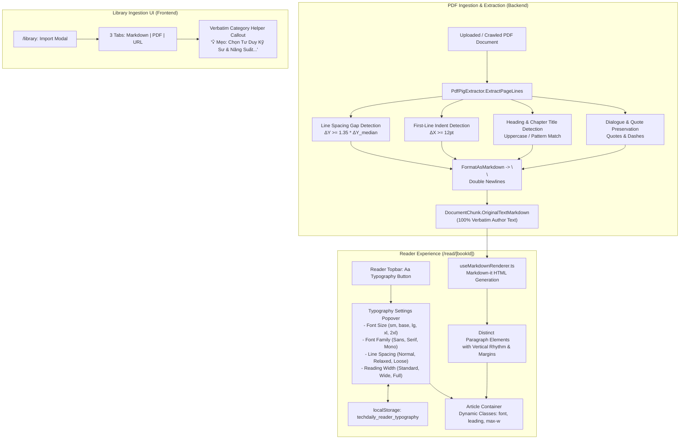

# Design: GitBook Reader Typography Controls, PDF Paragraph Segmentation, and Verbatim Preservation Hints

## Context

TechDaily's reading view (`/read/[bookId]`) is designed to deliver a distraction-free, focused learning environment for software engineers. However, readers consuming long-form literature and technical books face significant legibility barriers:
1. **Unformatted PDF text:** In `PdfPigExtractor.cs`, `ExtractPageLines` concatenates lines using single newlines (`\n`). In Markdown parsers adhering to CommonMark (including `useMarkdownRenderer.ts` where `breaks: false`), single newlines inside paragraph blocks are treated as soft breaks (spaces). Consequently, entire chapters of imported books (e.g., *Atomic Habits* / *Thói quen nguyên tử*) collapse into a single monolithic block of text without paragraph breaks, section headings, or breathing room.
2. **Missing user guidance on verbatim text preservation:** While the backend pipeline supports 100% verbatim text preservation for books imported under Category 4 ("Engineering Craft & Mindset" / "Tư Duy Kỹ Sư & Năng Suất"), users in `/library` have no visible guidance advising them to select this category when importing complete books.
3. **Lack of reader typography controls:** Unlike modern e-reading platforms (Kindle, Apple Books, GitBook), `/read/[bookId].vue` hardcodes font size (`text-sm md:text-lg`), system sans-serif font family, line height, and container width (`max-w-3xl`). Readers cannot customize their reading experience.

See `proposal.md` for broader background and motivation.

---

## Goals / Non-Goals

### Goals
- **Geometry-Aware Paragraph Segmentation:** Enhance `PdfPigExtractor.ExtractPageLines` and `FormatAsMarkdown` with line spacing gap detection ($\Delta Y \ge 1.35 \times \Delta Y_{\text{median}}$) and first-line indentation detection ($\Delta X \ge 12\text{pt}$) to cleanly separate paragraphs with double newlines (`\n\n`).
- **Heading & Section Title Isolation:** Automatically detect standalone chapter titles, uppercase lines, and preface sections, wrapping them in Markdown headings (`\n\n## {Title}\n\n`).
- **Dialogue & Quotation Formatting:** Preserve distinct line breaks for spoken dialogue (`—`, `-`) and quotations (`"`, `“`, `”`).
- **Clean Semantic Paragraph HTML:** Ensure `useMarkdownRenderer.ts` renders distinct `<p>` tags with balanced vertical margins.
- **Verbatim Category In-Context Hint:** Add a clear, localized visual tip under the Category selector in all 3 tabs of the `/library` import modal (Markdown Series, PDF Upload, URL Crawler).
- **Novel-Style Reader Typography Popover:** Implement an `Aa` typography settings popover in the top navigation bar of `/read/[bookId].vue` next to `ThemeToggle`, offering 5 font size scale presets, 3 font families (Sans, Serif, Monospace), 3 line heights (Normal, Relaxed, Loose), 3 reading widths (Standard, Wide, Full), and `localStorage` persistence.
- **Production CI/CD & Live Verification:** Define a complete deployment workflow and browser-based verification checklist on `https://techdaily.duckdns.org`.

### Non-Goals
- Modifying PDF rasterization, image extraction, or complex multi-column OCR.
- Altering the SM-2 flashcard scheduling algorithm, quiz generation prompts, or vector embeddings.
- Executing backend database schema migrations (typography settings are stored purely in client-side `localStorage`).
- Implementing typography controls on non-reading views (e.g. `/profile`, `/review`, `/today`).

---

## Architecture & Data Flow



---

## Detailed Design & Algorithms

### 1. PDF Line Spacing & Indentation Segmentation (`PdfPigExtractor.cs`)

In `ExtractPageLines(UglyToad.PdfPig.Content.Page page)`:
1. **Word & Line Grouping:**
   - Words are grouped by their baseline vertical coordinate:
     ```csharp
     var lineGroups = words
         .GroupBy(w => (int)Math.Round(w.BoundingBox.Bottom / 3.5))
         .OrderByDescending(g => g.Key)
         .ToList();
     ```
   - For each line group, calculate geometric properties:
     - `Top`: maximum top coordinate of words in the line.
     - `Bottom`: minimum bottom coordinate of words in the line.
     - `Left`: leftmost X coordinate of the first word (`w.BoundingBox.Left`).
     - `Right`: rightmost X coordinate of the last word (`w.BoundingBox.Right`).
     - `Text`: words ordered by `w.BoundingBox.Left` joined by single space.
2. **Median Line Height & Gap Calculation:**
   - Calculate vertical gaps between consecutive lines $i$ and $i+1$:
     $$\text{gap}_i = \text{line}[i].\text{Bottom} - \text{line}[i+1].\text{Top}$$
     (or baseline difference $\Delta Y_i = \text{baseline}_i - \text{baseline}_{i+1}$).
   - Compute the median spacing $\Delta Y_{\text{median}}$ across all adjacent line pairs on the page.
3. **Paragraph Boundary Heuristics:**
   - **Line Spacing Gap:** If $\Delta Y_i \ge 1.35 \times \Delta Y_{\text{median}}$, a paragraph boundary has occurred $\rightarrow$ append `\n\n`.
   - **First-Line Indent:** Compute the left margin $X_{\min}$ across all standard text lines. If $\text{line}[i+1].\text{Left} - X_{\min} \ge 12\text{pt}$, line $i+1$ begins a new paragraph $\rightarrow$ append `\n\n`.
4. **Heading & Section Title Isolation:**
   - In `FormatAsMarkdown(string text, string heading)`:
   - Identify lines matching chapter and section patterns:
     - Standalone uppercase lines (e.g. `LỜI NÓI ĐẦU`, `PHẦN GIỚI THIỆU`).
     - Specific section patterns: `^Câu chuyện của chính tôi\.?$`, `^Chương\s+\d+`, `^Chapter\s+\d+`.
     - Centered short lines ($< 60$ chars) where $\Delta X_{\text{left}} \approx \Delta X_{\text{right}}$.
   - Format matching lines as `\n\n## {Title}\n\n`.
5. **Dialogue & Quotation Line Breaks:**
   - Spoken dialogue lines starting with `"- "`, `"– "`, `"— "`, `"“"`, or `"\""` preserve their line break so quotes do not merge into preceding sentences.

### 2. Markdown Paragraph Rendering (`useMarkdownRenderer.ts`)

- With double newlines (`\n\n`) properly emitted by `PdfPigExtractor`, Markdown-it generates separate `paragraph_open` (`<p>`) and `paragraph_close` (`</p>`) tokens.
- Tailwind prose styles in `read/[bookId].vue` are updated to ensure `<p>` tags receive balanced vertical rhythm:
  ```css
  prose-p:my-4 prose-p:leading-inherit
  ```
- This completely eliminates the squashed solid block of text in the reader.

### 3. Verbatim Category Helper Hint (`frontend/pages/library.vue`)

In `frontend/pages/library.vue`, a clean callout box is rendered immediately below the Category `<select>` element in:
1. Tab 0: Markdown Series Tab (lines ~552)
2. Tab 1: PDF Upload Tab (lines ~697)
3. Tab 2: URL Crawler Tab (lines ~760)

**Component Markup:**
```html
<div class="mt-2.5 p-3 rounded-xl bg-amber-50/70 dark:bg-amber-950/30 border border-amber-200/80 dark:border-amber-800/60 flex items-start gap-2.5 text-xs text-amber-800 dark:text-amber-300">
  <Lightbulb class="w-4 h-4 shrink-0 mt-0.5 text-amber-600 dark:text-amber-400" />
  <p class="leading-relaxed">
    {{ $t('library.verbatim_category_hint') }}
  </p>
</div>
```

**Locale Strings:**
- **VI (`vi.json`):** `"verbatim_category_hint": "💡 Mẹo: Chọn danh mục \"Tư Duy Kỹ Sư & Năng Suất\" nếu bạn muốn giữ nguyên văn 100% từng câu chữ của sách (không dùng AI tóm tắt ngắn lại)."`
- **EN (`en.json`):** `"verbatim_category_hint": "💡 Tip: Select \"Engineering Craft & Mindset\" if you want 100% verbatim author text preserved without AI condensing."`

### 4. Novel-Style Reader Typography Controls (`frontend/pages/read/[bookId].vue`)

#### Topbar Button
In the reader topbar, directly adjacent to `<ThemeToggle />`:
```html
<!-- Typography Settings Button -->
<button
  @click="isTypographyOpen = !isTypographyOpen"
  class="p-2 rounded-xl border border-slate-200 dark:border-slate-800 text-slate-700 dark:text-slate-300 hover:bg-slate-100 dark:hover:bg-slate-800 transition-colors flex items-center justify-center font-serif font-bold text-sm select-none"
  :class="{ 'bg-slate-100 dark:bg-slate-800 ring-2 ring-brand-500/20': isTypographyOpen }"
  :title="$t('reader.typography_settings')"
  aria-label="Typography Settings"
>
  Aa
</button>
```

#### Typography Popover Panel
A floating card rendered with backdrop-dismiss:
- **Font Size Control:**
  - Scale values: `['sm', 'base', 'lg', 'xl', '2xl']`.
  - Corresponding body sizes: `text-sm` (14px), `text-base` (16px), `text-lg` (18px), `text-xl` (20px), `text-2xl` (22px).
  - Decrement `A-` (disabled when at `'sm'`), visual step dots / active label, Increment `A+` (disabled when at `'2xl'`).
- **Font Family Selector:**
  - 3 options styled as pill toggles:
    - **Sans-Serif:** `font-sans` (`Inter, system-ui, sans-serif`).
    - **Serif:** `font-serif` (`Merriweather, Georgia, Lora, serif`).
    - **Monospace:** `font-mono` (`JetBrains Mono, monospace`).
- **Line Spacing (Leading) Selector:**
  - 3 options:
    - **Standard:** `leading-normal` (1.5).
    - **Relaxed:** `leading-relaxed` (1.625, default).
    - **Loose:** `leading-loose` (2.0).
- **Reading Width Selector:**
  - 3 options:
    - **Standard:** `max-w-3xl` (~768px).
    - **Wide:** `max-w-4xl` (~896px).
    - **Full:** `max-w-full`.

#### State Management & LocalStorage Persistence
```typescript
interface TypographySettings {
  fontSize: 'sm' | 'base' | 'lg' | 'xl' | '2xl';
  fontFamily: 'sans' | 'serif' | 'mono';
  lineSpacing: 'normal' | 'relaxed' | 'loose';
  readingWidth: 'standard' | 'wide' | 'full';
}

const STORAGE_KEY = 'techdaily_reader_typography';
const DEFAULT_TYPOGRAPHY: TypographySettings = {
  fontSize: 'base',
  fontFamily: 'sans',
  lineSpacing: 'relaxed',
  readingWidth: 'standard',
};

const typography = ref<TypographySettings>({ ...DEFAULT_TYPOGRAPHY });

// Hydration on mount
onMounted(() => {
  if (import.meta.client) {
    try {
      const saved = localStorage.getItem(STORAGE_KEY);
      if (saved) {
        typography.value = { ...DEFAULT_TYPOGRAPHY, ...JSON.parse(saved) };
      }
    } catch {
      // Fallback gracefully to default settings
    }
  }
});

// Watch and persist
watch(
  typography,
  (newVal) => {
    if (import.meta.client) {
      try {
        localStorage.setItem(STORAGE_KEY, JSON.stringify(newVal));
      } catch {
        // Ignore storage quota errors
      }
    }
  },
  { deep: true }
);
```

#### Dynamic Class Bindings on Reader Container & Article
```html
<!-- Outer reading container width -->
<div
  v-else-if="currentChunk"
  class="w-full space-y-8 sm:space-y-10 transition-all duration-200"
  :class="[
    typography.readingWidth === 'standard' ? 'max-w-3xl' : '',
    typography.readingWidth === 'wide' ? 'max-w-4xl' : '',
    typography.readingWidth === 'full' ? 'max-w-full' : '',
  ]"
>
  ...
  <!-- Markdown Article with dynamic font size, family, leading -->
  <article
    class="markdown-body prose prose-slate dark:prose-invert max-w-full min-w-0 break-words prose-p:my-4 transition-all duration-150"
    :class="[
      `text-${typography.fontSize}`,
      `font-${typography.fontFamily}`,
      `leading-${typography.lineSpacing}`,
    ]"
    v-html="renderedMarkdown"
  ></article>
</div>
```

---

## Decisions

### 1. Heuristic-Based PDF Segmentation vs. AI Post-Processing
- **Decision:** Implement geometry-based line spacing gap and indentation heuristics directly inside `PdfPigExtractor.cs`.
- **Rationale:** Geometry calculations in `PdfPig` execute in $< 5\text{ms}$ with zero API latency and zero token cost, guaranteeing deterministic paragraph structure for 100+ page books. AI post-processing would introduce rate limits, monetary cost, and risk of hallucination or non-verbatim paraphrasing.
- **Alternatives Considered:** Calling Gemini Flash to segment text after extraction (rejected due to latency, token consumption, and risk to verbatim fidelity).

### 2. Client-Side LocalStorage Persistence vs. Database User Preferences Table
- **Decision:** Store typography settings in `localStorage` under `techdaily_reader_typography`.
- **Rationale:** Typography settings are device-dependent (e.g. an engineer might prefer 18px Serif on desktop and 14px Sans on a mobile phone). `localStorage` avoids database roundtrips and requires zero schema migrations.
- **Alternatives Considered:** Adding a `TypographySettings` JSON column to `Users` table (rejected as excessive coupling and suboptimal for multi-device reading).

### 3. Stepped 5-Point Scale vs. Continuous Pixel Slider
- **Decision:** Use a 5-step scale (`sm`, `base`, `lg`, `xl`, `2xl`).
- **Rationale:** Stepped controls eliminate awkward intermediate font sizes where line heights or heading ratios clash with Tailwind typography scales, mirroring Apple Books and Kindle interfaces.

### 4. Direct In-Context Callout vs. Tooltip for Verbatim Ingestion Hint
- **Decision:** Place a persistent amber callout box directly below the Category dropdown.
- **Rationale:** Tooltips have low discovery rates on mobile touchscreens and desktop hover. An ambient callout box ensures every user uploading or crawling a book clearly understands how to preserve 100% of the author's narrative prose.

---

## Risks / Trade-offs

| Risk | Impact | Mitigation |
|---|---|---|
| Non-standard PDF line spacing causing false-positive paragraph breaks | Over-segmentation of text into 1-line paragraphs | Calculate median spacing $\Delta Y_{\text{median}}$ across the entire page; require gap ratio $\ge 1.35 \times \Delta Y_{\text{median}}$ to filter out standard line jitter. |
| Missing fonts on client operating systems (e.g. Linux without Merriweather) | Degraded serif visual rendering | Provide comprehensive fallback stacks in Tailwind config (`Merriweather, Georgia, Cambria, 'Times New Roman', serif`). |
| SSR hydration mismatch when reading preferences from `localStorage` | Client-side hydration warning in Nuxt | Initialize typography state with default values on server; hydrate from `localStorage` inside `onMounted` with `import.meta.client` guard. |
| Reader popover clipping on small mobile screens | Inaccessible controls on narrow viewports | Anchor popover right-aligned (`right-0 sm:right-auto`) with max-width bounding and high z-index (`z-50`). |

---

## Deployment & Verification Plan

1. **Commit & Push:**
   - Commit all changes to a clean branch and push to `origin main`.
2. **GitHub Actions CI/CD:**
   - Monitor the automated GitHub Actions pipeline to completion (~4–5 minutes).
3. **Live MCP Verification (`https://techdaily.duckdns.org`):**
   - **Reader Paragraphs:** Open `/read/[bookId]` for an imported book (e.g. *Atomic Habits*); verify text renders in distinct `<p>` tags with vertical margins.
   - **Typography Controls:** Click `Aa` popover; verify font size changes (`A-` / `A+`), font family toggles between Sans and Serif, line height adjusts, and reading width widens.
   - **Persistence:** Reload page; verify typography settings persist from `localStorage`.
   - **Library Modal:** Open `/library` import modal; verify the verbatim category callout renders in Markdown, PDF, and URL Crawler tabs in both Vietnamese and English.
