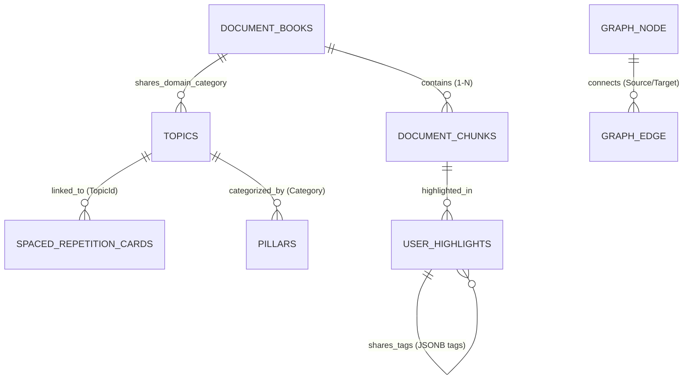
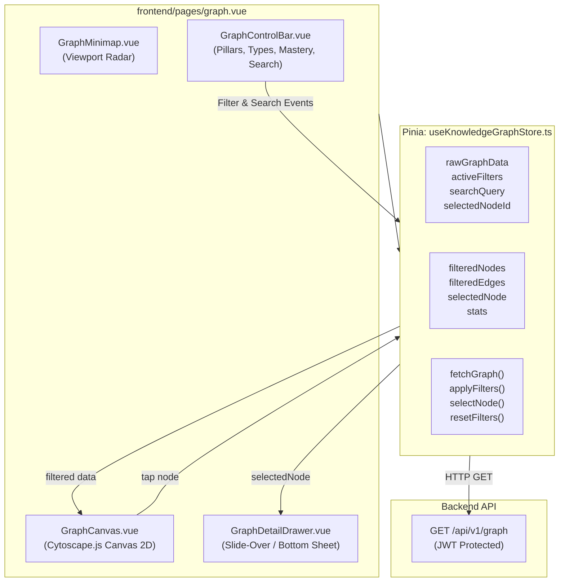

# Design: Interactive Architecture Knowledge Graph

## Context

TechDaily helps software engineers cultivate high-leverage technical mastery through daily reading slices, spaced repetition retention, scenario drills, curated tech insights, and structured curriculum roadmaps. However, as the platform has grown, its core learning modalities have remained isolated in separate functional silos:
- `/today`: Daily 3–5 minute reading slices and scenario drills.
- `/roadmap`: 30-day curriculum roadmap tracking foundational topics.
- `/library`: PDF and web book catalog with chapter navigation.
- `/review`: Spaced repetition flashcards with SM-2 retention scheduling.
- `/notes`: User reading highlights and annotations.
- `/insights`: Real-world senior engineering trade-offs and runtime mechanics.
- `/quiz`: Topic-based scenario quizzes.

In reality, engineering concepts do not exist in vacuums. A senior software engineer's mental model is inherently non-linear and associative:
```
┌─────────────────────────────────────────────────────────────────────────────┐
│                    ASSOCIATIVE KNOWLEDGE NETWORK                            │
│                                                                             │
│   [.NET CLR Generational GC & LOH] ──(Memory / Alloc)──> [Postgres MVCC]    │
│                 │                                              │            │
│          (Async I/O / Channels)                        (Buffer Cache / WAL) │
│                 │                                              │            │
│                 ▼                                              ▼            │
│     [Transactional Outbox / Idempotency] <────(Storage)──── [PgBouncer]     │
│                 │                                                           │
│           (Critical Rendering)                                              │
│                 ▼                                                           │
│    [Browser DOM / Event Loop / Vue 3] <──(Web Vitals)── [SSR Hydration]     │
└─────────────────────────────────────────────────────────────────────────────┘
```

Without an associative visualization, learners cannot perceive how their highlighted reading notes, active flashcards, and book chapters link back to foundational curriculum topics and engineering pillars.

This document specifies the technical architecture, data structures, algorithms, and user experience for the **Interactive Architecture Knowledge Graph (`/graph`)**.

---

## Goals & Non-Goals

### Goals
1. **Zero VPS Overhead (No Neo4j / Graph DBs):**
   - Avoid introducing any graph database container (e.g. Neo4j, Memgraph, ArangoDB).
   - Derive all graph nodes, edges, and associative relationships directly from existing PostgreSQL 17 relational tables in a single indexed query.
2. **Sub-5ms Query & Sub-60KB Payload:**
   - The endpoint `GET /api/v1/graph` must execute in sub-5ms on PostgreSQL 17 and return a lightweight JSON payload (~30–60 KB) strictly bounded under 100 KB.
3. **100% Client-Side Physics Simulation:**
   - Render the graph using Cytoscape.js (Canvas 2D) in the browser.
   - Run force-directed physics layout with rapid cooling that settles and freezes within 1.5 seconds, dropping to 0% CPU/GPU usage when idle.
4. **Multi-Dimensional Real-Time Filtering:**
   - Filter dynamically by engineering pillar, node type, flashcard mastery level (`Learning`, `Reviewing`, `Mastered`), and text search without triggering backend requests.
5. **Contextual Action Bridges:**
   - Provide a slide-over detail drawer on node selection with 1-click action buttons into review sessions, chapter reading, and quiz drills.
6. **Bilingual & Responsive Invariants:**
   - Full support for English (`en.json`) and Vietnamese (`vi.json`) with `whitespace-nowrap shrink-0` on buttons and badges.

### Non-Goals
- Real-time multi-user collaborative editing or live WebSocket graph sync.
- Arbitrary free-form user node/edge drafting; all nodes and edges are strictly grounded in relational domain data.
- Server-side image rasterization or server-side graph layout calculations.
- Running heavy $O(N^2)$ vector cosine distance matrix calculations across all chunks at request time.

---

## Data Modeling & Relational Graph Derivation



### Graph Node Schema (`GraphNodeDto`)
Each node represents a distinct learning artifact:
```csharp
public sealed record GraphNodeDto(
    string Id,
    string Label,
    GraphNodeType Type,
    int Category,
    string? CategoryName,
    MasteryStatus Mastery,
    int Weight,
    Dictionary<string, object?> Properties
);

public enum GraphNodeType
{
    Topic = 1,
    Book = 2,
    Card = 3,
    Highlight = 4
}

public enum MasteryStatus
{
    None = 0,
    Learning = 1,
    Reviewing = 2,
    Mastered = 3
}
```

### Graph Edge Schema (`GraphEdgeDto`)
Each edge represents a typed relationship between two nodes:
```csharp
public sealed record GraphEdgeDto(
    string Id,
    string Source,
    string Target,
    GraphRelationType RelationType,
    string? Label,
    int Weight
);

public enum GraphRelationType
{
    TopicToPillar = 1,
    CardToTopic = 2,
    BookToTopic = 3,
    HighlightToBook = 4,
    HighlightToTopic = 5,
    SharedTag = 6
}
```

### Response Container (`KnowledgeGraphResponse`)
```csharp
public sealed record KnowledgeGraphResponse(
    IReadOnlyList<GraphNodeDto> Nodes,
    IReadOnlyList<GraphEdgeDto> Edges,
    GraphStatsDto Stats,
    DateTime GeneratedAtUtc
);

public sealed record GraphStatsDto(
    int TotalNodes,
    int TotalEdges,
    Dictionary<string, int> NodeTypeCounts,
    Dictionary<string, int> PillarCounts,
    int MasteredCardsCount
);
```

### Relational Extraction Logic in PostgreSQL 17
All nodes and edges are assembled in memory from indexed queries within `GetKnowledgeGraphQueryHandler`:
1. **Topic Nodes & Pillar Edges:**
   - Query `_dbContext.Topics.AsNoTracking().ToListAsync()`.
   - Each topic becomes a `GraphNodeType.Topic` node.
   - Topics map to virtual category pillars (`0=FrontendWeb`, `1=BackendDotNet`, `2=DatabaseStorage`, `3=SystemDesign`, `4=EngineeringCraft`), establishing foundational cluster hubs.
2. **Book Nodes & Book-to-Topic Edges:**
   - Query `_dbContext.DocumentBooks.AsNoTracking().Where(b => b.IsPublished && !b.IsDeleted).ToListAsync()`.
   - Each book becomes a `GraphNodeType.Book` node.
   - Edges connect books to topics within the same category pillar.
3. **Card Nodes & Card-to-Topic Edges:**
   - Query `_dbContext.SpacedRepetitionCards.AsNoTracking().Where(c => c.UserId == userId).ToListAsync()`.
   - Each card becomes a `GraphNodeType.Card` node.
   - Mastery is derived from `IntervalDays`:
     - $\ge 21\text{ days}$: `MasteryStatus.Mastered`
     - $6\text{ to }20\text{ days}$: `MasteryStatus.Reviewing`
     - $< 6\text{ days}$: `MasteryStatus.Learning`
   - Edge connects `Card.Id` $\rightarrow$ `Card.TopicId` with `RelationType.CardToTopic`.
4. **Highlight Nodes & Highlight Edges:**
   - Query `_dbContext.UserHighlights.AsNoTracking().Include(h => h.DocumentChunk).Where(h => h.UserId == userId).ToListAsync()`.
   - Each highlight becomes a `GraphNodeType.Highlight` node with truncated quote label.
   - Edge connects `Highlight.Id` $\rightarrow$ `DocumentBookId` with `RelationType.HighlightToBook`.
   - Edges connect highlights to topics when highlight tags match topic slugs or category names (`HighlightToTopic`).
5. **Shared Tag Associative Intersections:**
   - For all user highlights containing non-empty `Tags` array:
   - Normalize tags to lowercase trimmed strings.
   - If highlight $A$ and highlight $B$ share one or more tags (e.g. `"mvcc"` or `"concurrency"`), emit an edge between $A$ and $B$ with `RelationType.SharedTag` and `Label = matchedTag`.

---

## Backend Architecture & Pure Dependency Injection

Following TechDaily's Clean Architecture conventions:
```
backend/src/TechDaily.Api/Endpoints/KnowledgeGraphEndpoints.cs
backend/src/TechDaily.Application/Features/KnowledgeGraph/
    ├── DTOs/KnowledgeGraphDtos.cs
    └── GetKnowledgeGraph/
        ├── GetKnowledgeGraphQuery.cs
        └── GetKnowledgeGraphQueryHandler.cs
```

### Pure DI Registration (No MediatR)
In `backend/src/TechDaily.Application/DependencyInjection.cs`:
```csharp
services.AddScoped<IUseCase<GetKnowledgeGraphQuery, KnowledgeGraphResponse>, GetKnowledgeGraphQueryHandler>();
```

### Endpoint Definition
In `backend/src/TechDaily.Api/Endpoints/KnowledgeGraphEndpoints.cs`:
```csharp
public static class KnowledgeGraphEndpoints
{
    public static RouteGroupBuilder MapKnowledgeGraphEndpoints(this RouteGroupBuilder group)
    {
        group.MapGet("/", async (
            ClaimsPrincipal userClaims,
            IUseCase<GetKnowledgeGraphQuery, KnowledgeGraphResponse> handler,
            CancellationToken ct) =>
        {
            var userId = GetUserIdFromClaims(userClaims);
            if (!userId.HasValue)
            {
                return Results.Unauthorized();
            }

            var query = new GetKnowledgeGraphQuery(userId.Value);
            var result = await handler.ExecuteAsync(query, ct);

            return result.IsSuccess
                ? Results.Ok(result.Value)
                : Results.BadRequest(new { code = result.Error.Code, error = result.Error.Message });
        })
        .RequireAuthorization()
        .WithName("GetKnowledgeGraph")
        .WithSummary("Retrieves the full architecture knowledge graph with topics, books, cards, and highlights for the authenticated user.");

        return group;
    }
}
```

In `backend/src/TechDaily.Api/Program.cs`:
```csharp
app.MapGroup("/api/v1/graph")
    .WithTags("Knowledge Graph")
    .RequireAuthorization()
    .MapKnowledgeGraphEndpoints();
```

---

## Frontend Architecture & State Management



### Pinia Store: `useKnowledgeGraphStore.ts`
```typescript
export interface GraphFilters {
  category: number | null // null = All pillars
  nodeTypes: Set<GraphNodeType>
  mastery: MasteryStatus | null // null = All mastery
  searchQuery: string
}

export const useKnowledgeGraphStore = defineStore('knowledgeGraph', () => {
  const api = useApiClient()
  const rawData = ref<KnowledgeGraphResponse | null>(null)
  const isLoading = ref<boolean>(false)
  const error = ref<string | null>(null)
  const selectedNodeId = ref<string | null>(null)

  const filters = reactive<GraphFilters>({
    category: null,
    nodeTypes: new Set(['Topic', 'Book', 'Card', 'Highlight']),
    mastery: null,
    searchQuery: ''
  })

  // Filtered nodes projection
  const filteredNodes = computed(() => {
    if (!rawData.value) return []
    return rawData.value.nodes.filter(node => {
      // 1. Node type filter
      if (!filters.nodeTypes.has(node.type)) return false

      // 2. Category pillar filter
      if (filters.category !== null && node.category !== filters.category) return false

      // 3. Mastery status filter (applies to cards)
      if (filters.mastery !== null && node.type === 'Card' && node.mastery !== filters.mastery) return false

      return true
    })
  })

  // Filtered edges: keep edges where both source and target are visible
  const filteredEdges = computed(() => {
    if (!rawData.value) return []
    const visibleNodeIds = new Set(filteredNodes.value.map(n => n.id))
    return rawData.value.edges.filter(edge =>
      visibleNodeIds.has(edge.source) && visibleNodeIds.has(edge.target)
    )
  })

  const selectedNode = computed(() => {
    if (!rawData.value || !selectedNodeId.value) return null
    return rawData.value.nodes.find(n => n.id === selectedNodeId.value) ?? null
  })

  async function fetchGraph() {
    isLoading.value = true
    error.value = null
    try {
      rawData.value = await api.get<KnowledgeGraphResponse>('/api/v1/graph')
    } catch (err: any) {
      error.value = err?.data?.error || err?.message || 'Failed to load knowledge graph.'
    } finally {
      isLoading.value = false
    }
  }

  function selectNode(id: string | null) {
    selectedNodeId.value = id
  }

  function resetFilters() {
    filters.category = null
    filters.nodeTypes = new Set(['Topic', 'Book', 'Card', 'Highlight'])
    filters.mastery = null
    filters.searchQuery = ''
    selectedNodeId.value = null
  }

  return {
    rawData,
    isLoading,
    error,
    filters,
    selectedNodeId,
    filteredNodes,
    filteredEdges,
    selectedNode,
    fetchGraph,
    selectNode,
    resetFilters
  }
})
```

---

## Cytoscape.js Canvas 2D Integration & Theme Synchronization

### Canvas Lifecycle & Rapid Physics Settling
To guarantee zero ongoing CPU consumption in client browsers:
1. `cytoscape` mounts onto a dedicated `<div ref="canvasRef">` inside `GraphCanvas.vue`.
2. The layout algorithm uses `cose` (Compound Spring Embedder) with high cooling factor:
   ```javascript
   layout: {
     name: 'cose',
     animate: true,
     animationDuration: 1200,
     coolingFactor: 0.95,
     numIter: 300,
     randomize: false,
     fit: true,
     padding: 50,
     stop: () => {
       // Freeze physics completely once settled
     }
   }
   ```
3. After ~1.2–1.5 seconds, physics iterations complete and Cytoscape freezes position calculations. The canvas operates in pure 2D transform mode (pan and zoom only).

### Theme Styling & Color Palette
The cytoscape stylesheet reacts to `@nuxtjs/color-mode` (`colorMode.value === 'dark' ? darkTheme : lightTheme`):

| Element | Light Mode | Dark Mode | Shape |
|---|---|---|---|
| Background Canvas | `#f8fafc` (slate-50) | `#020617` (slate-950) | Grid dots |
| Topic Node (Runtime) | `#0284c7` (sky-600) | `#38bdf8` (sky-400) | Ellipse (36px) |
| Topic Node (Storage) | `#059669` (emerald-600) | `#34d399` (emerald-400) | Ellipse (36px) |
| Topic Node (System Design) | `#7c3aed` (violet-600) | `#a78bfa` (violet-400) | Ellipse (36px) |
| Topic Node (Frontend) | `#d97706` (amber-600) | `#fbbf24` (amber-400) | Ellipse (36px) |
| Topic Node (Craft) | `#e11d48` (rose-600) | `#fb7185` (rose-400) | Ellipse (36px) |
| Book Node | `#475569` (slate-600) | `#94a3b8` (slate-400) | Round Rectangle (32x24px) |
| Card (Learning) | `#f59e0b` (amber-500) | `#fbbf24` (amber-400) | Diamond (24px) |
| Card (Reviewing) | `#3b82f6` (blue-500) | `#60a5fa` (blue-400) | Diamond (24px) |
| Card (Mastered) | `#10b981` (emerald-500) | `#34d399` (emerald-400) | Diamond (28px) |
| Highlight Node | `#8b5cf6` (violet-500) | `#c4b5fd` (violet-300) | Hexagon (20px) |
| Structural Edges | `#cbd5e1` (slate-300) | `#1e293b` (slate-800) | Solid Line, 1.5px |
| Associative Tag Edges | `#93c5fd` (blue-300) | `#1e3a8a` (blue-900) | Dashed Line, 1px |

When searching, matching nodes maintain 100% opacity with an active glow outline, while non-matching nodes fade to `opacity: 0.15` and non-connected edges drop to `opacity: 0.05`.

---

## Slide-Over Detail Drawer & Action Bridges

Selecting any node opens `GraphDetailDrawer.vue`:
```
┌──────────────────────────────────────────────┐
│ [Type Badge] [Pillar Tag]                [X] │
│                                              │
│ Large Node Title                             │
│ Subtitle / Metadata (e.g. Day 14 • Senior)   │
├──────────────────────────────────────────────┤
│ Summary / Excerpt:                           │
│ "Generational GC divides the managed heap    │
│  into Generation 0, 1, and 2..."             │
├──────────────────────────────────────────────┤
│ Spaced Repetition Metrics: (if Card)         │
│ Interval: 24 days • EF: 2.50 • Reps: 4       │
├──────────────────────────────────────────────┤
│ Connected Concepts (4 links):                │
│ • [Topic] Large Object Heap Allocation       │
│ • [Book] CLR via C# (4th Edition)            │
│ • [Card] GC Allocation Budgets               │
├──────────────────────────────────────────────┤
│ Action Bridges (1-Click CTAs):               │
│ [ Review Flashcard ]  [ Read Chapter ]       │
└──────────────────────────────────────────────┘
```

### Action Bridge Routes
- **Topic Node:**
  - *"Practice Quiz"*: Navigates to `/quiz?topic={slug}`.
  - *"View Roadmap"*: Navigates to `/roadmap#{dayOrder}`.
- **Book Node:**
  - *"Browse in Library"*: Navigates to `/library`.
  - *"Read Slices"*: Navigates to `/read/{bookId}`.
- **Card Node:**
  - *"Review Flashcard"*: Navigates to `/review?cardId={id}`.
- **Highlight Node:**
  - *"Read Chapter"*: Navigates to `/read/{bookId}#slice-{chunkOrder}`.
  - *"View in Notes"*: Navigates to `/notes?highlightId={id}`.

### Bilingual Layout Invariant
All buttons enforce `whitespace-nowrap shrink-0` and responsive flex gaps to guarantee that Vietnamese strings (e.g. *"Ôn Tập Thẻ Ghi Nhớ"*, *"Đọc Trích Đoạn Chương"*) render without text collisions or clipping.

---

## Performance & VPS Zero-Overhead Invariants

### Memory & Process Footprint Comparison
| Metric | Neo4j / Dedicated Graph DB | TechDaily Relational Projection |
|---|---|---|
| VPS Resident RAM | 1.5 GB – 3.0 GB | **0 MB additional RAM** |
| Additional Docker Containers | 1 (Neo4j image ~800MB) | **0 containers** |
| Server-side Layout Compute | Continuous CPU load | **0 CPU cycles (Client Canvas 2D)** |
| Query Execution Time | 15–40 ms over Bolt protocol | **< 5 ms (PostgreSQL indexed join)** |
| Network Payload Size | 200–500 KB (Verbose graph format) | **30–60 KB JSON** |
| Client Idle CPU / GPU | Variable if unmanaged | **0% (Frozen physics after 1.5s)** |

---

## Security, Authentication & Error Handling

1. **Authentication:**
   - Strict JWT Bearer validation (`.RequireAuthorization()`).
   - Rejects unauthenticated requests with `HTTP 401 Unauthorized` and RFC 7807 problem details.
2. **User Data Isolation:**
   - Card and Highlight queries strictly enforce `WHERE "UserId" = @CurrentUserId`.
   - Users can never view or traverse other users' flashcards or private reading highlights.
3. **Frontend Error Resilience:**
   - If the graph API fails or times out, the page displays a localized retry banner with an illustration, preventing white screens.
   - If a new user has zero flashcards or highlights, the canvas renders standard curriculum topics and published books with a welcoming empty-state hint encouraging them to start reading.
