# Design: Quiz Bento Dashboard, Review Daily Completion Hub, and Notes Dynamic Tags

## Context

TechDaily empowers software engineers to advance their careers through curated technical reading, spaced repetition retention, and scenario challenges. The platform's retention engine relies on three interconnected learning surfaces:
1. **Interview Quiz (`/quiz`)**: Multiple-choice scenario questions evaluating practical engineering trade-offs across seniority levels.
2. **Spaced Repetition Review (`/review`)**: SuperMemo SM-2 flashcard deck for long-term recall of concepts, book highlights, and quiz mistakes.
3. **Reading Notes (`/notes`)**: Technical highlights, quotes, and personal reflections curated from engineering books.

Recent production telemetry, UI audits, and codebase inspection have revealed critical design gaps and behavioral bugs across these three interfaces:
- On `/quiz`, the Seniority Level breakdown fails to display distinct seniority tiers due to string enum deserialization mismatch, collapsing all four rows into `'Senior'`. Furthermore, the Stats view is rendered as a dated, flat 4-box counter that omits topic-level strengths and weaknesses.
- On `/review`, completing the daily review session leaves the user in an empty viewport with an isolated dark card, isolating them from their retention achievements and forcing manual navigation to the deck management tab to inspect upcoming cards.
- On `/notes`, user highlights carry technical tags (`#dotnet`, `#architecture`, `#performance`), but users must manually type search queries instead of using 1-click horizontal tag chips.

This design document specifies the architecture, component hierarchy, data structures, algorithms, and deployment/verification strategy to modernize all three surfaces into high-density, engaging Bento architectures.

---

## Goals / Non-Goals

### Goals
- **Seniority Bug Resolution**: Implement `formatSeniorityLevel(level: string | number)` in `frontend/pages/quiz.vue` to reliably map both string enum values (`"Fresher"`, `"Junior"`, `"Middle"`, `"Senior"`) and numeric values (`0`, `1`, `2`, `3`) to distinct seniority metadata.
- **Quiz Bento Dashboard**: Redesign `/quiz` Stats tab into a 4-card Bento Grid Dashboard:
  1. Hero Performance Card (accuracy rate, total answered, review queue count, 1-click review CTA).
  2. Spaced Mastery Gauge Card (semi-circular radial SVG gauge displaying Mastery Rate = $(Mastered / TotalAnswered) \times 100\%$ with tier badges).
  3. Seniority Matrix Card (distinct color-coded bars, counts, and percentages for Fresher, Junior, Mid-Level, Senior).
  4. Topic Strengths & Weaknesses Radar Card (rendering `TopicBreakdown` with Emerald/Amber/Rose accuracy badges).
- **Daily Review Completion Hub**: Replace the solitary empty card on `/review` with a balanced, celebratory Completion Hub embedding:
  1. Celebratory Hero Banner with triumphant copy and confetti.
  2. Embedded `MasteryGaugeCard` displaying total deck retention and tier status.
  3. Embedded `ReviewForecastChart` displaying 7-day upcoming review volume.
  4. Dual action buttons: "Browse Full Deck (N cards)" and "Cram / Extended Practice".
- **Notes Dynamic Tags Filter**: Add a horizontal scrollable tag chip bar at the top of `/notes`:
  1. Default chip `Tất cả (N)` with total highlight count.
  2. Dynamically extracted tags sorted by frequency descending with occurrence counts.
  3. Interactive tag selection seamlessly composed conjunctively (`AND`) with text search.
- **Production Deployment & Live Verification**: Push to `main`, observe CI/CD container build/deployment, and conduct live verification via MCP tools on `https://techdaily.duckdns.org`.

### Non-Goals
- Altering the backend `QuizLevel` enum serialization format in ASP.NET Core (frontend must be resilient to both string and number serialization).
- Modifying the underlying SuperMemo SM-2 algorithm or database schemas.
- Changing authentication middleware, user profiles, or payment tiers.

---

## Architecture & Data Flow

```mermaid
flowchart TD
    subgraph QuizSurface ["/quiz: Interview Quiz"]
        QuizStore["useInterviewQuizStore"]
        StatsTab["Stats Tab View"]
        FormatHelper["formatSeniorityLevel() Helper"]
        Bento1["Hero Performance Card\nAccuracy % + Review CTA"]
        Bento2["Spaced Mastery Gauge Card\nSemi-Circular Radial SVG"]
        Bento3["Seniority Matrix Card\nFresher/Junior/Mid/Senior"]
        Bento4["Topic Strengths & Weaknesses\nTopicBreakdown Badges"]
        
        QuizStore -->|stats: GetQuizStatsResponse| StatsTab
        StatsTab --> Bento1
        StatsTab --> Bento2
        StatsTab --> FormatHelper --> Bento3
        StatsTab --> Bento4
    end

    subgraph ReviewSurface ["/review: Spaced Repetition"]
        ReviewStore["useReviewStore"]
        SessionTab["Session Tab View\n(cards.length === 0)"]
        CompletionHub["Daily Review Completion Hub"]
        CelebrationBanner["Celebratory Banner\n+ Confetti Burst"]
        EmbeddedGauge["MasteryGaugeCard\nMastered / Total Cards"]
        EmbeddedForecast["ReviewForecastChart\n7-Day Upcoming Reviews"]
        ActionCTAs["Action CTAs:\nBrowse Full Deck | Extended Practice"]
        
        ReviewStore -->|cards, deckStatistics, deckCards| SessionTab
        SessionTab --> CompletionHub
        CompletionHub --> CelebrationBanner
        CompletionHub --> EmbeddedGauge
        CompletionHub --> EmbeddedForecast
        CompletionHub --> ActionCTAs
    end

    subgraph NotesSurface ["/notes: Reading Notes Hub"]
        NotesStore["useNotesStore"]
        TagBar["Horizontal Scrollable Tag Chip Bar"]
        AllChip["'Tất cả (N)' Chip"]
        DynamicChips["Dynamic Tag Chips\n'#tag (count)'"]
        FilteredList["Conjunctive Filtered Highlights List\n(selectedTag AND searchKeyword)"]
        
        NotesStore -->|highlights| TagBar
        TagBar --> AllChip
        TagBar --> DynamicChips
        TagBar -->|selectedTag| FilteredList
    end

    subgraph DeploymentFlow ["Deployment & Live Verification"]
        GitPush["git push origin main"]
        CICD["GitHub Actions CI/CD\nDocker Build & GHCR Push"]
        VPS["VPS Production Deploy\nContainer Restart & Nginx Reload"]
        MCPLive["MCP Browser Tools\nLive Verification on https://techdaily.duckdns.org"]
        
        GitPush --> CICD --> VPS --> MCPLive
    end
```



---

## Detailed Component Specifications

### 1. Quiz Bento Dashboard & Seniority Bug Fix (`frontend/pages/quiz.vue`)

#### 1.1 Root Cause & Helper Implementation
In `frontend/pages/quiz.vue`, `seniorityLevels` is defined as:
```typescript
const seniorityLevels = [
  { id: 0, key: 'level_fresher', label: 'Fresher / Entry', desc: 'Core syntax, OOP, basic algorithms' },
  { id: 1, key: 'level_junior', label: 'Junior', desc: 'Framework APIs, standard libraries, debugging' },
  { id: 2, key: 'level_middle', label: 'Mid-Level', desc: 'Design patterns, concurrency, SQL tuning' },
  { id: 3, key: 'level_senior', label: 'Senior / Staff', desc: 'Under-the-hood runtime, memory trade-offs' }
]
```
The backend `GetQuizStatsResponse` serializes `LevelStatDto.Level` via `JsonStringEnumConverter` as string values: `"Fresher"`, `"Junior"`, `"Middle"`, `"Senior"`.
Indexing `seniorityLevels[lvl.level]` evaluates to `seniorityLevels["Fresher"]`, which is `undefined`. The expression `|| 'Senior'` then triggers, rendering all 4 rows as 'Senior'.

**Solution**: Implement `formatSeniorityLevel`:
```typescript
function formatSeniorityLevel(level: string | number) {
  if (typeof level === 'number') {
    return seniorityLevels[level] || seniorityLevels[3]
  }
  const levelStr = String(level).trim().toLowerCase()
  if (levelStr === 'fresher' || levelStr === '0') return seniorityLevels[0]
  if (levelStr === 'junior' || levelStr === '1') return seniorityLevels[1]
  if (levelStr === 'middle' || levelStr === 'mid' || levelStr === '2') return seniorityLevels[2]
  if (levelStr === 'senior' || levelStr === '3') return seniorityLevels[3]
  return seniorityLevels[3]
}
```

#### 1.2 Bento Grid Layout Structure
On the Stats tab (`quizStore.activeTab === 'stats'`), replace the flat grid with an asymmetric 4-card Bento Dashboard:
```html
<div class="grid grid-cols-1 md:grid-cols-2 lg:grid-cols-12 gap-4 sm:gap-6">
  <!-- Bento 1: Hero Performance Card (lg:col-span-7) -->
  <!-- Bento 2: Spaced Mastery Gauge Card (lg:col-span-5) -->
  <!-- Bento 3: Seniority Matrix Card (lg:col-span-6) -->
  <!-- Bento 4: Topic Strengths & Weaknesses Radar Card (lg:col-span-6) -->
</div>
```

- **Bento 1: Hero Performance Card**:
  - Highlights Accuracy Rate prominently (`text-3xl sm:text-4xl font-black text-brand-600 dark:text-brand-400`).
  - Displays Total Answered and Unmastered Review Queue count (`quizStore.stats.reviewQueueCount`).
  - Readiness badge (e.g. `quiz.readiness_ready` if accuracy $\ge 75\%$, `quiz.readiness_building` if $\ge 50\%$, `quiz.readiness_starting` otherwise).
  - Primary CTA button: "Review Mistakes (N)" (`quiz.btn_start_review`), triggering `quizStore.activeTab = 'review'`.

- **Bento 2: Spaced Mastery Gauge Card**:
  - Semi-circular SVG gauge with radius = 45 and circumference $\approx 141.37$.
  - Calculates Mastery Rate = $\min(100, \max(0, \text{round}((\text{masteredCount} / \text{totalAnswered}) \times 100)))$.
  - Dynamic stroke-dashoffset: $141.37 - (\text{masteryRate} / 100) \times 141.37$.
  - Displays Mastered vs Total Answered with motivational tier badges.

- **Bento 3: Seniority Matrix Card**:
  - Iterates `quizStore.stats.levelBreakdown`.
  - Uses `formatSeniorityLevel(lvl.level)` to display `{ label, desc }`.
  - Color-coded progress bars:
    * Fresher: Emerald (`bg-emerald-500`)
    * Junior: Sky (`bg-sky-500`)
    * Mid-Level: Amber (`bg-amber-500`)
    * Senior: Brand/Violet (`bg-brand-500`)
  - Displays `(lvl.masteredCount / lvl.answeredCount mastered)` and `lvl.accuracyRate%`.

- **Bento 4: Topic Strengths & Weaknesses Card**:
  - Iterates `quizStore.stats.topicBreakdown`.
  - Displays topic name, answered count, and an accuracy badge:
    * $\ge 80\%$: Emerald badge (`bg-emerald-50 dark:bg-emerald-950/40 text-emerald-600 dark:text-emerald-400 border-emerald-200`)
    * $50\%\text{--}79\%$: Amber badge (`bg-amber-50 dark:bg-amber-950/40 text-amber-600 dark:text-amber-400 border-amber-200`)
    * $< 50\%$: Rose badge (`bg-rose-50 dark:bg-rose-950/40 text-rose-600 dark:text-rose-400 border-rose-200`)

---

### 2. Review Daily Completion Hub (`frontend/pages/review.vue`)

#### 2.1 State & Layout Integration
In `frontend/pages/review.vue`, when `activeTab === 'session'` and `reviewStore.cards.length === 0`:
Replace the existing lonely card (`max-w-md p-8 sm:p-10 ... my-auto`) with a structured, balanced **Daily Review Completion Hub**:
```html
<div class="w-full max-w-4xl space-y-6 sm:space-y-8 animate-in fade-in zoom-in-95 duration-200">
  <!-- Celebratory Hero Banner -->
  <div class="p-6 sm:p-8 rounded-3xl bg-gradient-to-br from-emerald-500/10 via-brand-500/5 to-transparent border border-emerald-500/20 dark:border-emerald-500/30 text-center space-y-3 shadow-sm">
    <div class="w-16 h-16 rounded-2xl bg-emerald-100 dark:bg-emerald-500/20 text-emerald-600 dark:text-emerald-400 border border-emerald-200 dark:border-emerald-500/30 flex items-center justify-center mx-auto shadow-sm">
      <CheckCircle class="w-8 h-8" />
    </div>
    <h2 class="text-2xl sm:text-3xl font-extrabold text-slate-900 dark:text-white tracking-tight">
      {{ $t('review.no_cards') }}
    </h2>
    <p class="text-sm sm:text-base text-slate-600 dark:text-slate-400 max-w-xl mx-auto leading-relaxed">
      {{ $t('review.no_cards_desc') }}
    </p>
    <!-- Action CTAs -->
    <div class="flex flex-col sm:flex-row items-center justify-center gap-3 pt-2">
      <button
        @click="activeTab = 'management'"
        class="w-full sm:w-auto inline-flex items-center justify-center gap-2 px-5 py-3 rounded-2xl bg-brand-600 hover:bg-brand-500 text-white font-semibold text-xs sm:text-sm shadow-md shadow-brand-500/20 transition-all active:scale-95"
      >
        <Library class="w-4 h-4" />
        <span>{{ $t('review.browse_deck_btn') }} ({{ reviewStore.deckStatistics.totalCards }} {{ $t('review.cards_unit') }})</span>
      </button>
      <NuxtLink
        to="/today"
        class="w-full sm:w-auto inline-flex items-center justify-center gap-2 px-5 py-3 rounded-2xl bg-white dark:bg-slate-900 hover:bg-slate-50 dark:hover:bg-slate-800 text-slate-700 dark:text-slate-200 font-semibold text-xs sm:text-sm border border-slate-200 dark:border-slate-800 transition-all shadow-sm"
      >
        <Sparkles class="w-4 h-4 text-brand-500" />
        <span>{{ $t('review.continue_drill') }}</span>
      </NuxtLink>
    </div>
  </div>

  <!-- Embedded Bento Analytics (Mastery Gauge + 7-Day Forecast) -->
  <div class="grid grid-cols-1 md:grid-cols-2 gap-4 sm:gap-6">
    <MasteryGaugeCard
      :mastered-count="reviewStore.deckStatistics.masteredCount"
      :total-count="reviewStore.deckStatistics.totalCards"
    />
    <ReviewForecastChart
      :cards="reviewStore.deckCards"
    />
  </div>
</div>
```

Ensure `fetchDeck(1)` is executed on page load so `reviewStore.deckStatistics` and `reviewStore.deckCards` are populated without requiring the user to open the Deck Management tab first.

---

### 3. Notes Dynamic Tags Filter (`frontend/pages/notes.vue`)

#### 3.1 Tag Extraction & Frequency Sorting
Compute all unique tags and their counts across `notesStore.highlights`:
```typescript
interface TagCount {
  tag: string
  count: number
}

const tagCounts = computed<TagCount[]>(() => {
  const counts: Record<string, number> = {}
  notesStore.highlights.forEach((h) => {
    if (h.tags && Array.isArray(h.tags)) {
      h.tags.forEach((rawTag) => {
        const clean = rawTag.trim().replace(/^#/, '').toLowerCase()
        if (clean.length > 0) {
          counts[clean] = (counts[clean] || 0) + 1
        }
      })
    }
  })

  return Object.entries(counts)
    .map(([tag, count]) => ({ tag, count }))
    .sort((a, b) => b.count - a.count || a.tag.localeCompare(b.tag))
})

const selectedTag = ref<string | null>(null)

function selectTag(tag: string | null) {
  if (selectedTag.value === tag) {
    selectedTag.value = null
  } else {
    selectedTag.value = tag
  }
}
```

#### 3.2 Conjunctive Filtering in `filteredHighlights`
Update `filteredHighlights` to filter conjunctively:
```typescript
const filteredHighlights = computed(() => {
  const q = highlightSearchQuery.value.trim().toLowerCase()
  const activeTag = selectedTag.value ? selectedTag.value.toLowerCase() : null

  return notesStore.highlights.filter((h) => {
    // 1. Tag matching
    if (activeTag) {
      const hasTag = h.tags?.some((t) => t.trim().replace(/^#/, '').toLowerCase() === activeTag)
      if (!hasTag) return false
    }

    // 2. Keyword matching
    if (q) {
      const matchText = h.selectedText.toLowerCase().includes(q)
      const matchNote = h.note ? h.note.toLowerCase().includes(q) : false
      const matchBook = h.bookTitle.toLowerCase().includes(q)
      const matchChapter = h.chapterTitle.toLowerCase().includes(q)
      const matchTags = h.tags?.some((t) => t.toLowerCase().includes(q.replace(/^#/, '')))
      if (!matchText && !matchNote && !matchBook && !matchChapter && !matchTags) {
        return false
      }
    }

    return true
  })
})
```

#### 3.3 Horizontal Scrollable Chip Bar Template
```html
<div v-if="notesStore.highlights.length > 0" class="flex items-center gap-2 overflow-x-auto no-scrollbar py-1">
  <!-- Default All Chip -->
  <button
    @click="selectTag(null)"
    :class="[
      'px-3 py-1.5 rounded-xl text-xs font-bold transition-all whitespace-nowrap shrink-0 border inline-flex items-center gap-1.5',
      selectedTag === null
        ? 'bg-indigo-600 text-white border-transparent shadow-sm'
        : 'bg-white dark:bg-slate-900 text-slate-600 dark:text-slate-400 border-slate-200 dark:border-slate-800 hover:bg-slate-50 dark:hover:bg-slate-800'
    ]"
  >
    <span>{{ $t('notes.tag_all') }}</span>
    <span :class="selectedTag === null ? 'text-white/80' : 'text-slate-400 dark:text-slate-500'">
      ({{ notesStore.highlights.length }})
    </span>
  </button>

  <!-- Dynamic Tag Chips -->
  <button
    v-for="item in tagCounts"
    :key="item.tag"
    @click="selectTag(item.tag)"
    :class="[
      'px-3 py-1.5 rounded-xl text-xs font-semibold transition-all whitespace-nowrap shrink-0 border inline-flex items-center gap-1',
      selectedTag === item.tag
        ? 'bg-indigo-600 text-white border-transparent shadow-sm'
        : 'bg-white dark:bg-slate-900 text-slate-600 dark:text-slate-400 border-slate-200 dark:border-slate-800 hover:bg-slate-50 dark:hover:bg-slate-800'
    ]"
  >
    <span>#{{ item.tag }}</span>
    <span :class="selectedTag === item.tag ? 'text-white/80' : 'text-slate-400 dark:text-slate-500'">
      ({{ item.count }})
    </span>
  </button>
</div>
```

---

### 4. Deployment & Live Verification Protocol

#### 4.1 CI/CD Pipeline
- Code is committed and pushed to remote branch `main`.
- GitHub Actions workflow executes:
  1. Backend build & unit test run (`dotnet test`).
  2. Frontend build & unit test run (`npm test`, `npx nuxi build`).
  3. Multi-arch Docker image build (`ghcr.io/duycld03/techdaily-api`, `ghcr.io/duycld03/techdaily-web`).
  4. SSH dispatch to production VPS: container pull, rolling restart, health checks, and nginx reload.
  5. Workflow takes approximately 4–5 minutes to settle.

#### 4.2 MCP Live Verification Checklist
Once CI/CD completes, execute live testing on `https://techdaily.duckdns.org` via MCP tools:
1. **Quiz Stats Tab (`https://techdaily.duckdns.org/quiz`)**:
   - Log in with test user credentials.
   - Navigate to `/quiz` and click the "Thống kê" ("Stats") tab.
   - Verify that the 4 Bento cards render in responsive grid layout.
   - Verify that the Seniority Matrix card displays distinct rows:
     * "Fresher / Entry"
     * "Junior"
     * "Mid-Level"
     * "Senior / Staff"
     (no row should improperly display 'Senior' if its level is Fresher or Junior).
   - Verify Topic Strengths & Weaknesses card displays colored accuracy badges.
2. **Review Completion Hub (`https://techdaily.duckdns.org/review`)**:
   - Navigate to `/review` when 0 cards are due (or complete a session).
   - Verify that the Daily Review Completion Hub displays:
     * Celebratory hero banner.
     * Embedded Mastery Gauge Card with circular gauge and percentage.
     * Embedded 7-Day Review Forecast chart showing upcoming days.
     * "Browse Full Deck (N cards)" button navigates to Deck Management tab.
     * "Cram / Extended Practice" button routes properly.
3. **Notes Dynamic Tags (`https://techdaily.duckdns.org/notes`)**:
   - Navigate to `/notes`.
   - Verify that the horizontal tag chip bar renders at the top with "Tất cả (N)" active.
   - Click a dynamic tag chip (e.g. `#dotnet`); verify that highlights filter immediately to matching notes.
   - Enter a search query in the search bar while the tag is active; verify conjunctive filtering.
   - Click "Tất cả" to clear tag filter; verify all highlights restore.

---

## Internationalization (i18n)

Update `frontend/i18n/locales/en.json` and `frontend/i18n/locales/vi.json` with required keys:

| Key | English (`en.json`) | Vietnamese (`vi.json`) |
| --- | --- | --- |
| `quiz.bento_hero_title` | `Performance Overview` | `Tổng Quan Hiệu Suất` |
| `quiz.bento_seniority_title` | `Seniority Matrix` | `Ma Trận Cấp Bậc` |
| `quiz.bento_topic_title` | `Topic Strengths & Radar` | `Radar Thế Mạnh & Điểm Yếu` |
| `quiz.bento_mastery_title` | `Spaced Mastery Rate` | `Tỷ Lệ Thành Thạo SM-2` |
| `quiz.readiness_ready` | `Interview Ready` | `Sẵn Sàng Phỏng Vấn` |
| `quiz.readiness_building` | `Building Reflexes` | `Đang Rèn Phản Xạ` |
| `quiz.readiness_starting` | `Getting Started` | `Bắt Đầu Luyện Tập` |
| `quiz.btn_review_mistakes` | `Review Mistakes ({count})` | `Ôn Tập Câu Sai ({count})` |
| `review.cards_unit` | `cards` | `thẻ` |
| `review.cram_practice_btn` | `Extended Practice` | `Luyện Tập Mở Rộng` |
| `notes.tag_all` | `All` | `Tất cả` |

---

## Responsive & Accessibility Considerations

- **Desktop ($\ge 1280\text{px}$)**:
  - Quiz Bento Dashboard uses a 12-column grid (`lg:col-span-7`, `lg:col-span-5`, `lg:col-span-6`, `lg:col-span-6`).
  - Review Completion Hub renders Mastery Gauge and Review Forecast side-by-side in a 2-column layout.
- **Tablet ($768\text{px}\text{--}1279\text{px}$)**:
  - 2-column grid layout across Bento cards.
- **Mobile ($< 768\text{px}$)**:
  - Single-column vertical stacking with natural spacing (`space-y-4` / `space-y-6`).
  - Horizontal scrollbar on tag chip bar uses `no-scrollbar` class with smooth momentum touch scrolling.
  - Minimum touch target sizing of $\ge 40\text{px}$ on mobile buttons and chips.
  - Full dark mode support matching TechDaily's high-contrast slate-900 / slate-950 theme.
