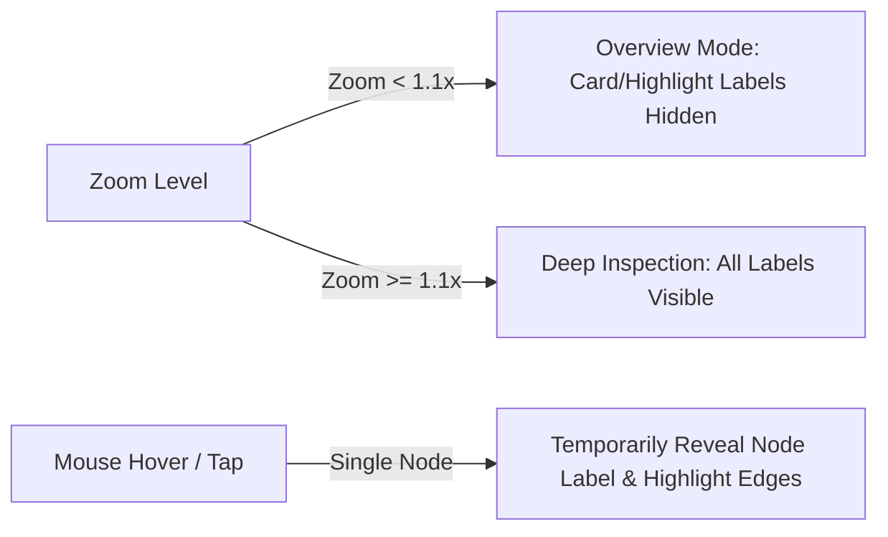

# Technical Design: Technology-Agnostic Architectural Pillars & Knowledge Graph Decluttering

## Context

See `proposal.md` for background and problem statement.

The system currently exhibits two tightly coupled architectural defects:
1. `Category.BackendDotNet` is baked into domain enums, EF Core database string conversions, AI prompts, and documentation (`docs/curriculum-30-days.md`). This narrows the perceived scope of TechDaily to a .NET 30-day tutorial site.
2. In `GetKnowledgeGraphQueryHandler.cs`, flashcards created from reading highlights or quiz mistakes do not possess a `TopicId`. Because no edge is generated for them, they have degree 0. In Cytoscape's CoSE force-directed layout, disconnected nodes are repelled to the canvas perimeter, resulting in an unreadable horizontal pile of diamond nodes with colliding 100px labels at the bottom edge.

## Goals / Non-Goals

**Goals:**
- Rename `Category.BackendDotNet` to `Category.BackendRuntime` in `DomainEnums.cs` while preserving integer ordinal value (`1`).
- Provide seamless dual-reading EF Core value conversion to safely parse legacy `"BackendDotNet"` database rows into `Category.BackendRuntime`.
- Remove `docs/curriculum-30-days.md` and eliminate .NET-biased fallback defaults across crawlers, AI prompts, and ingestion endpoints.
- Ensure 100% of graph nodes have edge degree $\ge 1$ by wiring `CardToHighlight` and `CardToPillar` edges for topic-less cards.
- Implement Level-of-Detail (LOD) label rendering and top-padding clearance in `GraphCanvas.vue` to eradicate text collisions.

**Non-Goals:**
- Deleting the underlying seed JSON data (`curriculum-30-days.json`); it remains as the onboarding Starter Pack.
- Supporting multi-category tagging per single document.
- Replacing Cytoscape.js with alternative graph rendering engines.

---

## Decisions

### 1. Enum Refactoring & Database Dual-Conversion Strategy

```csharp
// TechDaily.Domain.Enums.Category
public enum Category
{
    FrontendWeb = 0,
    BackendRuntime = 1, // Refactored from BackendDotNet (value preserved)
    DatabaseStorage = 2,
    SystemDesign = 3,
    EngineeringCraft = 4
}
```

**Database Invariant Analysis:**
- Tables `TechInsights` and `InterviewQuestions` map `Category` as integer (`int`). Preserving ordinal `1` guarantees zero breaking schema changes for these tables.
- Tables `Topics` and `DocumentBooks` map `Category` as string (`HasConversion<string>()`). Existing production databases may contain `"BackendDotNet"`.
- To guarantee zero runtime failure on legacy records without requiring an immediate database lock:
  We configure an EF Core `ValueConverter<Category, string>`:
  - **Writing to DB:** Always writes `v.ToString()` (`"BackendRuntime"`).
  - **Reading from DB:**
    ```csharp
    v => string.Equals(v, "BackendDotNet", StringComparison.OrdinalIgnoreCase) || string.Equals(v, "DotNet", StringComparison.OrdinalIgnoreCase)
        ? Category.BackendRuntime
        : Enum.Parse<Category>(v, true)
    ```
- An EF Core migration and SQL update statement will also update existing database strings:
  ```sql
  UPDATE "Topics" SET "Category" = 'BackendRuntime' WHERE "Category" IN ('BackendDotNet', 'DotNet');
  UPDATE "DocumentBooks" SET "Category" = 'BackendRuntime' WHERE "Category" IN ('BackendDotNet', 'DotNet');
  ```

### 2. Knowledge Graph Relational Repair: Eliminating Orphan Nodes

In `GetKnowledgeGraphQueryHandler.cs`, edge generation for `cards` is expanded:
1. **`card.TopicId.HasValue && topicMap.ContainsKey(card.TopicId.Value)`**:
   Generate `CardToTopic` edge (existing behavior).
2. **`card.SourceHighlightId.HasValue`**:
   Generate `CardToHighlight` edge:
   ```csharp
   edges.Add(new GraphEdgeDto(
       Id: $"edge-card-{card.Id}-highlight-{card.SourceHighlightId.Value}",
       Source: card.Id.ToString(),
       Target: card.SourceHighlightId.Value.ToString(),
       RelationType: "CardToHighlight",
       Label: "Highlight",
       Weight: 1
   ));
   ```
3. **Fallback (Quiz Mistake Cards or Unlinked Cards)**:
   Connect to the corresponding pillar hub:
   ```csharp
   edges.Add(new GraphEdgeDto(
       Id: $"edge-card-{card.Id}-pillar-{category}",
       Source: card.Id.ToString(),
       Target: $"pillar-{category}",
       RelationType: "CardToPillar",
       Label: "Review",
       Weight: 1
   ));
   ```

**Architectural Outcome:**
Every card node now has at least one spring edge pulling it into either a topic cluster, a highlight cluster, or a pillar constellation. The CoSE physics layout organically arranges them into orbital rings instead of dumping them onto the bottom border.

### 3. Level-of-Detail (LOD) Label Rendering & Canvas Clearance

In `GraphCanvas.vue`:



1. **Selective Label Display in Cytoscape Stylesheet:**
   - Pillars, Books, and Topics display labels by default (`font-size: 11`, `text-max-width: 100`).
   - Cards and Highlights have `'label': ''` by default at macro zoom.
   - Hovering over a card (`cy.on('mouseover', 'node[type="card"], node[type="highlight"]')`) or selecting it sets dynamic class `.label-revealed` which renders its label.
   - When the user zooms in close ($zoom \ge 1.1\times$), `.lod-detailed` class is added to the canvas elements, rendering all labels.
2. **Top Viewport Clearance:**
   - Increase CoSE layout padding to `padding: 90`.
   - On initial layout settlement (`layout.on('stop')`), pan the viewport down slightly or center with `cy.fit(cy.elements(), 80)` ensuring the glassmorphic `GraphControlBar` never overlaps the upper nodes (`FrontendWeb` and `EngineeringCraft`).

### 4. Retiring `docs/curriculum-30-days.md` & Decoupling Framing

1. Remove `docs/curriculum-30-days.md`.
2. Update `AGENTS.md` and `README.md` documentation tables:
   - Clarify that TechDaily is a technology-agnostic active recall platform.
   - Describe `curriculum-30-days.json` as the seed starter pack.
3. Update UI strings in `en.json` and `vi.json`:
   - `Backend (.NET)` $\to$ `Backend & Runtime` / `Hệ Thống Backend & Runtime`.
   - Reframe `/roadmap` header: `[Starter Pack] Senior Fullstack Curriculum (Demo)`.
   - Add prompt banner: *"Upload your own books or documentation in the Library to create your custom active track."*

---

## Risks / Trade-offs

- **[Risk] Existing database rows containing `"BackendDotNet"` throw deserialization exceptions.**
  $\to$ *Mitigation:* The custom EF Core `ValueConverter` accepts `"BackendDotNet"` and `"DotNet"` as aliases for `Category.BackendRuntime`. A SQL data patch updates existing rows to `"BackendRuntime"`.
- **[Risk] High density of flashcard edges cluttering the graph.**
  $\to$ *Mitigation:* `CardToHighlight` and `CardToPillar` edges have lower weight (1), subtle opacity (0.4), and can be toggled via the existing "Flashcard" filter chip in `GraphControlBar.vue`.
- **[Risk] Broken unit tests expecting string `"BackendDotNet"` or old pillar IDs.**
  $\to$ *Mitigation:* Update test fixtures across backend (`GetKnowledgeGraphQueryHandlerTests.cs`, `WebArticleCrawlerTests.cs`) and frontend Vitest specs.
